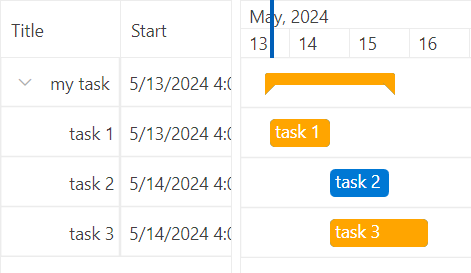

## Environment
<table>
	<tbody>
		<tr>
			<td>Product Version</td>
			<td>2024.1.423</td>
		</tr>
		<tr>
			<td>Product</td>
			<td>RadGanttView for WPF</td>
		</tr>
	</tbody>
</table>

## Description

Change the color of the highlighted items of RadGanttView.

## Solution

To achieve this behavior, you can implement a custom [attached property](). It will retrive the elements responsible for the highlighted states of the EventContainer and SummaryContainer elements and update them based on its value. To retrieve the elements for the highlighted state, use the [ChildrenOfType](#childrenoftypeextensions) extension method.

__Custom attached property for modifying the highlighted items' color__
```C#
    public class EventContainerExtensions
    {
        public static SolidColorBrush GetEventContainerHighlightBrush(DependencyObject obj)
        {
            return (SolidColorBrush)obj.GetValue(EventContainerHighlightBrushProperty);
        }

        public static void SetEventContainerHighlightBrush(DependencyObject obj, SolidColorBrush value)
        {
            obj.SetValue(EventContainerHighlightBrushProperty, value);
        }

        public static readonly DependencyProperty EventContainerHighlightBrushProperty =
            DependencyProperty.RegisterAttached("EventContainerHighlightBrush", typeof(SolidColorBrush), typeof(EventContainerExtensions), new PropertyMetadata(null,   OnEventContainerHighlightBrushChanged));

        private static void OnEventContainerHighlightBrushChanged(DependencyObject d, DependencyPropertyChangedEventArgs e)
        {
            EventContainer eventContainer = (EventContainer)d;

            eventContainer.Loaded += EventContainer_Loaded;
        }

        private static void EventContainer_Loaded(object sender, RoutedEventArgs e)
        {
            EventContainer eventContainer = sender as EventContainer;

            if (eventContainer != null)
            {
                SolidColorBrush newColor = GetEventContainerHighlightBrush(eventContainer);

                //SummaryContainer
                if (eventContainer is SummaryContainer summaryContainer)
                {
                    ChangeHighlightColorOfSummaryContainer(summaryContainer, newColor);
                }
                //EventContainer
                else
                {
                    ChangеHighlightColorOfEventContainer(eventContainer, newColor);
                }
            }
        }

        private static void ChangеHighlightColorOfEventContainer(EventContainer eventContainer, SolidColorBrush newColor)
        {
            Border highlightVisual = eventContainer.ChildrenOfType<Border>().FirstOrDefault(x => x.Name == "HighlightVisual");

            if (highlightVisual != null)
            {
                highlightVisual.Background = newColor;
                highlightVisual.BorderBrush = newColor;
            }
        }

        private static void ChangeHighlightColorOfSummaryContainer(EventContainer summaryContainer, SolidColorBrush newColor)
        {
            Border backgroundBorderHighlighted = summaryContainer.ChildrenOfType<Border>().FirstOrDefault(x => x.Name == "BackgroundBorderHighlighted");
            Path rightMarkerHighlighted = summaryContainer.ChildrenOfType<Path>().FirstOrDefault(x => x.Name == "RightMarkerHighlighted");
            Path leftMarkerHighlighted = summaryContainer.ChildrenOfType<Path>().FirstOrDefault(x => x.Name == "LeftMarkerHighlighted");

            if (backgroundBorderHighlighted != null && rightMarkerHighlighted != null && leftMarkerHighlighted != null)
            {
                backgroundBorderHighlighted.Background = newColor;
                backgroundBorderHighlighted.BorderBrush = newColor;

                rightMarkerHighlighted.Fill = newColor;
                leftMarkerHighlighted.Fill = newColor;
            }
        }
    }
```

__Setting the EventContainerExtensions.EventContainerHighlightBrush attached property__
```XAML
    <Grid.Resources>
        <!-- If you use NoXaml dlls set the BasedOn property of the Style: BasedOn="{StaticResource EventContainerStyle}" -->
        <Style TargetType="telerik:EventContainer">
            <Setter Property="local:EventContainerExtensions.EventContainerHighlightBrush" Value="Orange"/>
        </Style>
        <!-- If you use NoXaml dlls set the BasedOn property of the Style: BasedOn="{StaticResource SummaryContainerStyle}" -->
        <Style TargetType="telerik:SummaryContainer">
            <Setter Property="local:EventContainerExtensions.EventContainerHighlightBrush" Value="Orange"/>
        </Style>
    </Grid.Resources>
```

__Windows 11 themed RadGanttView with different color for its highlighted items__

