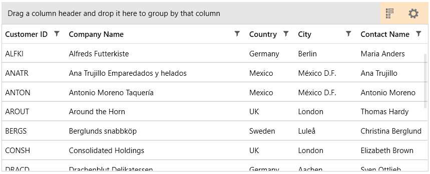

## Environment
<table>
	<tbody>
		<tr>
			<td>Product Version</td>
			<td>2019.2 812</td>
		</tr>
		<tr>
			<td>Product</td>
			<td>RadGridView for WPF</td>
		</tr>
	</tbody>
</table>

## Description

How to change the Background color of RadGridView's ControlPanel.

## Solution

1. Subscribe to the Loaded event of RadGridView.

2. In the event handler, get the ItemsControl that represents the Control Panel.

3. Set the Background property of the Control Panel.


```C#
	private void RadGridView_Loaded(object sender, RoutedEventArgs e)
	{
		var controlPanel = this.radGridView.ChildrenOfType<ItemsControl>().FirstOrDefault(x => x.Name == "PART_ControlPanelItemsControl");
		controlPanel.Background = Brushes.OrangeRed;
	}
```



## See Also  
* [Control Panel]()
* [ChildrenOfType]()

