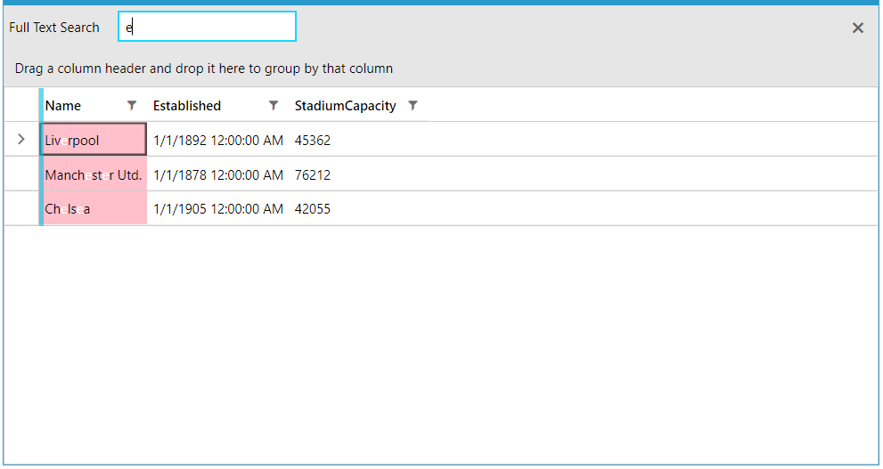

## Environment
<table>
    <tbody>
        <tr>
			<td>Product Version</td>
			<td>2022.2.622</td>
		</tr>
		<tr>
			<td>Product</td>
			<td>RadGridView for WPF</td>
		</tr>
	</tbody>
</table>

## Description

How to change the highlighted background and foreground colors of a matched GridViewCell element when search as you type is applied.

## Solution

To change the background color, create a new `Style` and set its `TargetType` property to `GridViewCell`. Then, add a new setter for the `HighlightedBackground` property and set it to the desired value.


```XAML
    <!-- If you use NoXaml dlls set the BasedOn property of the Style: BasedOn="{StaticResource GridViewCellStyle}" -->
    <Style TargetType="telerik:GridViewCell">
        <Setter Property="HighlightedBackground" Value="Pink"/>
    </Style>
```

To modify the foreground color of the matched GridViewCell, create a new `Style` and set its `TargetType` to `HighlightTextBlock`. After that, set the wanted foreground color to its `HighlightBrush` property.  


```XAML
	<!-- If you use NoXaml dlls set the BasedOn property of the Style: BasedOn="{StaticResource HighlightTextBlockStyle}" -->
	<Style TargetType="telerik:HighlightTextBlock"> 
	        <Setter Property="HighlightBrush" Value="White"/>        
	</Style>
```



## See Also  
* [Styling Search Panel]()