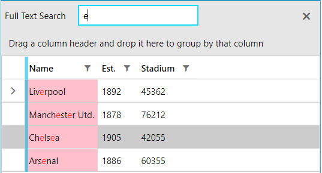

## Environment
<table>
    <tbody>
        <tr>
			<td>Product Version</td>
			<td>2022.2.622</td>
		</tr>
		<tr>
			<td>Product</td>
			<td>RadGridView for WPF</td>
		</tr>
	</tbody>
</table>

## Description

How to change the highlighted background color of a matched GridViewCell element when search as you type is applied.

## Solution

Create a new `Style` and set its `TargetType` property to `GridViewCell`. Then, add a new setter for the `HighlightedBackground` property and set it to the desired value.

#### __[XAML]__
{{region gridview-change-default-cell-highlight-background-0}}
    <!-- If you use NoXaml dlls set the BasedOn property of the Style: BasedOn="{StaticResource GridViewCellStyle}" -->
    
{{endregion}}

## See Also  
* [Styling Search Panel]()