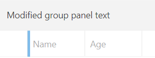

## Environment
<table>
	<tbody>
		<tr>
			<td>Product Version</td>
			<td>2025.1.211</td>
		</tr>
		<tr>
			<td>Product</td>
			<td>RadGridView for WPF</td>
		</tr>
	</tbody>
</table>

## Description

How to change the text of the group panel of RadGridView.

## Solution

To change the text of the group panel of `RadGridView`, subscribe to its `Loaded` event and retrieve the `TextBlock` element with x:Name="panelText". To do so, you can use the [ChildrenOfType]() extension method. Then, you can modify the `Text` property of the retrieved element.

#### __[C#] Changing the text of the group panel of RadGridView__
{{region kb-gridview-change-group-panel-text-0}}
    private void RadGridView_Loaded(object sender, RoutedEventArgs e)
    {
        var groupPanelTextBlock = this.gridView.ChildrenOfType<TextBlock>().FirstOrDefault(x => x.Name == "panelText");
        groupPanelTextBlock.Text = "Modified group panel text";
    }
{{endregion}}

__RadGridView with modified group panel text__

