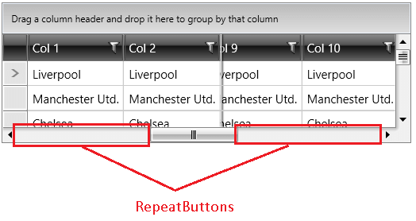

## Environment

<table>
	<tbody>
		<tr>
			<td>Product Version</td>
			<td>2020.2.617</td>
		</tr>
		<tr>
			<td>Product</td>
			<td>RadGridView for WPF</td>
		</tr>
	</tbody>
</table>

## Description

How to change the default scroll step applied when you click on an empty space on the ScrollBar's track area (the RepeatButtons).

#### Figure 1: ScrollBar empty track area


## Solution

Subscribe to the PreviewMouseLeftButtonDown event of RadGridView. In the event handler, check if the mouse is over a ScrollBar's RepeatButton with x:Name set to "PageUp" or "PageDown". In this case, handle the event which will cancel the scrolling and use the ScrollViewer's __ScrollToHorizontalOffset__ method to scroll manually. 

The following example shows how to implement this for the horizontal ScrollBar, but you can use this approach also for the vertical one.


```C#
	private void RadGridView_PreviewMouseLeftButtonDown(object sender, MouseButtonEventArgs e)
	{
		var originalSourceEl = e.OriginalSource as FrameworkElement;
		var repeatButton = originalSourceEl.ParentOfType<RepeatButton>();
		var scrollBar = repeatButton.ParentOfType<ScrollBar>();
		var grid = sender as RadGridView;

		// Handle only the case when the horizontal scrollbar is clicked
		if(repeatButton != null && scrollBar != null && scrollBar.Name == "PART_HorizontalScrollBar")
		{
			var scrollViewer = grid.ChildrenOfType<GridViewScrollViewer>().FirstOrDefault();
			// You can calculate the exact amount to scroll depending on the scenario 			
			var amountToScroll = 30;
			if (repeatButton.Name == "PageUp")
			{
				scrollViewer.ScrollToHorizontalOffset(scrollViewer.HorizontalOffset + amountToScroll);
				e.Handled = true;
			}

			if(repeatButton.Name == "PageDown")
			{
				scrollViewer.ScrollToHorizontalOffset(scrollViewer.HorizontalOffset - amountToScroll);
				e.Handled = true;
			}
		}
	}
```