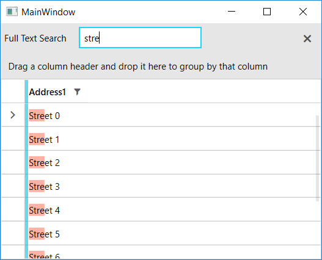

## Environment
<table>
    <tbody>
	    <tr>
	    	<td>Product Version</td>
	    	<td>2019.1.220</td>
	    </tr>
	    <tr>
	    	<td>Product</td>
	    	<td>RadGridView for WPF</td>
	    </tr>
    </tbody>
</table>

## Description

How to remove the default cell background highlighting when search as you type and replace it with a custom one.

## Solution

1. Create a custom column that derives from `GridViewDataColumn`.
2. Override the `CreateCellElement` method of the column.
3. Replace the default `HighlightTextBlock` element with a `TextBlock`.
4. Populate the new TextBlock with customized `Run` elements in order to reflect the search result in the cell.


```C#
	public class CustomDataColumn : GridViewDataColumn
	{
		public override FrameworkElement CreateCellElement(GridViewCell cell, object dataItem)
		{
			var element = base.CreateCellElement(cell, dataItem);            
			if (element is HighlightTextBlock)
			{   
				var textBlock = (HighlightTextBlock)element;

				// The next three lines of code are required in order to apply the built-in highlighting, thus populating the TextEffects.
				// This way we have the means to create the the Run elements properly.
				textBlock.DataContext = dataItem;
				textBlock.Text = textBlock.GetValue(HighlightTextBlock.TextProperty).ToString();
				textBlock.HighlightBrush = Brushes.Green;

				
				if (textBlock.TextEffects.Count > 0 && !string.IsNullOrEmpty(textBlock.Text))
				{
					var newCellElement = new TextBlock();
					for (int i = 0; i < textBlock.Text.Length; i++)
					{
						char character = textBlock.Text[i];
						bool isHighlightedCharacter = textBlock.TextEffects.Any(x => x.PositionStart <= i && i < (x.PositionStart + x.PositionCount));                        
						newCellElement.Inlines.Add(new Run(character.ToString()) { Background = isHighlightedCharacter ? new SolidColorBrush(Colors.Tomato) { Opacity = 0.5 } : null });
					}                    
					return newCellElement;
				}
			}           
			return element;
		}        
	}
```


```XAML
	<telerik:RadGridView.Columns>
		<local:CustomDataColumn DataMemberBinding="{Binding Address}" />
	</telerik:RadGridView.Columns>
```



## See Also 

* [Search as you Type]()
* [Defining Columns]()
* [Custom Column]()