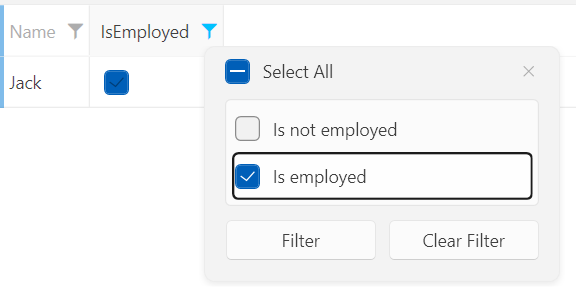

## Environment

<table>
	<tr>
		<td>Product Version</td>
		<td>2023.3.1114</td>
	</tr>
	<tr>
		<td>Product</td>
		<td>RadGridView for WPF</td>
	</tr>
</table>

## Description

How to customize the distinct values of a column of `RadGridView` when filtering.

## Solution

The `GridViewBoundColumnBase` class exposes the `FilteringDisplayFunc` property, which will allow you to customize the distinct values when filtering. To achieve this, extend the column that you will use and create a custom function of the type of `Func<object, object>`. This custom function will be returned when the FilteringDisplayFunc property of this column is called.

The following example shows how to utilize the FilteringDisplayFunc property. It extends the `GridViewDataColumn` column, but you can use the same approach with the other types of columns:

1. Create the model and view model:

	__Creating a sample model and view model__
	```C#
	    public class Person
	    {
	        public string Name { get; set; }
	        public bool IsEmployed { get; set; }
	    }
	
	    public class MainViewModel
	    {
	        public MainViewModel()
	        {
	            this.People = new ObservableCollection<Person>()
	            {
	                new Person() { Name = "Jack", IsEmployed = true },
	                new Person() { Name = "Mike", IsEmployed = false },
	            };
	        }
	
	        public ObservableCollection<Person> People { get; set; }
	    }
	```

2. Extend the column that you will use override the FilteringDisplayFunc property:

	__Creating a custom column and overriding the FilteringDisplayFunc property__
	```C#
	    public class CustomGridViewDataColumn : GridViewDataColumn
	    {
	        protected override Func<object, object> FilteringDisplayFunc => base.FilteringDisplayFunc;
	    }
	```

3. Create a field of the type of `Func<object, object>` and a method that will contain the distinct values modification. After that, set it as a return value for the FilteringDisplayFunc property:

	__Creating a custom function__
	```C#
	    public class CustomGridViewDataColumn : GridViewDataColumn
	    {
	        private Func<object, object> filteringDisplayFunc;
	
	        public CustomGridViewDataColumn()
	        {
	            this.filteringDisplayFunc = GetDistinctValueDisplayObject;
	        }
	
	        private object GetDistinctValueDisplayObject(object arg)
	        {
	            return null;
	        }
	
	        protected override Func<object, object> FilteringDisplayFunc
	        {
	            get { return filteringDisplayFunc; }
	        }
	    }
	```

4. The logic of the custom column will modify the distinct values for the IsEmployed property from the first step. 

	__Implementing the customization logic for the distinct values of the custom column__
	```C#
	    public class CustomGridViewDataColumn : GridViewDataColumn
	    {
	        private Func<object, object> filteringDisplayFunc;
	
	        public CustomGridViewDataColumn()
	        {
	            this.filteringDisplayFunc = GetDistinctValueDisplayObject;
	        }
	
	        private object GetDistinctValueDisplayObject(object arg)
	        {
	            if (arg is bool isEmployed)
	            {
	                string displayNameValue = isEmployed ? "Is employed" : "Is not employed";
	
	                return displayNameValue;
	            }
	
	            return null;
	        }
	
	        protected override Func<object, object> FilteringDisplayFunc
	        {
	            get { return filteringDisplayFunc; }
	        }
	    }
	```

5. Add the custom column to the Columns collection of RadGridView and bind it to the intended property. For this example, it will be the IsEmployed property:

__Adding the custom column to the Columns collection of RadGridView__
	```C#
	    <Grid>
	        <Grid.DataContext>
	            <local:MainViewModel/>
	        </Grid.DataContext>
	        <telerik:RadGridView ItemsSource="{Binding People}" AutoGenerateColumns="False">
	            <telerik:RadGridView.Columns>
	                <telerik:GridViewDataColumn DataMemberBinding="{Binding Name}"/>
	                <local:CustomGridViewDataColumn DataMemberBinding="{Binding IsEmployed}"/>
	            </telerik:RadGridView.Columns>
	        </telerik:RadGridView>
	    </Grid>
	```

The produced result will be as follows:


