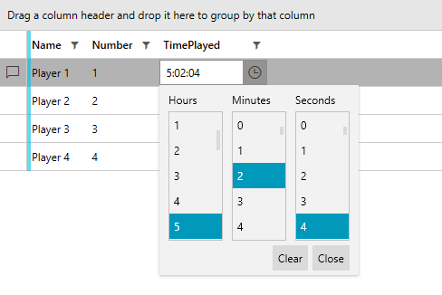
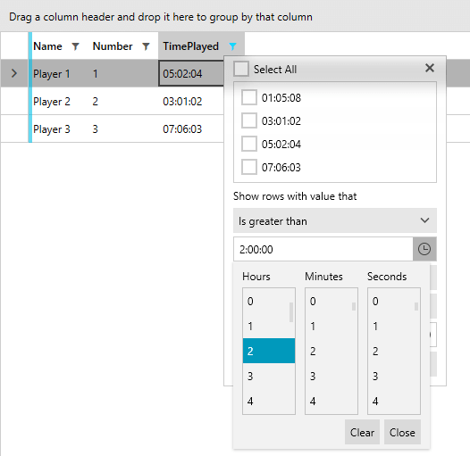

## Environment
<table>
	<tr>
		<td>Product</td>
		<td>RadGridView for WPF</td>
	</tr>
</table>

## Description

How to implement a GridViewDataColumn, which can display, edit and filter a property of type TimeSpan.

## Solution

To achieve this we will inherit GridViewDataColumn, override the __CreateCellEditElement__ and __CreateFieldFilterEditor__ methods and use a [RadTimeSpanPicker]() in order to manipulate the TimeSpan values. 

__Example 1: Sample model and viewmodel__
```C#

    public class Player : ViewModelBase
    {
        private string name;
        private int number;
        private TimeSpan timePlayed;

        public Player(string name, int number, TimeSpan timeSpan) : base()
        {
            this.name = name;
            this.number = number;
            this.timePlayed = timeSpan;
        }

        public string Name
        {
            get { return this.name; }
            set
            {
                if (value != this.name)
                {
                    this.name = value;
                    this.OnPropertyChanged("Name");
                }
            }
        }

        public int Number
        {
            get { return this.number; }
            set
            {
                if (value != this.number)
                {
                    this.number = value;
                    this.OnPropertyChanged("Number");
                }
            }
        }

        public TimeSpan TimePlayed
        {
            get
            {
                return this.timePlayed;
            }
            set
            {
                if (this.timePlayed != value)
                {
                    this.timePlayed = value;
                    this.OnPropertyChanged("TimePlayed");
                }
            }
        }

        public static ObservableCollection<Player> GetPlayers()
        {
            ObservableCollection<Player> players = new ObservableCollection<Player>();
            Player player;

            player = new Player("Player 1",  1, new TimeSpan(5, 2, 4));
            players.Add(player);

            player = new Player("Player 2", 2, new TimeSpan(3, 1, 2));
            players.Add(player);
        
            player = new Player("Player 3", 3, new TimeSpan(7, 6, 3));
            players.Add(player);

            player = new Player("Player 4", 4, new TimeSpan(1, 5, 8));
            players.Add(player);

            return players;
        }
    }
    
    public class MyViewModel : ViewModelBase
    {
        private ObservableCollection<Player> players;

        public ObservableCollection<Player> Players
        {
            get
            {
                if (this.players == null)
                {
                    this.players = Player.GetPlayers();
                }

                return this.players;
            }
        }
    }
```

__Example 2__ demonstrates how we can utilize the __CreateCellEditElement__ and __CreateFieldFilterEditor__ methods of the GridViewDataColumn. This allows us to return a new instance of a __RadTimeSpanPicker__ and bind its __Value__ property accordingly. 

__Example 2: Custom TimeSpanPickerColumn__
```C#

    public class TimeSpanPickerColumn : GridViewDataColumn
    {
        public override FrameworkElement CreateCellEditElement(GridViewCell cell, object dataItem)
        {
            var timeSpanPicker = new RadTimeSpanPicker();
            timeSpanPicker.TimeSpanComponents.Add(new HourTimeSpanComponent() { Step = 1 });
            timeSpanPicker.TimeSpanComponents.Add(new MinuteTimeSpanComponent() { Step = 1 });
            timeSpanPicker.TimeSpanComponents.Add(new SecondTimeSpanComponent() { Step = 1 });

            var valueBinding = new Binding(this.DataMemberBinding.Path.Path)
            {
                Mode = BindingMode.TwoWay,
            };
            timeSpanPicker.SetBinding(RadTimeSpanPicker.ValueProperty, valueBinding);

            return timeSpanPicker;
        }

        public override FrameworkElement CreateFieldFilterEditor()
        {
            var timeSpanPicker = new RadTimeSpanPicker();

            timeSpanPicker.TimeSpanComponents.Add(new HourTimeSpanComponent() { Step = 1 });
            timeSpanPicker.TimeSpanComponents.Add(new MinuteTimeSpanComponent() { Step = 1 });
            timeSpanPicker.TimeSpanComponents.Add(new SecondTimeSpanComponent() { Step = 1 });

            Binding selectedValueBinding = new Binding("Value")
            {
                Mode = BindingMode.TwoWay,
                FallbackValue = null,
                Converter = new TimeSpanFilterEditorConverter(),
            };
            timeSpanPicker.SetBinding(RadTimeSpanPicker.ValueProperty, selectedValueBinding);

            return timeSpanPicker;
        }

        private class TimeSpanFilterEditorConverter : IValueConverter
        {
            public object Convert(object value, Type targetType, object parameter, System.Globalization.CultureInfo culture)
            {
                if (Object.Equals(value, Telerik.Windows.Data.FilterDescriptor.UnsetValue))
                {
                    // When the filter is turned off this is what your editor will get. 
                    return null;
                }

                return value;
            }

            public object ConvertBack(object value, Type targetType, object parameter, System.Globalization.CultureInfo culture)
            {
                if (value == null)
                {
                    // When your editor wants to turn off the filter this is what it should return. 
                    return FilterDescriptor.UnsetValue;
                }

                return value;
            }
        }
    }
```

__Example 3: Using the custom TimeSpanPickerColumn__
```XAML

    <Grid>
        <Grid.DataContext>
            <my:MyViewModel />
        </Grid.DataContext>

        <telerik:RadGridView ItemsSource="{Binding Players}" 
                             AutoGenerateColumns="False">
            <telerik:RadGridView.Columns>
                <telerik:GridViewDataColumn DataMemberBinding="{Binding Name}"/>
                <telerik:GridViewDataColumn DataMemberBinding="{Binding Number}"/>
                <my:TimeSpanPickerColumn DataMemberBinding="{Binding TimePlayed}" />
            </telerik:RadGridView.Columns>
        </telerik:RadGridView>
    </Grid>
```

> The "my" namespace refers to the namespace where the "TimeSpanPickerColumn" and "MyViewModel" classes are defined. 

#### __Figure 1: Editing TimeSpanPickerColumn in the Fluent theme__


#### __Figure 2: Filtering TimeSpanPickerColumn in the Fluent theme__


## See Also

* [Create Custom Editor with RadGridView]()
* [Create a Custom Field Filter Editor]()