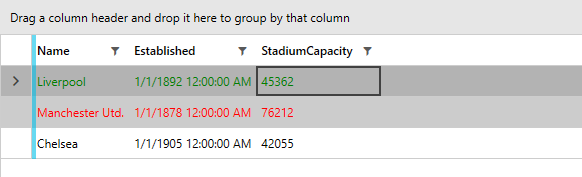

## Environment
<table>
    <tbody>
	    <tr>
	    	<td>Product</td>
	    	<td>RadGridView for WPF</td>
	    </tr>
    </tbody>
</table>

## Description

How to change the Foreground of а GridViewRow that is selected or hovered. 

## Solution

Add a style targeting __GridViewRow__ with Triggers that check the __IsSelected__ and __IsMouseOver__ properties and change its __Foreground__. 

> __Example 1__ uses the model and viewmodel defined in the [Getting Started]() article of the RadGridView.
 
__Example 1: Custom style targeting__
```XAML
	<Grid>
        <Grid.Resources>
            <!-- If you are using the NoXaml binaries, you should base the style on the default one for the theme like so-->
            <!-- <Style TargetType="telerik:GridViewRow" BasedOn="{StaticResource GridViewRowStyle}"> -->
            <Style TargetType="telerik:GridViewRow" >
                <Style.Triggers>
                    <Trigger Property="IsSelected" Value="True">
                        <Setter Property="Foreground" Value="Red" />
                    </Trigger>
                    <MultiTrigger >
                        <MultiTrigger.Conditions>
                            <Condition Property="IsMouseOver" Value="True"/>
                            <Condition Property="IsSelected" Value="False"/>
                        </MultiTrigger.Conditions>
                        <Setter Property="Foreground" Value="Green" />
                    </MultiTrigger>
                </Style.Triggers>
            </Style>
        </Grid.Resources>

        <telerik:RadGridView ItemsSource="{Binding Clubs}"
                             GroupRenderMode="Flat" />
    </Grid>
```

> The demonstrated approach may not be relevant for all UI for WPF themes. 

#### __Figure 1: Selected and Hovered GridViewRows with changed Foreground in the Fluent theme__


## See Also
* [Styling a Cell]()
* [Styling a Row]()
* [Editing ControlTemplates]()
