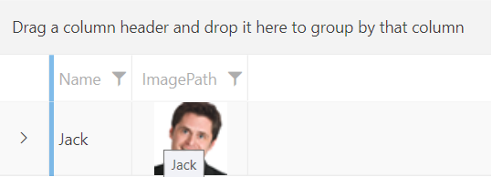

## Environment
<table>
	<tbody>
		<tr>
			<td>Product Version</td>
			<td>2024.2.514</td>
		</tr>
		<tr>
			<td>Product</td>
			<td>RadGridView for WPF</td>
		</tr>
	</tbody>
</table>

## Description

How to set a tooltip on the cells of a column.

## Solution

The `ToolTip` property of each column type of RadGridView is inherited from the `FrameworkContentElement` class, which is the base class of all of them. There is no implementation for this property in the context of the columns. Instead, you can use the `ToolTipTemplate` property.

#### __[XAML] Setting the ToolTipTemplate property of a GridViewImageColumn__
{{region kb-gridview-set-tooltip-on-column-cells-0}}
    <telerik:RadGridView ItemsSource="{Binding MyCollection}"
                         AutoGenerateColumns="False">
        <telerik:RadGridView.Columns>
            <telerik:GridViewImageColumn DataMemberBinding="{Binding MyImagePath}">
                <telerik:GridViewImageColumn.ToolTipTemplate>
                    <DataTemplate>
                        <TextBlock Text="My ToolTip"/>
                    </DataTemplate>
                </telerik:GridViewImageColumn.ToolTipTemplate>
            </telerik:GridViewImageColumn>
        </telerik:RadGridView.Columns>
    </telerik:RadGridView>
{{endregion}}

You can bind the elements inside the DataTemplate for the ToolTipTemplate property to properties of the underlying data model.

The following example showcases this scenario:

#### __[C#] Defining the model and view model__
{{region kb-gridview-set-tooltip-on-column-cells-1}}
    public class Person
    {
        public string Name { get; set; }
        public string ImagePath { get; set; }
    }

    public class MainViewModel
    {
        public MainViewModel()
        {
            this.People = new ObservableCollection<Person>()
            {
                new Person()
                {
                    Name = "Jack",
                    ImagePath = "jack.png"
                },
            };
        }

        public ObservableCollection<Person> People { get; set; }
    }
{{endregion}}

#### __[XAML] Binding the Name property to the element inside the DataTemplate for the ToolTipTemplate property__
{{region kb-gridview-set-tooltip-on-column-cells-2}}
    <Grid>
        <Grid.DataContext>
            <local:MainViewModel/>
        </Grid.DataContext>
        <telerik:RadGridView ItemsSource="{Binding People}"
                             AutoGenerateColumns="False">
            <telerik:RadGridView.Columns>
                <telerik:GridViewDataColumn DataMemberBinding="{Binding Name}"/>
                <telerik:GridViewImageColumn DataMemberBinding="{Binding ImagePath}">
                    <telerik:GridViewImageColumn.ToolTipTemplate>
                        <DataTemplate>
                            <TextBlock Text="{Binding Name}"/>
                        </DataTemplate>
                    </telerik:GridViewImageColumn.ToolTipTemplate>
                </telerik:GridViewImageColumn>
            </telerik:RadGridView.Columns>
        </telerik:RadGridView>
    </Grid>
{{endregion}}

__Tooltip of GridViewImageColumn bound to a property of the underlying data model__

