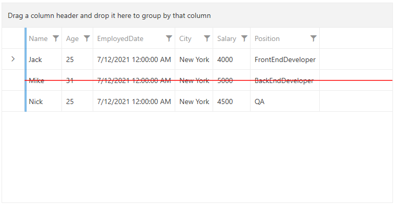

## Environment
<table>
	<tbody>
		<tr>
			<td>Product Version</td>
			<td>2024.2.524</td>
		</tr>
		<tr>
			<td>Product</td>
			<td>RadGridView for WPF</td>
		</tr>
	</tbody>
</table>

## Description

How to strikeout/strikethrough the rows of `RadGridView`.

## Solution

Extract the default `ControlTemplate` of the `GridViewRow` element. It has an __x:Name="GridViewRowTemplate"__. In it, add a new `Border` element and set the `Grid.Column` and `Grid.ColumnSpan` attached property to __2__. You can customize the color and the thickness via the `BorderBrush`, `Height`, and `BorderBrush` properties. Set the `Visibility` property to `Collapsed`. 

>tip To learn how to extract the default ControlTemplates of the Telerik controls, check the [Editing Control Templates](#extracting-control-templates-manually-from-the-theme-xaml-file) article.

To control the visibility of the additional Border element, create a new `DataTrigger` in the `ControlTemplate.Triggers` collection of the extracted ControlTemplate. Bind DataTrigger to a property from your business model, which depending on its value, will change the Visibility property of the Border element.

Create a new `Style` with `TargetType="GridViewRow"` and set the modified ControlTemplate to the `Template` property.

The following example showcases this approach when the [Windows 11 theme]() is applied:

__Creating a sample model and view model__
```C#
    public enum Position
    {
        Manager,
        FrontEndDeveloper,
        BackEndDeveloper,
        QA,
        TechnicalSupportEngineer,
    }

    public class EmployeeInfo : ViewModelBase
    {
        private bool isDeleted;

        public string Name { get; set; }
        public int Age { get; set; }
        public DateTime EmployedDate { get; set; }
        public string City { get; set; }
        public double Salary { get; set; }
        public Position Position { get; set; }

        public bool IsDeleted
        {
            get { return this.isDeleted; }
            set { this.isDeleted = value; this.OnPropertyChanged(nameof(this.IsDeleted)); }
        }
    }

    public class MainViewModel
    {
        public MainViewModel()
        {
            this.Employees = new ObservableCollection<EmployeeInfo>()
            {
                new EmployeeInfo()
                {
                    Name = "Jack",
                    Age = 25,
                    EmployedDate = new DateTime(2021, 7, 12),
                    City = "New York",
                    Salary = 4000,
                    Position = Position.FrontEndDeveloper,
                },
                new EmployeeInfo()
                {
                    Name = "Mike",
                    Age = 31,
                    EmployedDate = new DateTime(2021, 7, 12),
                    City = "New York",
                    Salary = 5000,
                    IsDeleted = true,
                    Position = Position.BackEndDeveloper,
                },
                new EmployeeInfo()
                {
                    Name = "Nick",
                    Age = 25,
                    EmployedDate = new DateTime(2021, 7, 12),
                    City = "New York",
                    Salary = 4500,
                    Position = Position.QA,
                },
            };
        }

        public ObservableCollection<EmployeeInfo> Employees { get; set; }
    }
```

__Extracting and modifying the default ControlTemplate of the GridViewRow element__
```XAML
    <Application x:Class="GridViewStrikeoutRow.App"
                 xmlns="http://schemas.microsoft.com/winfx/2006/xaml/presentation"
                 xmlns:x="http://schemas.microsoft.com/winfx/2006/xaml"
                 xmlns:grid="clr-namespace:Telerik.Windows.Controls.GridView;assembly=Telerik.Windows.Controls.GridView"
                 xmlns:telerik="http://schemas.telerik.com/2008/xaml/presentation"
                 StartupUri="MainWindow.xaml">
        <Application.Resources>
            <ResourceDictionary>
                <ResourceDictionary.MergedDictionaries>
                    <ResourceDictionary Source="/Telerik.Windows.Themes.Windows11;component/Themes/System.Windows.xaml"/>
                    <ResourceDictionary Source="/Telerik.Windows.Themes.Windows11;component/Themes/Telerik.Windows.Controls.xaml"/>
                    <ResourceDictionary Source="/Telerik.Windows.Themes.Windows11;component/Themes/Telerik.Windows.Controls.GridView.xaml"/>
                    <ResourceDictionary Source="/Telerik.Windows.Themes.Windows11;component/Themes/Telerik.Windows.Controls.Input.xaml"/>
                </ResourceDictionary.MergedDictionaries>
                <ControlTemplate x:Key="CustomGridViewRowTemplate" TargetType="grid:GridViewRow">
                    <Border BorderBrush="{TemplateBinding BorderBrush}" BorderThickness="{TemplateBinding BorderThickness}">
                        <VisualStateManager.VisualStateGroups>
                            <VisualStateGroup x:Name="SelectionStates">
                                <VisualState x:Name="Unselected"/>
                                <VisualState x:Name="SelectedUnfocused">
                                    <Storyboard>
                                        <ObjectAnimationUsingKeyFrames Duration="0" Storyboard.TargetName="Background_Selected_Unfocused" Storyboard.TargetProperty="Visibility">
                                            <DiscreteObjectKeyFrame KeyTime="0">
                                                <DiscreteObjectKeyFrame.Value>
                                                    <Visibility>Visible</Visibility>
                                                </DiscreteObjectKeyFrame.Value>
                                            </DiscreteObjectKeyFrame>
                                        </ObjectAnimationUsingKeyFrames>
                                        <ObjectAnimationUsingKeyFrames Duration="0" Storyboard.TargetName="Background_Selected" Storyboard.TargetProperty="Visibility">
                                            <DiscreteObjectKeyFrame KeyTime="0">
                                                <DiscreteObjectKeyFrame.Value>
                                                    <Visibility>Collapsed</Visibility>
                                                </DiscreteObjectKeyFrame.Value>
                                            </DiscreteObjectKeyFrame>
                                        </ObjectAnimationUsingKeyFrames>
                                    </Storyboard>
                                </VisualState>
                                <VisualState x:Name="Selected">
                                    <Storyboard>
                                        <ObjectAnimationUsingKeyFrames Duration="0" Storyboard.TargetName="Background_Selected" Storyboard.TargetProperty="Visibility">
                                            <DiscreteObjectKeyFrame KeyTime="0">
                                                <DiscreteObjectKeyFrame.Value>
                                                    <Visibility>Visible</Visibility>
                                                </DiscreteObjectKeyFrame.Value>
                                            </DiscreteObjectKeyFrame>
                                        </ObjectAnimationUsingKeyFrames>
                                    </Storyboard>
                                </VisualState>
                            </VisualStateGroup>
                        </VisualStateManager.VisualStateGroups>
                        <grid:SelectiveScrollingGrid x:Name="grid">
                            <Grid.ColumnDefinitions>
                                <ColumnDefinition Width="Auto"/>
                                <ColumnDefinition Width="Auto"/>
                                <ColumnDefinition Width="Auto"/>
                                <ColumnDefinition/>
                            </Grid.ColumnDefinitions>
                            <Grid.RowDefinitions>
                                <RowDefinition/>
                                <RowDefinition Height="Auto"/>
                                <RowDefinition Height="Auto"/>
                            </Grid.RowDefinitions>
                            <Border x:Name="Background_Main"
                                    Grid.Column="2"
                                    Grid.ColumnSpan="2"
                                    Background="{TemplateBinding Background}"
                                    BorderBrush="{TemplateBinding BorderBrush}"
                                    BorderThickness="{Binding HorizontalGridLinesWidth, RelativeSource={RelativeSource TemplatedParent}, Converter={StaticResource GridLineWidthToThicknessConverter},  ConverterParameter=Bottom}"
                                    Padding="{TemplateBinding Padding}"
                                    Margin="{TemplateBinding Margin}"
                                    VerticalAlignment="{TemplateBinding VerticalContentAlignment}"/>
                            <grid:DetailsPresenter x:Name="PART_DetailsPresenter"
                                                   Grid.Column="2"
                                                   Grid.ColumnSpan="2"
                                                   Grid.Row="1"
                                                   BorderThickness="0"
                                                   DetailsProvider="{TemplateBinding DetailsProvider}"
                                                   Margin="0 -1 0 0"/>
                            <ContentPresenter x:Name="PART_HierarchyChildPresenter"
                                              Grid.Column="2"
                                              Grid.ColumnSpan="2"
                                              Grid.Row="2"
                                              grid:SelectiveScrollingGrid.SelectiveScrollingClip="True"
                                              Margin="0 -1 0 0"
                                              Visibility="{Binding IsExpanded, RelativeSource={RelativeSource TemplatedParent}, Converter={StaticResource BooleanToVisibilityConverter}}"/>
                            <Border
                                    Grid.RowSpan="3"
                                    Width="{telerik:Windows11Resource ResourceKey=GridViewIndentWidth}"
                                    Background="{TemplateBinding Background}"
                                    Visibility="{TemplateBinding RowIndicatorVisibility}"
                                    grid:SelectiveScrollingGrid.SelectiveScrollingOrientation="Vertical"/>
                            <Border x:Name="PART_RowBorder"
                                    Grid.ColumnSpan="4"
                                    Grid.RowSpan="3"
                                    BorderBrush="{TemplateBinding HorizontalGridLinesBrush}"
                                    BorderThickness="{Binding HorizontalGridLinesWidth, RelativeSource={RelativeSource TemplatedParent}, Converter={StaticResource GridLineWidthToThicknessConverter},  ConverterParameter=Bottom}"/>
                            <Border x:Name="Background_Over" Grid.ColumnSpan="4" Background="{TemplateBinding MouseOverBackground}" Visibility="Collapsed" Margin="0 0 0 1"/>
                            <Border x:Name="Background_Selected_Unfocused"
                                    Grid.ColumnSpan="4"
                                    Background="{telerik:Windows11Resource ResourceKey=SelectedUnfocusedBrush}"
                                    Visibility="Collapsed"
                                    Margin="0 0 0 1"/>
                            <Border x:Name="Background_Selected" Grid.ColumnSpan="4" Background="{TemplateBinding SelectedBackground}" Visibility="Collapsed" Margin="0 0 0 1"/>
                            <Border x:Name="PART_IndicatorPresenter"
                                    Grid.RowSpan="3"
                                    Width="{telerik:Windows11Resource ResourceKey=GridViewIndentWidth}"
                                    Background="Transparent"
                                    BorderBrush="{TemplateBinding BorderBrush}"
                                    BorderThickness="0 0 1 1"
                                    VerticalAlignment="Stretch"
                                    Visibility="{TemplateBinding RowIndicatorVisibility}"
                                    grid:SelectiveScrollingGrid.SelectiveScrollingOrientation="Vertical">
                                <Grid>
                                    <Grid x:Name="GridIndicatorPresenter">
                                        <Grid x:Name="NavigatorIndicator" HorizontalAlignment="Center" VerticalAlignment="Center" Visibility="Collapsed">
                                            <telerik:RadGlyph x:Name="IconRight" Foreground="{telerik:Windows11Resource ResourceKey=IconBrush}" Glyph="{StaticResource GlyphArrowChevronRight}"/>
                                        </Grid>
                                        <Grid x:Name="EditIndicator" HorizontalAlignment="Center" VerticalAlignment="Center" Visibility="Collapsed">
                                            <telerik:RadGlyph Foreground="{telerik:Windows11Resource ResourceKey=IconBrush}" Glyph="{StaticResource GlyphComment}"/>
                                        </Grid>
                                        <Grid x:Name="InvalidEditableIndicator" Width="16" Height="16" HorizontalAlignment="Center" VerticalAlignment="Center" Visibility="Collapsed">
                                            <telerik:RadGlyph Foreground="{telerik:Windows11Resource ResourceKey=ValidationBrush}" Glyph="{StaticResource GlyphComment}"/>
                                            <ToolTipService.ToolTip>
                                                <ToolTip Placement="Bottom" Content="{TemplateBinding Errors}" Template="{StaticResource GridViewValidationToolTipTemplate}"/>
                                            </ToolTipService.ToolTip>
                                        </Grid>
                                        <Grid x:Name="ErrorIndicator" Width="16" Height="16" HorizontalAlignment="Center" VerticalAlignment="Center" Visibility="Collapsed">
                                            <telerik:RadGlyph Foreground="{telerik:Windows11Resource ResourceKey=ValidationBrush}" Glyph="{StaticResource GlyphWarning}"/>
                                            <ToolTipService.ToolTip>
                                                <ToolTip Placement="Bottom" Content="{TemplateBinding Errors}" Template="{StaticResource GridViewValidationToolTipTemplate}"/>
                                            </ToolTipService.ToolTip>
                                        </Grid>
                                        <Thumb x:Name="PART_RowResizer" Style="{StaticResource RowGripperStyle}"/>
                                    </Grid>
                                    <grid:GridViewPinButton x:Name="PinnedRowPresenter" IsPinned="{Binding IsPinned, RelativeSource={RelativeSource TemplatedParent}}" Visibility="Collapsed"/>
                                </Grid>
                            </Border>
                            <!--Additional Border element that will be used in the DataTrigger to apply a strikeout/strikethrough effect-->
                            <Border x:Name="Background_Strikeout" BorderBrush="Red" BorderThickness="2" Grid.Column="2" Grid.ColumnSpan="2" Height="2" Visibility="Collapsed" Panel.ZIndex="1"/>
                            <grid:DataCellsPresenter x:Name="PART_DataCellsPresenter" Grid.Column="3"/>
                            <telerik:GridViewToggleButton x:Name="PART_HierarchyExpandButton"
                                                          Grid.Column="2"
                                                          Width="{telerik:Windows11Resource ResourceKey=GridViewIndentWidth}"
                                                          IsChecked="{Binding IsExpanded, Mode=TwoWay, RelativeSource={RelativeSource TemplatedParent}}"
                                                          Opacity="{Binding IsExpandable, RelativeSource={RelativeSource TemplatedParent}, Converter={StaticResource BooleanToOpacityConverter}}"
                                                          grid:SelectiveScrollingGrid.SelectiveScrollingOrientation="Vertical"
                                                          IsHitTestVisible="{TemplateBinding IsExpandable}"
                                                          Visibility="{Binding HasHierarchy, RelativeSource={RelativeSource TemplatedParent}, Converter={StaticResource BooleanToVisibilityConverter}}"
                                                          IsTabStop="{TemplateBinding IsTabStop}"/>
                            <grid:IndentPresenter x:Name="PART_IndentPresenter"
                                                  Margin="0 0 0 1"
                                                  IndentLevel="{TemplateBinding IndentLevel}"
                                                  Grid.Column="1"
                                                  Grid.RowSpan="4"
                                                  grid:SelectiveScrollingGrid.SelectiveScrollingOrientation="Vertical"/>
                            <Border x:Name="Background_Invalid"
                                    Grid.ColumnSpan="4"
                                    grid:SelectiveScrollingGrid.SelectiveScrollingClip="True"
                                    BorderBrush="{telerik:Windows11Resource ResourceKey=ValidationBrush}"
                                    BorderThickness="1"
                                    Visibility="Collapsed"/>
                        </grid:SelectiveScrollingGrid>
                    </Border>
                    <ControlTemplate.Triggers>
                        <MultiTrigger>
                            <MultiTrigger.Conditions>
                                <Condition Property="IsMouseOver" Value="True"/>
                                <Condition Property="DisplayVisualCues" Value="True"/>
                                <Condition Property="IsValid" Value="True"/>
                                <Condition Property="IsSelected" Value="False"/>
                            </MultiTrigger.Conditions>
                            <Setter TargetName="Background_Over" Property="Visibility" Value="Visible"/>
                        </MultiTrigger>
                        <MultiTrigger>
                            <MultiTrigger.Conditions>
                                <Condition Property="IsValid" Value="False"/>
                                <Condition Property="IsInEditMode" Value="False"/>
                                <Condition Property="DisplayVisualCues" Value="True"/>
                            </MultiTrigger.Conditions>
                            <Setter TargetName="Background_Invalid" Property="Visibility" Value="Visible"/>
                            <Setter TargetName="ErrorIndicator" Property="Visibility" Value="Visible"/>
                            <Setter TargetName="Background_Selected_Unfocused" Property="Background" Value="{x:Null}"/>
                            <Setter TargetName="Background_Selected" Property="Background" Value="{x:Null}"/>
                            <Setter TargetName="Background_Main" Property="Visibility" Value="Collapsed"/>
                        </MultiTrigger>
                        <MultiTrigger>
                            <MultiTrigger.Conditions>
                                <Condition Property="IsValid" Value="False"/>
                                <Condition Property="IsInEditMode" Value="True"/>
                                <Condition Property="DisplayVisualCues" Value="True"/>
                            </MultiTrigger.Conditions>
                            <Setter TargetName="Background_Invalid" Property="Visibility" Value="Visible"/>
                            <Setter TargetName="InvalidEditableIndicator" Property="Visibility" Value="Visible"/>
                            <Setter TargetName="Background_Selected_Unfocused" Property="Background" Value="{x:Null}"/>
                            <Setter TargetName="Background_Selected" Property="Background" Value="{x:Null}"/>
                            <Setter TargetName="Background_Main" Property="Visibility" Value="Collapsed"/>
                        </MultiTrigger>
                        <MultiTrigger>
                            <MultiTrigger.Conditions>
                                <Condition Property="IsValid" Value="True"/>
                                <Condition Property="IsInEditMode" Value="True"/>
                            </MultiTrigger.Conditions>
                            <Setter TargetName="EditIndicator" Property="Visibility" Value="Visible"/>
                        </MultiTrigger>
                        <MultiTrigger>
                            <MultiTrigger.Conditions>
                                <Condition Property="IsValid" Value="True"/>
                                <Condition Property="IsCurrent" Value="True"/>
                                <Condition Property="IsInEditMode" Value="False"/>
                            </MultiTrigger.Conditions>
                            <Setter TargetName="NavigatorIndicator" Property="Visibility" Value="Visible"/>
                        </MultiTrigger>
                        <MultiDataTrigger>
                            <MultiDataTrigger.Conditions>
                                <Condition Binding="{Binding IsEnabled, ElementName=PinnedRowPresenter}" Value="True"/>
                                <Condition Binding="{Binding IsMouseOver, ElementName=PART_IndicatorPresenter}" Value="True"/>
                            </MultiDataTrigger.Conditions>
                            <Setter TargetName="GridIndicatorPresenter" Property="Visibility" Value="Collapsed"/>
                            <Setter TargetName="PinnedRowPresenter" Property="Visibility" Value="Visible"/>
                        </MultiDataTrigger>
                        <MultiDataTrigger>
                            <MultiDataTrigger.Conditions>
                                <Condition Binding="{Binding IsPinned, RelativeSource={RelativeSource Self}}" Value="True"/>
                                <Condition Binding="{Binding IsEnabled, ElementName=PinnedRowPresenter}" Value="True"/>
                            </MultiDataTrigger.Conditions>
                            <Setter Property="Background" Value="{telerik:Windows11Resource ResourceKey=StrokeBrush}"/>
                            <Setter TargetName="GridIndicatorPresenter" Property="Visibility" Value="Collapsed"/>
                            <Setter TargetName="PinnedRowPresenter" Property="Visibility" Value="Visible"/>
                        </MultiDataTrigger>
                        <Trigger Property="HorizontalGridLinesWidth" Value="0">
                            <Setter TargetName="PART_DetailsPresenter" Property="Margin" Value="0"/>
                            <Setter TargetName="PART_HierarchyChildPresenter" Property="Margin" Value="0"/>
                            <Setter TargetName="PART_IndentPresenter" Property="Margin" Value="0"/>
                            <Setter TargetName="Background_Over" Property="Margin" Value="0"/>
                            <Setter TargetName="Background_Selected_Unfocused" Property="Margin" Value="0"/>
                            <Setter TargetName="Background_Selected" Property="Margin" Value="0"/>
                        </Trigger>
                        <!--DataTrigger using the value of the IsDeleted property from the EmployeeInfo class to control the Visibility of the additional Border element-->
                        <DataTrigger Binding="{Binding Path=IsDeleted}" Value="True">
                            <Setter TargetName="Background_Strikeout" Property="Visibility" Value="Visible"/>
                            <Setter Property="IsHitTestVisible" Value="False"/>
                        </DataTrigger>
                    </ControlTemplate.Triggers>
                </ControlTemplate>
            </ResourceDictionary>
        </Application.Resources>
    </Application>
```

__Applying the customized ControlTemplate to the GridViewRow element__
```XAML
    <Style TargetType="grid:GridViewRow" BasedOn="{StaticResource GridViewRowStyle}">
        <Setter Property="Template" Value="{StaticResource CustomGridViewRowTemplate}"/>
    </Style>
```

__Setting up the RadGridView control using the created model and view model__
```XAML
    <Grid>
        <Grid.DataContext>
            <local:MainViewModel/>
        </Grid.DataContext>
        <telerik:RadGridView ItemsSource="{Binding Employees}" AutoGenerateColumns="False">
            <telerik:RadGridView.Columns>
                <telerik:GridViewDataColumn DataMemberBinding="{Binding Name}"/>
                <telerik:GridViewDataColumn DataMemberBinding="{Binding Age}"/>
                <telerik:GridViewDataColumn DataMemberBinding="{Binding EmployedDate}"/>
                <telerik:GridViewDataColumn DataMemberBinding="{Binding City}"/>
                <telerik:GridViewDataColumn DataMemberBinding="{Binding Salary}"/>
                <telerik:GridViewDataColumn DataMemberBinding="{Binding Position}"/>
            </telerik:RadGridView.Columns>
        </telerik:RadGridView>
    </Grid>
```

__GridViewRow with a strikeout/strikethrough effect__


