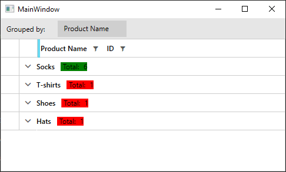
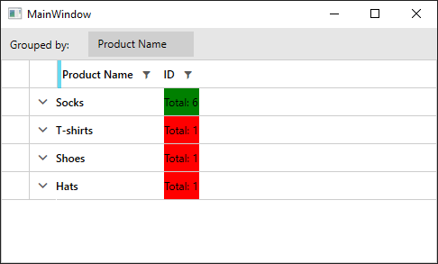

## Environment

<table>
	<tr>
		<td>Product</td>
		<td>RadGridView for WPF</td>
	</tr>
</table>

## Description

How to change the style of the aggregates based on the results. 

## Solution

The approach would differ depending on the value of the [ColumnAggregatesAlignment](#align-aggregates-in-groupheaderrow) property of the RadGridView. If its value is __NoAlignment__ (which is the default), the aggregate results are shown in __GridViewAggregateResultCell__ elements. If its value is __NextToGroupKey__ or __BelowToGroupKey__, the results are displayed in __GridViewGroupHeaderCell__ elements. This article will show how you can conditionally style both elements. 

__Example 1__ demonstrates a sample model and viewmodel that will be used for demonstration purposes. 

__Example 1: The model and viewmodel__

```C#
    public class Product
    {
        public Product(string name, int id)
        {
            this.Name = name;
            this.ID = id;
        }
        public string Name
        {
            get;
            set;
        }

        public int ID
        {
            get;
            set;
        }

        public static ObservableCollection<Product> GetProducts()
        {
            ObservableCollection<Product> products = new ObservableCollection<Product>();
            var id = 0;
            for (int i = 1; i < 7; i++)
            {
                products.Add(new Product("Socks", ++id));
            }
            products.Add(new Product("T-shirts", ++id));
            products.Add(new Product("Shoes", ++id));
            products.Add(new Product("Hats", ++id));
            
            return products;
        }
    }

    public class ViewModel
    {
        private ObservableCollection<Product> products;

        public ObservableCollection<Product> Products
        {
            get
            {
                if(this.products == null)
                {
                    this.products = Product.GetProducts();
                }

                return this.products;

            }
        }
    }
```
```VB.NET
    Public Class Product
        Public Sub New(ByVal name As String, ByVal id As Integer)
            Me.Name = name
            Me.ID = id
        End Sub
        Public Property Name() As String

        Public Property ID() As Integer

        Public Shared Function GetProducts() As ObservableCollection(Of Product)
            Dim products As New ObservableCollection(Of Product)()
            Dim _id = 0
            For i As Integer = 1 To 6
                id += 1
                products.Add(New Product("Socks", _id))
            Next i

            id += 1
            products.Add(New Product("T-shirts", _id))

            id += 1
            products.Add(New Product("Shoes", _id))

            id += 1
            products.Add(New Product("Hats", _id))

            Return products
        End Function
    End Class

    Public Class ViewModel
        Private _products As ObservableCollection(Of Product)

        Public ReadOnly Property Products() As ObservableCollection(Of Product)
            Get
                If Me._products Is Nothing Then
                    Me._products = Product.GetProducts()
                End If

                Return Me._products
            End Get
        End Property
    End Class
```

#### Styling the GridViewAggregateResultCell elements

This approach is valid when the [ColumnAggregatesAlignment](#align-aggregates-in-groupheaderrow) of the RadGridView is __NoAlignment__. __Example 2__ shows how to create a style targeting GridViewAggregateResultCell and change its Background depending on its DataContext. 

__Example 2: Conditionally styling GridViewAggregateResultCell__

```XAML

    <Grid>
        <Grid.DataContext>
            <local:ViewModel />
        </Grid.DataContext>
        
        <Grid.Resources>
            <local:AggregateResultsListItemCountToBackgroundConverter x:Key="AggregateResultsListItemCountToBackgroundConverter" />

            <!-- If you are using the NoXaml dlls, you should base the style on the default one for the theme like so-->
            <!-- <Style TargetType="telerik:GridViewAggregateResultCell" BasedOn="{StaticResource GridViewAggregateResultCellStyle}">-->
            <Style TargetType="telerik:GridViewAggregateResultCell">
                <Setter Property="Background" Value="{Binding ., Converter={StaticResource AggregateResultsListItemCountToBackgroundConverter}}" />
            </Style>
        </Grid.Resources>
        <telerik:RadGridView x:Name="grid" ColumnAggregatesAlignment="NoAlignment"  GroupRenderMode="Flat" ItemsSource="{Binding Products}" AutoGenerateColumns="False" >
            <telerik:RadGridView.Columns>
                <telerik:GridViewDataColumn DataMemberBinding="{Binding Name}" Header="Product Name" />
                <telerik:GridViewDataColumn DataMemberBinding="{Binding ID}" >
                    <telerik:GridViewDataColumn.AggregateFunctions>
                        <telerik:CountFunction Caption="Total: " />
                    </telerik:GridViewDataColumn.AggregateFunctions>
                </telerik:GridViewDataColumn>
            </telerik:RadGridView.Columns>
            <telerik:RadGridView.GroupDescriptors>
                <telerik:ColumnGroupDescriptor Column="{Binding Path=Columns[\Name], ElementName=grid}" DisplayContent="Product Name" />
            </telerik:RadGridView.GroupDescriptors>
        </telerik:RadGridView>
    </Grid>
```

__Example 3: AggregateResultsListItemCountToBackgroundConverter implementation__

```C#

    public class AggregateResultsListItemCountToBackgroundConverter : IValueConverter
    {
        public object Convert(object value, Type targetType, object parameter, CultureInfo culture)
        {
            var aggregateResult = value as AggregateResult;

            if (aggregateResult.ItemCount <= 1)
            {
                return Brushes.Red;
            }
            else
            {
                return Brushes.Green;
            }
        }

        public object ConvertBack(object value, Type targetType, object parameter, CultureInfo culture)
        {
            throw new NotImplementedException();
        }
    }
```
```VB.NET

    Public Class AggregateResultsListItemCountToBackgroundConverter
	    Implements IValueConverter

        Public Function Convert(ByVal value As Object, ByVal targetType As Type, ByVal parameter As Object, ByVal culture As CultureInfo) As Object
            Dim aggregateResult = TryCast(value, AggregateResult)

            If aggregateResult.ItemCount <= 1 Then
                Return Brushes.Red
            Else
                Return Brushes.Green
            End If
        End Function

        Public Function ConvertBack(ByVal value As Object, ByVal targetType As Type, ByVal parameter As Object, ByVal culture As CultureInfo) As Object
            Throw New NotImplementedException()
        End Function
    End Class
```


#### __Figure 1: Result from Example 2 in the Fluent theme__




#### Styling the GridViewGroupHeaderCell elements

This approach is valid when the [ColumnAggregatesAlignment](#align-aggregates-in-groupheaderrow) of the RadGridView is  __NextToGroupKey__ or __BelowToGroupKey__. __Example 4__ shows how to create a style targeting GridViewGroupHeaderCell and change its Background depending on its DataContext. 

__Example 4: Conditionally styling GridViewGroupHeaderCell__

```XAML

    <Grid>
        <Grid.DataContext>
            <local:ViewModel />
        </Grid.DataContext>
        
        <Grid.Resources>
            <local:IsNullConverter x:Key="IsNullConverter" />
            <local:ItemCountToBackgroundConverter x:Key="ItemCountToBackgroundConverter" />

            <!-- If you are using the NoXaml dlls, you should base the style on the default one for the theme like so-->
            <!-- <Style TargetType="telerik:GridViewGroupHeaderCell" BasedOn="{StaticResource GridViewGroupHeaderCellStyle}">-->

            <Style TargetType="telerik:GridViewGroupHeaderCell">
                <!-- Apply this style only to GridViewGroupHeaderCell elements that have some Content-->
                <Style.Triggers>
                    <DataTrigger Binding="{Binding Content, Converter={StaticResource IsNullConverter}, RelativeSource={RelativeSource Mode=Self}}" Value="False">
                        <Setter Property="Background" Value="{Binding ., Converter={StaticResource ItemCountToBackgroundConverter}}" />
                    </DataTrigger>
                </Style.Triggers>
            </Style>
        </Grid.Resources>
        <telerik:RadGridView x:Name="grid" ColumnAggregatesAlignment="NextToGroupKey"  GroupRenderMode="Flat" ItemsSource="{Binding Products}" AutoGenerateColumns="False" >
            <telerik:RadGridView.Columns>
                <telerik:GridViewDataColumn DataMemberBinding="{Binding Name}" Header="Product Name" />
                <telerik:GridViewDataColumn DataMemberBinding="{Binding ID}" >
                    <telerik:GridViewDataColumn.AggregateFunctions>
                        <telerik:CountFunction Caption="Total: " />
                    </telerik:GridViewDataColumn.AggregateFunctions>
                </telerik:GridViewDataColumn>
            </telerik:RadGridView.Columns>
            <telerik:RadGridView.GroupDescriptors>
                <telerik:ColumnGroupDescriptor Column="{Binding Path=Columns[\Name], ElementName=grid}" DisplayContent="Product Name" />
            </telerik:RadGridView.GroupDescriptors>
        </telerik:RadGridView>
    </Grid>
```

__Example 5: Implementation of converters used in Example 4__

```C#
    public class ItemCountToBackgroundConverter : IValueConverter
    {
        public object Convert(object value, Type targetType, object parameter, CultureInfo culture)
        {
            var group = value as QueryableCollectionViewGroup;

            if (group.ItemCount > 5)
            {
                return Brushes.Green;
            }
            else
            {
                return Brushes.Red;
            }
        }

        public object ConvertBack(object value, Type targetType, object parameter, CultureInfo culture)
        {
            throw new NotImplementedException();
        }
    }

    public class IsNullConverter : IValueConverter
    {
        public object Convert(object value, Type targetType, object parameter, CultureInfo culture)
        {
            return value == null;
        }

        public object ConvertBack(object value, Type targetType, object parameter, CultureInfo culture)
        {
            throw new InvalidOperationException("IsNullConverter can only be used OneWay.");
        }
    }
```
```VB.NET
    Public Class ItemCountToBackgroundConverter
        Implements IValueConverter

        Public Function Convert(ByVal value As Object, ByVal targetType As Type, ByVal parameter As Object, ByVal culture As CultureInfo) As Object
            Dim group = TryCast(value, QueryableCollectionViewGroup)

            If group.ItemCount > 5 Then
                Return Brushes.Green
            Else
                Return Brushes.Red
            End If
        End Function

        Public Function ConvertBack(ByVal value As Object, ByVal targetType As Type, ByVal parameter As Object, ByVal culture As CultureInfo) As Object
            Throw New NotImplementedException()
        End Function
    End Class

    Public Class IsNullConverter
        Implements IValueConverter

        Public Function Convert(ByVal value As Object, ByVal targetType As Type, ByVal parameter As Object, ByVal culture As CultureInfo) As Object
            Return value Is Nothing
        End Function

        Public Function ConvertBack(ByVal value As Object, ByVal targetType As Type, ByVal parameter As Object, ByVal culture As CultureInfo) As Object
            Throw New InvalidOperationException("IsNullConverter can only be used OneWay.")
        End Function
    End Class
```

#### __Figure 2: Result from Example 3 in the Fluent theme__




## See Also

* [Aggregate Functions]()
* [Group Aggregates]()
