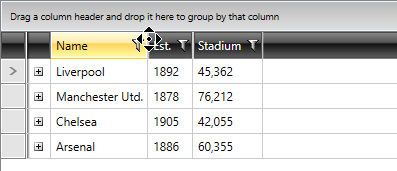

## Environment

<table>
	<tr>
		<td>Product</td>
		<td>RadGridView for WPF</td>
	</tr>
</table>

## Description

How to apply a style to the thumbs responsible for resizing the columns.

## Solution

To style the column resizers, you need to [edit the default template]() of the **GridViewHeaderCell** element and replace the default **ColumnHeaderGripperStyle** which is set for the **PART_LeftHeaderGripper** and **PART_RightHeaderGripper** elements.

__Example 1: Override the ColumnHeaderGripperStyle__

```XAML
    <Application.Resources>
        <ResourceDictionary>
            <ResourceDictionary.MergedDictionaries>
                <!-- other merged dictionaries -->
                <!-- if you're using the standard binaries -->
                <ResourceDictionary Source="/Telerik.Windows.Controls.GridView;component/Themes/GenericOfficeBlack.xaml"/>
                <!-- if you're using the NoXaml binaries -->
                <ResourceDictionary Source="/Telerik.Windows.Themes.Office_Black;component/Themes/Telerik.Windows.Controls.GridView.xaml"/>
                <!-- replace OfficeBlack with the theme you're using -->
            </ResourceDictionary.MergedDictionaries>
            <Style x:Key="ColumnHeaderGripperStyle" TargetType="Thumb">
                <Setter Property="Width" Value="8"/>
                <Setter Property="Background" Value="Transparent"/>
                <Setter Property="BorderBrush" Value="LightGray"/>
                <Setter Property="BorderThickness" Value="1"/>
                <Setter Property="Width" Value="1"/>
                <Setter Property="HorizontalContentAlignment" Value="Stretch"/>
                <Setter Property="VerticalContentAlignment" Value="Stretch"/>
                <Setter Property="Padding" Value="0"/>
                <Setter Property="Cursor" Value="ScrollAll"/>
                <Setter Property="Template">
                    <Setter.Value>
                        <ControlTemplate TargetType="Thumb">
                            <Border
                            Padding="{TemplateBinding Padding}"
                            Background="{TemplateBinding Background}"
                            BorderBrush="{TemplateBinding BorderBrush}"
                            BorderThickness="{TemplateBinding BorderThickness}"
                            HorizontalAlignment="{TemplateBinding HorizontalContentAlignment}"
                            VerticalAlignment="{TemplateBinding VerticalContentAlignment}"/>
                        </ControlTemplate>
                    </Setter.Value>
                </Setter>
            </Style>

            <ControlTemplate x:Key="GridViewHeaderCellTemplate" TargetType="grid:GridViewHeaderCell">
                <Grid x:Name="PART_OuterGrid">
                    <!-- the default control template that you've extracted -->
                </Grid>
            </ControlTemplate>

            <Style TargetType="telerik:GridViewHeaderCell" BasedOn="{StaticResource GridViewHeaderCellStyle}">
                <Setter Property="Template" Value="{StaticResource GridViewHeaderCellTemplate}"/>
            </Style>
        </ResourceDictionary>
    </Application.Resources>
```

#### Figure 1: The modified column resizers



## See Also

* [Editing Control Templates]()