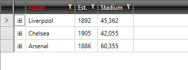

## Environment
<table>
	<tr>
		<td>Product Version</td>
		<td>2021.2.511</td>
	</tr>
	<tr>
		<td>Product</td>
		<td>RadGridView for WPF</td>
	</tr>
</table>

## Description

How to highlight the header cells of a filtered column.

## Solution

To style the header cells of a column after it has been filtered, you can handle the **CollectionChanged** event of RadGridView's **FilterDescriptors** collection.

__Example 1: Subscribe to the CollectionChanged event__

```C#
	this.GridView.FilterDescriptors.CollectionChanged += OnFilterDescriptorsCollectionChanged;
```

In the event handler, you can set the [HeaderCellStyle]() property of the column which was affected by the filtering and remove the style once the filter is cleared.

__Example 2: Handle the CollectionChanged event__

```C#
	private void OnFilterDescriptorsCollectionChanged(object sender, NotifyCollectionChangedEventArgs e)
	{
		switch (e.Action)
		{
			case System.Collections.Specialized.NotifyCollectionChangedAction.Add:
				if (e.NewItems.Count == 1)
				{
					var columnFilterDescriptor = e.NewItems[0] as IColumnFilterDescriptor;
					if (columnFilterDescriptor != null)
					{
						var column = columnFilterDescriptor.Column;
						column.HeaderCellStyle = App.Current.Resources["FilteredHeaderCellStyle"] as Style;
					}
				}
				break;
			case System.Collections.Specialized.NotifyCollectionChangedAction.Remove:
				if (e.OldItems.Count == 1)
				{
					var columnFilterDescriptor = e.OldItems[0] as IColumnFilterDescriptor;
					if (columnFilterDescriptor != null)
					{
						var column = columnFilterDescriptor.Column;
						column.HeaderCellStyle = App.Current.Resources["FilteredHeaderCellStyle"] as Style;
					}
				}
				break;
		}
	}
```

You can then define the **FilteredHeaderCellStyle** in the way you desire to highlight the header cells. **Example 3** demonstrates how to set the **Foreground** of the affected header cell to **Red**.

__Example 3: Define the style for the affected header cells in App.xaml__
```XAML
	<Style x:Key="FilteredHeaderCellStyle" TargetType="telerik:GridViewHeaderCell">
		<Setter Property="Foreground" Value="Red"/>
	</Style>
```

#### Figure 1: The highlighted header cell of the filtered column


