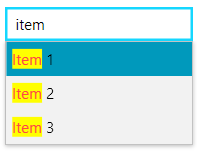

## Environment

<table>
	<tbody>
		<tr>
			<td>Product Version</td>
			<td>2023.3.1011</td>
		</tr>
		<tr>
			<td>Product</td>
			<td>RadHighlightTextBlock for WPF</td>
		</tr>
	</tbody>
</table>

## Description

How to use `RadHighlightTextBlock` in an `RadAutoCompleteBox`.

## Solution

Define a new `DataTemplate` that contains a RadHighlightTextBlock instance and set it to the `DropDownItemTemplate` property of RadAutoCompleteBox. Bind the `Text` property of the RadHighlightTextBlock to the property from the items' model that will be displayed in the RadAutoCompleteBox instance. Bind the `HighlightText` property to the `SearchText` property of RadAutoCompleteBox.

#### __[C#] Define the items' model and the view model__
{{region kb-highlighttextblock-integration-with-radautocompletebox-0}}
    public class ItemInfo
    {
        public string Content { get; set; }
    }

    public class MainViewModel
    {
        public MainViewModel()
        {
            this.ItemInfos = new ObservableCollection<ItemInfo>()
            {
                new ItemInfo() { Content = "Item 1" },
                new ItemInfo() { Content = "Item 2" },
                new ItemInfo() { Content = "Item 3" },
            };
        }

        public ObservableCollection<ItemInfo> ItemInfos { get; set; }
    }
{{endregion}}

#### __[VB.NET] Defining the items' model and the view model__
{{region kb-highlighttextblock-integration-with-radautocompletebox-1}}
    Public Class ItemInfo
        Public Property Content As String
    End Class

    Public Class MainViewModel
        Public Sub New()
            Me.ItemInfos = New ObservableCollection(Of ItemInfo)() From {
                New ItemInfo() With {
                    .Content = "Item 1"
                },
                New ItemInfo() With {
                    .Content = "Item 2"
                },
                New ItemInfo() With {
                    .Content = "Item 3"
                }
            }
        End Sub

        Public Property ItemInfos As ObservableCollection(Of ItemInfo)
    End Class
{{endregion}}

#### __[XAML] Creating a DataTemplate with a RadHighlightTextBlock__
{{region kb-highlighttextblock-integration-with-radautocompletebox-2}}
    <DataTemplate x:Key="HighlightTextBlockDataTemplate">
        <telerik:RadHighlightTextBlock Text="{Binding Content}"
                                       HighlightText="{Binding RelativeSource={RelativeSource   AncestorType=telerik:RadAutoCompleteBox}, Path=SearchText}"/>
    </DataTemplate>
{{endregion}}

#### __[XAML] Set the custom DataTemplate to the DropDownItemTemplate property of RadAutoCompleteBox__
{{region kb-highlighttextblock-integration-with-radautocompletebox-3}}
    <telerik:RadAutoCompleteBox
                         ItemsSource="{Binding ItemInfos}"
                         HorizontalAlignment="Center"
                         Width="150"
                         VerticalAlignment="Center"
                         AutoCompleteMode="Suggest"
                         TextSearchMode="Contains"
                         TextSearchPath="Content"
                         DropDownItemTemplate="{StaticResource HighlightTextBlockDataTemplate}"/>
{{endregion}}

__RadAutoCompleteBox with RadHighlightTextBlock__

