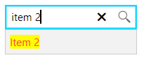

## Environment

<table>
	<tbody>
		<tr>
			<td>Product Version</td>
			<td>2023.3.1011</td>
		</tr>
		<tr>
			<td>Product</td>
			<td>RadHighlightTextBlock for WPF</td>
		</tr>
	</tbody>
</table>

## Description

How to use `RadHighlightTextBlock` in an `RadAutoSuggestBox`.

## Solution

Define a new `DataTemplate` that contains a `RadHighlightTextBlock` instance and set it to the `ItemTemplate` property of RadAutoSuggestBox. Bind the `Text` property of the RadHighlightTextBlock to the property from the items' model that will be displayed in the RadAutoSuggestBox instance. Bind the `HighlightText` property to the `Text` property of RadAutoSuggestBox.

__Define the items' model and the view model__
```C#
	public class ItemInfo
	{
	    public string Content { get; set; }
	}

	public class MainViewModel
	{
	    public MainViewModel()
	    {
	        this.ItemInfos = new ObservableCollection<ItemInfo>()
	        {
	            new ItemInfo() { Content = "Item 1" },
	            new ItemInfo() { Content = "Item 2" },
	            new ItemInfo() { Content = "Item 3" },
	        };
	    }

	    public ObservableCollection<ItemInfo> ItemInfos { get; set; }

	    public ObservableCollection<ItemInfo> GetItemInfosByText(string searchText)
	    {
	        var result = new ObservableCollection<ItemInfo>();
	        var lowerText = searchText.ToLowerInvariant();
	        return new ObservableCollection<ItemInfo>(ItemInfos.Where(x => x.Content.ToLowerInvariant().Contains(lowerText)).ToList());
	    }
	}
```
```VB.NET
	Public Class ItemInfo
	    Public Property Content As String
	End Class

	Public Class MainViewModel
	    Public Sub New()
	        Me.ItemInfos = New ObservableCollection(Of ItemInfo)() From {
	            New ItemInfo() With {
	                .Content = "Item 1"
	            },
	            New ItemInfo() With {
	                .Content = "Item 2"
	            },
	            New ItemInfo() With {
	                .Content = "Item 3"
	            }
	        }
	    End Sub

	    Public Property ItemInfos As ObservableCollection(Of ItemInfo)

	    Public Function GetItemInfosByText(ByVal searchText As String) As ObservableCollection(Of ItemInfo)
	        Dim result = New ObservableCollection(Of ItemInfo)()
	        Dim lowerText = searchText.ToLowerInvariant()
	        Return New ObservableCollection(Of ItemInfo)(ItemInfos.Where(Function(x) x.Content.ToLowerInvariant().Contains(lowerText)).ToList())
	    End Function
	End Class
```

__Creating a DataTemplate with a RadHighlightTextBlock__
```XAML
	<DataTemplate x:Key="HighlightTextBlockDataTemplate">
	    <telerik:RadHighlightTextBlock Text="{Binding Content}"
	                                   HighlightText="{Binding RelativeSource={RelativeSource 	AncestorType=telerik:RadAutoSuggestBox}, Path=Text}"/>
	</DataTemplate>
```

__Set the custom DataTemplate to the ItemTemplate property of RadAutoSuggestBox__
```XAML
	<telerik:RadAutoSuggestBox
	                     ItemsSource="{Binding ItemInfos}"
	                     HorizontalAlignment="Center"
	                     TextChanged="RadAutoSuggestBox_TextChanged"
	                     Width="150"
	                     VerticalAlignment="Center"
	                     TextMemberPath="Content"
	                     ItemTemplate="{StaticResource HighlightTextBlockDataTemplate}"/>
```

__RadAutoSuggestBox with RadHighlightTextBlock__

