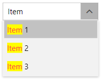

## Environment

<table>
	<tbody>
		<tr>
			<td>Product Version</td>
			<td>2023.3.1011</td>
		</tr>
		<tr>
			<td>Product</td>
			<td>RadHighlightTextBlock for WPF</td>
		</tr>
	</tbody>
</table>

## Description

How to use `RadHighlightTextBlock` in an editable `RadComboBox`.

## Solution

Define a new `DataTemplate` that contains a RadHighlightTextBlock instance and set it to the `ItemTemplate` property of RadComboBox. Bind the `Text` property of the RadHighlightTextBlock to the property from the items' model that will be displayed in the RadComboBox instance. Bind the `HighlightText` property to the `Text` property of RadComboBox.

__Define the items' model and the view model__
```C#
    public class ItemInfo
    {
        public string Content { get; set; }
    }

    public class MainViewModel
    {
        public MainViewModel()
        {
            this.ItemInfos = new ObservableCollection<ItemInfo>()
            {
                new ItemInfo() { Content = "Item 1" },
                new ItemInfo() { Content = "Item 2" },
                new ItemInfo() { Content = "Item 3" },
            };
        }

        public ObservableCollection<ItemInfo> ItemInfos { get; set; }
    }
```
```VB.NET
    Public Class ItemInfo
        Public Property Content As String
    End Class

    Public Class MainViewModel
        Public Sub New()
            Me.ItemInfos = New ObservableCollection(Of ItemInfo)() From {
                New ItemInfo() With {
                    .Content = "Item 1"
                },
                New ItemInfo() With {
                    .Content = "Item 2"
                },
                New ItemInfo() With {
                    .Content = "Item 3"
                }
            }
        End Sub

        Public Property ItemInfos As ObservableCollection(Of ItemInfo)
    End Class
```

__Creating a DataTemplate with a RadHighlightTextBlock__
```XAML
    <DataTemplate x:Key="HighlightTextBlockDataTemplate">
        <telerik:RadHighlightTextBlock Text="{Binding Content}" 
                                       HighlightText="{Binding Path=Text, RelativeSource={RelativeSource    AncestorType=telerik:RadComboBox}, Mode=TwoWay}"/>
    </DataTemplate>
```

__Set the custom DataTemplate to the ItemTemplate property of RadComboBox__
```XAML
    <telerik:RadComboBox IsEditable="True"
                         ItemsSource="{Binding ItemInfos}"
                         telerik:TextSearch.TextPath="Content"
                         ItemTemplate="{StaticResource HighlightTextBlockDataTemplate}"/>
```

__RadComboBox with RadHighlightTextBlock__



>important Integration with the RadHighlightTextBlock control and enabled autocomplete functionality is not supported. If you need highlighting in an autocomplete scenario, you can check the [RadHighlightTextBlock with RadAutoCompleteBox]() and [RadHighlightTextBlock with RadAutoSuggestBox]() articles.