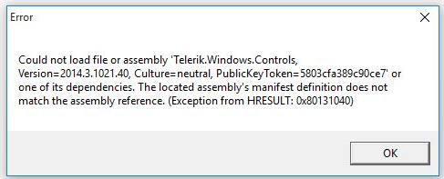

## Environment

<table>
    <tbody>
        <tr>
            <td>Product</td>
            <td>UI for WPF</td>
        </tr>
    </tbody>
</table>

## Description

When running an example from the Telerik UI for WPF Demos application, you may receive an error similar to:

`Could not load file or assembly '...'. The system cannot find the file specified.`

This is usually caused by cached ClickOnce files from a previous demos installation.

## Solution

1. Close the Telerik UI for WPF Demos application.

1. Uninstall the existing demos application.

1. Clear any cached ClickOnce files by deleting the contents of `C:\Users\<your_user>\AppData\Local\Apps\2.0`.

   >important Deleting the contents of this folder removes cache for all ClickOnce applications installed for the current user.

1. Install the latest demos package again from [https://demos.telerik.com/wpf/](https://demos.telerik.com/wpf/).

1. Run the example again.

## See Also

* [Installing WPF Demos Application]()
* [SDK Samples Browser Cannot Be Installed or Crashes]()