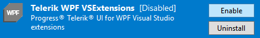

## Environment

<table>
<tbody>
<tr>
<td>Product</td>
<td>Progress Telerik UI for WPF</td>
</tr>
<tr>
<td>Component</td>
<td>Telerik UI for WPF Visual Studio Extensions</td>
</tr>
</tbody>
</table>

## Description

The Telerik menu is missing in Visual Studio.

This usually happens when Telerik UI for WPF extensions are disabled or not installed correctly.

## Solution

### Reason

Progress Telerik UI for WPF extensions are disabled or not installed correctly.

### Solution 1: Extension Is Disabled

1. Open Visual Studio.

1. Go to `Tools -> Extensions and Updates...`.

   For Visual Studio 2019 and later, use `Extensions -> Manage Extensions`.

1. Open the **Installed** tab.

1. Search for **Telerik UI for WPF VSExtensions**.

1. Make sure the extension is **Enabled**.

### Solution 2: Extension Is Not Installed

1. Open Visual Studio.

1. Go to `Tools -> Extensions and Updates...`.

   For Visual Studio 2019 and later, use `Extensions -> Manage Extensions`.

1. Open the **Online** tab.

1. Search for **Telerik UI for WPF VSExtensions**.

1. Download and install the extension.

>important If the steps above do not solve the issue, generate a Visual Studio ActivityLog file before contacting support:
>
>* Open [Developer Command Prompt](https://learn.microsoft.com/en-us/dotnet/framework/tools/developer-command-prompt-for-vs) for Visual Studio as administrator.
>* Run `devenv /log %userprofile%\desktop\ActivityLog.xml`.
>* Reproduce the problem.
>* Attach the generated ActivityLog file when contacting support.

## See Also

* [Visual Studio Extensions Overview]()
* [Installation Options]()
