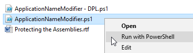
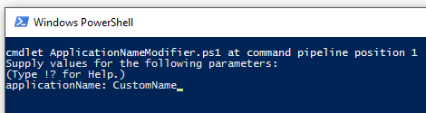

## Environment

<table>
<tbody>
<tr>
<td>Product</td>
<td>Progress Telerik UI for WPF</td>
</tr>
<tr>
<td>Version</td>
<td>Versions prior to 2025 Q2 (2025.2.521)</td>
</tr>
</tbody>
</table>

## Description

How to redistribute Telerik UI for WPF assemblies in versions prior to 2025 Q2 (2025.2.521), including the assembly protection workflow based on Telerik source code.

>important Protecting the Telerik dlls was required with versions prior 2025 Q2 (2025.2.521). With the introduction of the new licensing mechanism, Telerik UI for WPF has simplified deployment requirements. Starting with 2025 Q2, users are no longer required to protect the Telerik assemblies using the methods described below. Instead, the product now requires you to [install a license key](). Applications without a valid license will continue to function normally, but will display a warning dialog and a watermark.

## Solution

In some special cases, the Telerik dlls (in version prior 2025 Q) needs to be protected before redistributing to the end user. 

### Examples of Permitted Uses

* WPF applications for internal company use.

* Commercial WPF applications deployed to your end users. In this case, you may deploy the Telerik assemblies together with your application with the sole exception of the assemblies providing the additional design-time support for the Telerik controls. The design-time assemblies may not be deployed to end-users under any circumstance.

    The design-time assemblies are located in the `Telerik UI for WPF installation folder/Binaries/WPF40/design` folder.

    >tip The location of the design-time assemblies may vary depending on the Xaml or NoXaml binaries usage and also the .NET version of the control dlls. For example, the [NoXaml](), .NET 4.6.2 design-time assemblies are located in `Telerik UI for WPF installation folder/Binaries.NoXaml/WPF462/design`.

* WPF applications that offer a trial or free version of your application. If offering a free or trial version of your integrated product, redistribution of the assemblies is not permitted. You are required to protect all Telerik assemblies by using the method in the Protecting Telerik UI Assemblies section below.

### Protecting Telerik UI Assemblies

Technical guidelines for protecting Telerik UI for WPF binaries when redistributed with other applications.

There are two approaches:

* Use the PowerShell scripts.
* Manually edit the source code.

### Protect the Telerik Assemblies Using the PowerShell Scripts

Telerik UI source code provides two PowerShell scripts that allow you to apply the modifications needed to protect the Telerik assemblies without opening and editing files manually. The scripts are located in the `Build\BuildInstructions\AssemblyProtection` folder of the suite source code, which can be downloaded as explained in [Download Product Files]().

The available scripts are:

* `ApplicationNameModifier.ps1`: Uncomments the `ValidatePassPhrase()` method call and changes `ApplicationName` in `Core\Controls\Common\AssemblyProtection.cs`.

* `ApplicationNameModifier - DPL.ps1`: Uncomments the `ValidatePassPhrase()` method call and changes `ApplicationName` in `Documents\Licensing\AssemblyProtection.cs`.

#### Instructions

1. Right-click on the needed script and run it with PowerShell.

    

1. Enter the new `ApplicationName` when prompted.

    

1. Rebuild Telerik UI assemblies using one of the build approaches explained in the source build instructions (located in the `Build\BuildInstructions` folder).

1. In your application resources (`App.xaml`), create a string resource with key `Telerik.Windows.Controls.Key` and value equal to the `ApplicationName` value from step 2.

```xaml
<Application
    xmlns="http://schemas.microsoft.com/winfx/2006/xaml/presentation"
    xmlns:x="http://schemas.microsoft.com/winfx/2006/xaml"
    xmlns:system="clr-namespace:System;assembly=mscorlib"
    x:Class="...">
    <Application.Resources>
        <system:String x:Key="Telerik.Windows.Controls.Key">Sample Application Name v2.0 (tm)</system:String>
    </Application.Resources>
</Application>
```

### Protect the Telerik Assemblies by Manually Editing the Source Code

#### Prerequisites

All control assemblies should be built from source code due to modifications applied to the source files. The source code of UI for WPF is distributed separately and is bundled with build instructions. Read the source code build instructions beforehand. For brevity, this document assumes that the source distribution ZIP file is extracted in `C:\TelerikWPFSource`.

#### Instructions

1. Open `C:\TelerikWPFSource\Core\Controls\Common\AssemblyProtection.cs` in a text editor.

1. Uncomment the following line:

```csharp
public static void Validate()
{
    //Uncomment the following line
    //ValidatePassPhrase();
}
```

Change it to:

```csharp
public static void Validate()
{
    //Uncomment the following line
    ValidatePassPhrase();
}
```

1. Change the `ApplicationName` constant to match the name of your application:

```csharp
internal const string ApplicationName = "MyApp";
```

Change it to:

```csharp
internal const string ApplicationName = "Sample Application Name v2.0 (tm)";
```

1. Save `AssemblyProtection.cs` and rebuild the suite (described in source code build instructions).

1. In your application, replace existing Telerik assembly references with the ones built from source code.

1. If you run the application now, you should get an exception with a message like: `This version of Telerik UI for WPF is licensed only for use by Sample Application Name v2.0 (tm)`.

1. In your application resources (`App.xaml`), create a string resource with key `Telerik.Windows.Controls.Key` and value equal to the `ApplicationName` value from step 3.

```xaml
<Application
    xmlns="http://schemas.microsoft.com/winfx/2006/xaml/presentation"
    xmlns:x="http://schemas.microsoft.com/winfx/2006/xaml"
    xmlns:system="clr-namespace:System;assembly=mscorlib"
    x:Class="...">
    <Application.Resources>
        <system:String x:Key="Telerik.Windows.Controls.Key">Sample Application Name v2.0 (tm)</system:String>
    </Application.Resources>
</Application>
```

### Protect the Telerik Documents Assemblies by Editing the Source Code

The previous section explains how to build `Telerik.Windows.Controls` and the assemblies depending on it. The UI for WPF suite contains libraries for processing documents that do not depend on `Telerik.Windows.Controls.dll`.

If you are building assemblies needed for components depending on `Telerik.Windows.Documents.Core`, such as [Telerik Document Processing](https://docs.telerik.com/devtools/document-processing/introduction), execute the following steps as well.

>important The following instructions are valid for Telerik UI for WPF version Q2 2014 or later.

1. Open `C:\TelerikDocumentsProcessingSource\Documents\Licensing\AssemblyProtection.cs` in a text editor.

   >note In versions prior to R2 2016, the path is `C:\TelerikDocumentsProcessingSource\Documents\Core\Core\Licensing\AssemblyProtection.cs`.

1. Uncomment the following line:

```csharp
public static bool IsValid()
{
    // Uncomment the following line
    // return ValidatePassPhrase();
    return true;
}
```

Change it to:

```csharp
public static bool IsValid()
{
    // Uncomment the following line
    return ValidatePassPhrase();
}
```

1. Execute steps 3-7 from the previous section.

### Building the Source Code After Assembly Protection Code Changes

After enabling assembly protection by modifying the code as shown above, rebuild Telerik UI for WPF source code. The produced dlls can be redistributed with the final product. To see how to rebuild source code properly, check the following documents in [the source code ZIP file](https://www.telerik.com/account/product-download?product=RCWPF):

* `C:\Telerik UI for WPF Source Code\Build\BuildInstructions\Source Code Build Instructions for .NET Framework (4.6.2).rtf`
* `C:\Telerik UI for WPF Source Code\Build\BuildInstructions\Source Code Build Instructions for .NET.rtf`

## See Also

* [Installation Options]()
* [Installing License Key]()
* [Download Product Files]()