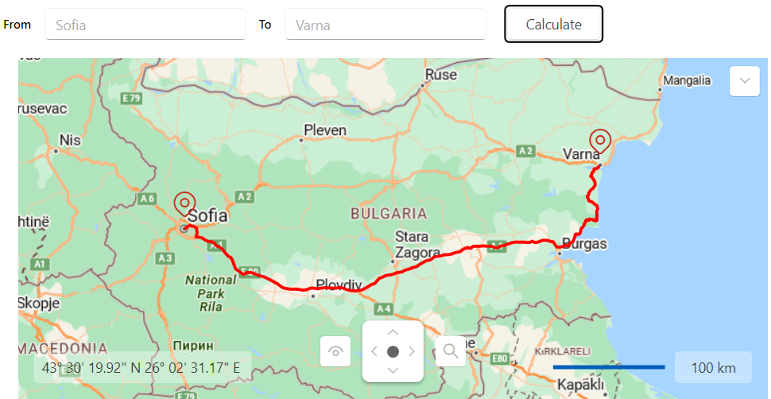

## Environment
<table>
	<tbody>
		<tr>
			<td>Product Version</td>
			<td>2025.1.211</td>
		</tr>
		<tr>
			<td>Product</td>
			<td>RadMap for WPF</td>
		</tr>
	</tbody>
</table>

## Description

Implementing routing functionality using the Azure Maps services.

## Solution

To achieve routing functionality using the Azure Maps services, you can create a new helper class. It will create a URL request for the Microsoft's routing and geocoding APIs and use the response to display the route on the RadMap control. In order to receive valid responses from the routing and geocoding APIs, you will need to pass a valid location and subscription key to the request URL string.

#### __[C#] Implementing a helper class for retrieving the route__
{{region kb-map-azuremapprovider-routing-0}}
    internal class AzureRoutingHelper
    {
        private static HttpClient httpClient = new HttpClient();

        internal static async Task<RouteInfo> GetRouteDirections(string startAddress, string endAddress)
        {
            var start = await GetGeoCode(startAddress);
            var end = await GetGeoCode(endAddress);

            return await GetRouteDirections(start, end);
        }

        internal static async Task<RouteInfo> GetRouteDirections(Location start, Location end)
        {
            var requestUrl = $"https://atlas.microsoft.com/route/directions/json?api-version=1.0&query={start}:{end}&instructionsType=text& subscription-key={Your Subscription Key}";

            var response = await httpClient.GetAsync(requestUrl);
            response.EnsureSuccessStatusCode();

            var jsonContent = await response.Content.ReadAsStringAsync();
            var options = new JsonSerializerOptions
            {
                PropertyNamingPolicy = JsonNamingPolicy.CamelCase,
                PropertyNameCaseInsensitive = true
            };

            var routeData = JsonSerializer.Deserialize<RouteResponse>(jsonContent, options);

            var firstLeg = routeData.Routes[0].Legs[0];
            var routeInfo = new RouteInfo() { Points = firstLeg.Points.Select(p => new Location(p.Latitude, p.Longitude)).ToList() };

            return routeInfo;
        }

        internal async static Task<Location> GetGeoCode(string location)
        {
            var requestUrl = $"https://atlas.microsoft.com/geocode?api-version=2025-01-01&query={location}&subscription-key={Your Subscription Key}";

            var response = await httpClient.GetAsync(requestUrl);
            response.EnsureSuccessStatusCode();

            var jsonContent = await response.Content.ReadAsStringAsync();
            var options = new JsonSerializerOptions
            {
                PropertyNamingPolicy = JsonNamingPolicy.CamelCase,
                PropertyNameCaseInsensitive = true
            };

            var featureCollection = JsonSerializer.Deserialize<FeatureCollection>(jsonContent, options);

            var firstCoordinates = featureCollection.Features.First().Geometry.Coordinates;
            return new Location(firstCoordinates[1], firstCoordinates[0]);
        }
    }

    public class FeatureCollection
    {
        public List<Feature> Features { get; set; }
    }

    public class Feature
    {
        public Geometry Geometry { get; set; }
    }

    public class Geometry
    {
        public List<double> Coordinates { get; set; }
    }

    public class RouteInfo
    {
        public List<Location> Points { get; set; }
    }

    public class RouteResponse
    {
        public List<Route> Routes { get; set; }
    }

    public class Route
    {
        public List<RouteLeg> Legs { get; set; }
    }

    public class RouteLeg
    {
        public List<RoutePoint> Points { get; set; }
    }

    public class RoutePoint
    {
        public double Latitude { get; set; }
        public double Longitude { get; set; }
    }
{{endregion}}

#### __[VB.NET] Implementing a helper class for retrieving the route__
{{region kb-map-azuremapprovider-routing-1}}
    Friend Class AzureRoutingHelper
        Private Shared httpClient As HttpClient = New HttpClient()

        Friend Shared Async Function GetRouteDirections(ByVal startAddress As String, ByVal endAddress As String) As Task(Of RouteInfo)
            Dim start = Await GetGeoCode(startAddress)
            Dim [end] = Await GetGeoCode(endAddress)
            Return Await GetRouteDirections(start, [end])
        End Function

        Friend Shared Async Function GetRouteDirections(ByVal start As Location, ByVal [end] As Location) As Task(Of RouteInfo)
            Dim requestUrl = $"https://atlas.microsoft.com/route/directions/json?api-version=1.0&query={start}:{[end]}&instructionsType=text&   subscription-key={Your Subscription Key}"
            Dim response = Await httpClient.GetAsync(requestUrl)
            response.EnsureSuccessStatusCode()
            Dim jsonContent = Await response.Content.ReadAsStringAsync()
            Dim options = New JsonSerializerOptions With {
                .PropertyNamingPolicy = JsonNamingPolicy.CamelCase,
                .PropertyNameCaseInsensitive = True
            }
            Dim routeData = JsonSerializer.Deserialize(Of RouteResponse)(jsonContent, options)
            Dim firstLeg = routeData.Routes(0).Legs(0)
            Dim routeInfo = New RouteInfo() With {
                .Points = firstLeg.Points.[Select](Function(p) New Location(p.Latitude, p.Longitude)).ToList()
            }
            Return routeInfo
        End Function

        Friend Async Shared Function GetGeoCode(ByVal location As String) As Task(Of Location)
            Dim requestUrl = $"https://atlas.microsoft.com/geocode?api-version=2025-01-01&query={location}&subscription-key={Your Subscription Key}"
            Dim response = Await httpClient.GetAsync(requestUrl)
            response.EnsureSuccessStatusCode()
            Dim jsonContent = Await response.Content.ReadAsStringAsync()
            Dim options = New JsonSerializerOptions With {
                .PropertyNamingPolicy = JsonNamingPolicy.CamelCase,
                .PropertyNameCaseInsensitive = True
            }
            Dim featureCollection = JsonSerializer.Deserialize(Of FeatureCollection)(jsonContent, options)
            Dim firstCoordinates = featureCollection.Features.First().Geometry.Coordinates
            Return New Location(firstCoordinates(1), firstCoordinates(0))
        End Function
    End Class

    Public Class FeatureCollection
        Public Property Features As List(Of Feature)
    End Class

    Public Class Feature
        Public Property Geometry As Geometry
    End Class

    Public Class Geometry
        Public Property Coordinates As List(Of Double)
    End Class

    Public Class RouteInfo
        Public Property Points As List(Of Location)
    End Class

    Public Class RouteResponse
        Public Property Routes As List(Of Route)
    End Class

    Public Class Route
        Public Property Legs As List(Of RouteLeg)
    End Class

    Public Class RouteLeg
        Public Property Points As List(Of RoutePoint)
    End Class

    Public Class RoutePoint
        Public Property Latitude As Double
        Public Property Longitude As Double
    End Class
{{endregion}}

Additionally, you can follow the next example, which showcases how to utilize the created `AzureRoutingHelper` class and its logic.

#### __[XAML] Defining the RadMap and the UI elements for the routing logic__
{{region kb-map-azuremapprovider-routing-2}}
<Grid x:Name="LayoutRoot" Margin="8">
    <Grid.RowDefinitions>
        <RowDefinition Height="Auto"/>
        <RowDefinition/>
    </Grid.RowDefinitions>

    <Grid.ColumnDefinitions>
        <ColumnDefinition Width="Auto"/>
        <ColumnDefinition Width="*"/>
    </Grid.ColumnDefinitions>

    <StackPanel Orientation="Horizontal" Grid.ColumnSpan="2" Margin="0 0 0 15">
        <TextBlock Text="From" FontWeight="SemiBold" VerticalAlignment="Center"/>
        <telerik:RadWatermarkTextBox x:Name="SourceTextBox"
                 Text="Sofia"
                 Width="210"
                 Margin="10 0 0 0"/>
        <TextBlock Text="To" FontWeight="SemiBold" VerticalAlignment="Center" Margin="10 0 0 0"/>
        <telerik:RadWatermarkTextBox x:Name="DestinationTextBox"
                 Text="Varna" 
                 Width="210"
                 Margin="10 0 0 0"/>
        <telerik:RadButton Content="Calculate"
                Width="100"
                Margin="15 0 0 0"
                Click="CalculateRouteButtonClicked"/>
    </StackPanel>

    <telerik:RadMap x:Name="RadMap" Grid.Row="1" Grid.Column="1" MinZoomLevel="3" Margin="15 0 0 0">
        <telerik:RadMap.Provider>
            <telerik:AzureMapProvider SubscriptionKey="Your Subscription Key"/>
        </telerik:RadMap.Provider>
        <telerik:VisualizationLayer x:Name="RouteLayer" />
    </telerik:RadMap>
</Grid>
{{endregion}}

#### __[C#] Utilizing the AzureRoutingHelper class__
{{region kb-map-azuremapprovider-routing-3}}
    public partial class MainWindow : Window
    {
        public MainWindow()
        {
            StyleManager.ApplicationTheme = new Windows11Theme();

            InitializeComponent();
        }

        private void CalculateRouteButtonClicked(object sender, RoutedEventArgs e)
        {
            this.FindRoute();
        }

        private async void FindRoute()
        {
            this.RouteLayer.Items.Clear();

            var start = this.SourceTextBox.Text;
            var end = this.DestinationTextBox.Text;

            RouteInfo routeInfo = null;
            try
            {
                routeInfo = await AzureRoutingHelper.GetRouteDirections(start, end);
            }
            catch (Exception ex)
            {
                MessageBox.Show("Please, update the start or end location!", "Route calculation error.", MessageBoxButton.OK);
                return;
            }

            if (routeInfo != null)
            {
                PolylineData routeLine = this.CreateNewPolyline(routeInfo.Points, Colors.Red, 3);

                this.RouteLayer.Items.Clear();
                this.RouteLayer.Items.Add(routeInfo.Points[0]);
                this.RouteLayer.Items.Add(routeInfo.Points[routeInfo.Points.Count - 1]);

                this.RouteLayer.Items.Add(routeLine);
            }

            var bestView = this.RouteLayer.GetBestView(this.RouteLayer.Items as IEnumerable<object>);
            this.RadMap.SetView(bestView);
        }

        private PolylineData CreateNewPolyline(IEnumerable<Location> directionPoints, Color color, double thickness)
        {
            PolylineData routeLine = new PolylineData()
            {
                ShapeFill = new MapShapeFill()
                {
                    Stroke = new SolidColorBrush(color),
                    StrokeThickness = thickness
                },
                Points = new LocationCollection(),
            };

            foreach (var point in directionPoints)
            {
                routeLine.Points.Add(point);
            }

            return routeLine;
        }
    }
{{endregion}}

#### __[VB.NET] Utilizing the AzureRoutingHelper class__
{{region kb-map-azuremapprovider-routing-4}}
    Public Partial Class MainWindow
        Inherits Window

        Public Sub New()
            StyleManager.ApplicationTheme = New Windows11Theme()
            InitializeComponent()
        End Sub

        Private Sub CalculateRouteButtonClicked(ByVal sender As Object, ByVal e As RoutedEventArgs)
            Me.FindRoute()
        End Sub

        Private Async Sub FindRoute()
            Me.RouteLayer.Items.Clear()
            Dim start = Me.SourceTextBox.Text
            Dim [end] = Me.DestinationTextBox.Text
            Dim routeInfo As RouteInfo = Nothing

            Try
                routeInfo = Await AzureRoutingHelper.GetRouteDirections(start, [end])
            Catch ex As Exception
                MessageBox.Show("Please, update the start or end location!", "Route calculation error.", MessageBoxButton.OK)
                Return
            End Try

            If routeInfo IsNot Nothing Then
                Dim routeLine As PolylineData = Me.CreateNewPolyline(routeInfo.Points, Colors.Red, 3)
                Me.RouteLayer.Items.Clear()
                Me.RouteLayer.Items.Add(routeInfo.Points(0))
                Me.RouteLayer.Items.Add(routeInfo.Points(routeInfo.Points.Count - 1))
                Me.RouteLayer.Items.Add(routeLine)
            End If

            Dim bestView = Me.RouteLayer.GetBestView(TryCast(Me.RouteLayer.Items, IEnumerable(Of Object)))
            Me.RadMap.SetView(bestView)
        End Sub

        Private Function CreateNewPolyline(ByVal directionPoints As IEnumerable(Of Location), ByVal color As Color, ByVal thickness As Double) As PolylineData
            Dim routeLine As PolylineData = New PolylineData() With {
                .ShapeFill = New MapShapeFill() With {
                    .Stroke = New SolidColorBrush(color),
                    .StrokeThickness = thickness
                },
                .Points = New LocationCollection()
            }

            For Each point In directionPoints
                routeLine.Points.Add(point)
            Next

            Return routeLine
        End Function
    End Class
{{endregion}}

__RadMap with AzureMapProvider and routing functionality__

>tip For a more in-depth example of an Azure Maps services routing, check the __Routing__ demo from our [Demos application]().