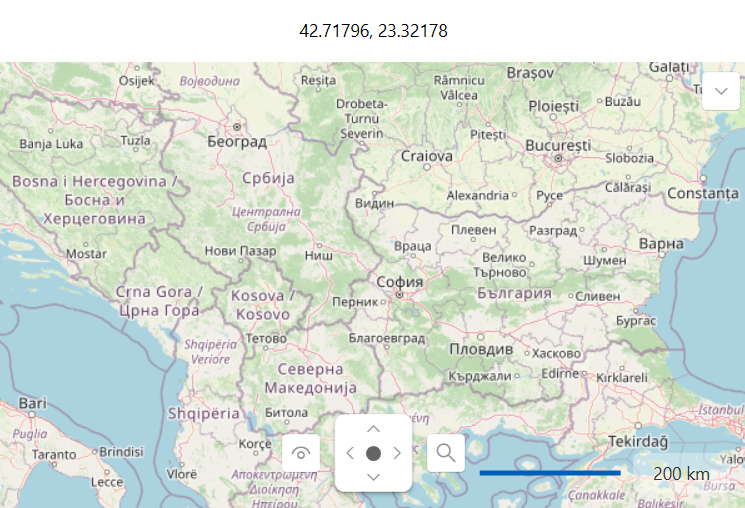

## Environment
<table>
	<tbody>
		<tr>
			<td>Product Version</td>
			<td>2025.3.815</td>
		</tr>
		<tr>
			<td>Product</td>
			<td>RadMap for WPF</td>
		</tr>
	</tbody>
</table>

## Description

Format the text that is displayed by the `MapMouseLocationIndicator` control.

## Solution

To format the text, extend the MapMouseLocationIndicator class to define a `TextBlock` property, which will call the `GetTemplateChild` method with parameter __"PART_TextBlock"__, and override the `OnMapInitialize` method. In it, you can format the text, as well as subscribe to the `MouseMove` event of the `RadMap` control that comes as a parameter, in which you can format the `TextBlock` each time the mouse moves.

#### __[C#] Extending the MapMouseLocationIndicator class to customize the format__
{{region kb-map-format-the-text-of-the-mapmouselocationindicator-0}}
    public class CustomMapMouseLocationIndicator : MapMouseLocationIndicator
    {
    	private const string IndicatorTextBlockPartName = "PART_TextBlock";
        private TextBlock IndicatorTextBlock
        {
            get
            {
                return this.GetTemplateChild(IndicatorTextBlockPartName) as TextBlock;
            }
        }

        protected override void OnMapInitialize(RadMap oldMapControl, RadMap newMapControl)
        {
            if (oldMapControl != null)
            {
                oldMapControl.MouseMove -= new MouseEventHandler(this.MapControl_MouseMove);
            }

            if (newMapControl != null)
            {
                newMapControl.MouseMove += new MouseEventHandler(this.MapControl_MouseMove);
                if (this.IndicatorTextBlock != null)
                {
                    this.IndicatorTextBlock.Text = this.LocationToString(newMapControl.Center);
                }
            }
        }

        private void MapControl_MouseMove(object sender, MouseEventArgs e)
        {
            Location mouse = Location.GetCoordinates(this.MapControl, e.GetPosition(this.MapControl));
            if (this.IndicatorTextBlock != null)
            {
                this.IndicatorTextBlock.Text = this.LocationToString(mouse);
            }
        }

        private string LocationToString(Location location)
        {
            string locationStr = string.Empty;

            switch (this.LocationFormat)
            {
                case LocationFormat.Geographical:
                    LocationDegrees degrees = new LocationDegrees(location);
                    locationStr = degrees.ToString();
                    break;

                case LocationFormat.Number:
                    locationStr = $"{location.Latitude:n5}, {location.Longitude:n5}";
                    break;
            }

            return locationStr;
        }
    }
{{endregion}}

#### __[XAML] Using the extended MapMouseLocationIndicator class__
{{region kb-map-format-the-text-of-the-mapmouselocationindicator-1}}
<Grid>
    <Grid.RowDefinitions>
        <RowDefinition Height="Auto"/>
        <RowDefinition Height="*"/>
    </Grid.RowDefinitions>
    <local:CustomMapMouseLocationIndicator MapControl="{Binding ElementName=radMap}" 
                                           LocationFormat="Number" 
                                           HorizontalAlignment="Center" 
                                           IndicatorLabelBackground="White" 
                                           IndicatorLabelBorderBrush="Black" 
                                           Foreground="Black" />
    <telerik:RadMap x:Name="radMap"
                    Grid.Row="1"
                    MouseLocationIndicatorVisibility="Collapsed">
        <telerik:RadMap.Providers>
            <telerik:OpenStreetMapProvider APIKey="your-api-key" StandardModeUserAgent="user-agent"/>
        </telerik:RadMap.Providers>
    </telerik:RadMap>
{{endregion}}

>important If you are using the __NoXaml__ version of our assemblies, you need to create a new `Style` that targets the `CustomMapMouseLocationIndicator` type. Then, it needs to be based via the `BasedOn` property on the default `Style` for the `MapMouseLocationIndicator` type, which has an __x:Key="MapMouseLocationIndicatorStyle"__.

__MapMouseLocationIndicator with formatted text__

