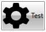

## Environment
<table>
	<tr>
		<td>Product</td>
		<td>RadButtons for WPF</td>
	</tr>
</table>


## Description

How to bind the __PathGeometry__ property of a RadPathButton to a glyph.

## Solution

Create a custom [IValueConverter](https://docs.microsoft.com/en-us/dotnet/api/system.windows.data.ivalueconverter?view=netframework-4.7.2) that returns a geometry based on a glyph string and set it to the __Converter__ property of the __PathGeometry__ binding.


```C#
	public partial class MainWindow : Window
    {
        public MainWindow()
        {
            InitializeComponent();

            this.DataContext = this;
        }

        public string Glyph
        {
            get { return "&#xe13a;"; }
        }
    }

    public class StringToGeometryConverter : IValueConverter
    {
        public object Convert(object value, Type targetType, object parameter, CultureInfo culture)
        {
            return RadGlyph.GetGeometry(this.GetGlyph(value.ToString()), "TelerikWebUI");
        }
        private string GetGlyph(string hexCode)
        {
            string glyphInt = hexCode.Substring(3, 4);
            var character = (char)int.Parse(glyphInt, NumberStyles.HexNumber);
            return character.ToString();
        }
        
        public object ConvertBack(object value, Type targetType, object parameter, System.Globalization.CultureInfo culture)
        {
            return null;
        }
    }
``` 


```XAML
	<Grid>
        <Grid.Resources>
            <local:StringToGeometryConverter x:Key="StringToGeometryConverter" />
        </Grid.Resources>
        <telerik:RadPathButton  PathGeometry="{Binding Glyph, Converter={StaticResource StringToGeometryConverter}}" Width="75" Height="50" Content="Test" ContentPlacement="Right" />
    </Grid>
```



> The "local" namespace refers to the namespace, where the StringToGeometryConverter is defined.

## See Also

* [RadGlyph]()
