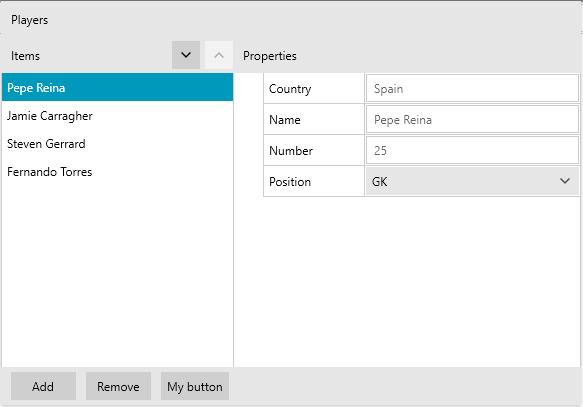

## Environment
<table>
	<tr>
		<td>Product</td>
		<td>RadPropertyGrid for WPF</td>
	</tr>
</table>


## Description

How to updade the visual representation of the CollectionEditor control.

## Solution

[Extract and edit]() its ControlTemplate, modify it so that it suits your needs and apply it through a style targeting __CollectionEditor__. __Example 1__ demonstrates how an additional button can be added to the template. 

__Example 1: Modifying the CollectionEditor ControlTemplate in the Fluent theme__
```XAML
	 <Application.Resources>
        <ResourceDictionary>
            <ControlTemplate x:Key="CollectionEditor_Template" TargetType="telerik:CollectionEditor">
                <Border x:Name="PART_RootBorder"
                Height="{Binding RelativeSource={RelativeSource TemplatedParent}, Mode=TwoWay, Path=Height}"
                Width="{Binding RelativeSource={RelativeSource TemplatedParent}, Mode=TwoWay, Path=Width}"
                BorderBrush="{TemplateBinding BorderBrush}"
                BorderThickness="{TemplateBinding BorderThickness}"
                Background="{TemplateBinding Background}">
                    <Grid Background="Transparent">
                        <Grid.RowDefinitions>
                            <RowDefinition Height="auto"/>
                            <RowDefinition Height="*"/>
                            <RowDefinition Height="auto"/>
                        </Grid.RowDefinitions>
                        <Grid.ColumnDefinitions>
                            <ColumnDefinition Width="2*"/>
                            <ColumnDefinition Width="3*"/>
                        </Grid.ColumnDefinitions>
                        <Border x:Name="Header"
                        MinHeight="36"
                        Grid.ColumnSpan="2"
                        Visibility="{Binding Header, RelativeSource={RelativeSource TemplatedParent}, Converter={StaticResource DescriptionVisibilityConverter}}"
                        Background="{telerik:FluentResource ResourceKey=MainBrush}">
                            <ContentControl
                            Margin="{TemplateBinding Padding}"
                            Content="{TemplateBinding Header}"
                            VerticalAlignment="{TemplateBinding VerticalContentAlignment}"
                            HorizontalAlignment="{TemplateBinding VerticalContentAlignment}"/>
                        </Border>
                        <Grid Grid.Row="1">
                            <Grid.RowDefinitions>
                                <RowDefinition Height="Auto"/>
                                <RowDefinition Height="*"/>
                            </Grid.RowDefinitions>
                            <Border Background="{telerik:FluentResource ResourceKey=MainBrush}" MinHeight="36">
                                <Grid MaxHeight="36">
                                    <TextBlock telerik:LocalizationManager.ResourceKey="CollectionEditorItems" VerticalAlignment="Center" Margin="{TemplateBinding Padding}"/>
                                    <StackPanel Orientation="Horizontal" HorizontalAlignment="Right">
                                        <telerik:RadButton x:Name="moveDownButton"
                                        IsEnabled="{TemplateBinding IsEnabled}"
                                        telerik:TouchManager.TouchMode="None"
                                        Command="{x:Static telerik:CollectionEditorCommands.MoveCurrentToNext}"
                                        MinWidth="28"
                                        MinHeight="28"
                                        Margin="0 0 5 0"
                                        Padding="0"
                                        HorizontalAlignment="Center"
                                        VerticalAlignment="Center">
                                            <telerik:RadGlyph FontSize="16" HorizontalAlignment="Center" VerticalAlignment="Center" Glyph="{StaticResource GlyphArrowChevronDown}"/>
                                        </telerik:RadButton>
                                        <telerik:RadButton x:Name="moveUpButton"
                                        IsEnabled="{TemplateBinding IsEnabled}"
                                        telerik:TouchManager.TouchMode="None"
                                        Command="{x:Static telerik:CollectionEditorCommands.MoveCurrentToPrevious}"
                                        MinWidth="28"
                                        MinHeight="28"
                                        Padding="0"
                                        HorizontalAlignment="Center"
                                        VerticalAlignment="Center">
                                            <telerik:RadGlyph FontSize="16" HorizontalAlignment="Center" VerticalAlignment="Center" Glyph="{StaticResource GlyphArrowChevronUp}"/>
                                        </telerik:RadButton>
                                    </StackPanel>
                                </Grid>
                            </Border>
                            <ListBox x:Name="PART_CollectionListBox"
                            Grid.Row="1"
                            ItemTemplate="{TemplateBinding ItemTemplate}"
                            IsEnabled="{TemplateBinding IsEnabled}"
                            BorderBrush="{TemplateBinding BorderBrush}"
                            BorderThickness="1 0 0 0"
                            Background="{TemplateBinding Background}"
                            ItemsSource="{TemplateBinding CollectionView}"
                            SelectedItem="{Binding RelativeSource={RelativeSource Mode=TemplatedParent}, Path=CurrentItem, Mode=TwoWay}"/>
                        </Grid>
                        <Grid Grid.Row="1" Grid.Column="2">
                            <Grid.RowDefinitions>
                                <RowDefinition Height="Auto"/>
                                <RowDefinition/>
                            </Grid.RowDefinitions>
                            <Border Background="{telerik:FluentResource ResourceKey=MainBrush}" MinHeight="36" MaxHeight="36">
                                <TextBlock telerik:LocalizationManager.ResourceKey="CollectionEditorProperties" VerticalAlignment="Center" Margin="{TemplateBinding Padding}"/>
                            </Border>
                            <telerik:RadPropertyGrid
                            Grid.Row="1"
                            BorderThickness="1 0"
                            IsReadOnly="{TemplateBinding IsReadOnly}"
                            IsEnabled="{TemplateBinding IsEnabled}"
                            Item="{TemplateBinding CurrentItem}"
                            BorderBrush="{TemplateBinding BorderBrush}"
                            LabelColumnWidth="100"
                            SortAndGroupButtonsVisibility="Collapsed"
                            SearchBoxVisibility="Collapsed"
                            DescriptionPanelVisibility="Collapsed"/>
                        </Grid>
                        <Border x:Name="FooterPanel_Background"
                        BorderBrush="{TemplateBinding BorderBrush}"
                        Grid.Row="2"
                        BorderThickness="0"
                        Grid.ColumnSpan="2"
                        Background="{telerik:FluentResource ResourceKey=MainBrush}">
                            <Grid>
                                <StackPanel Orientation="Horizontal" HorizontalAlignment="Left" Margin="0 5">
                                    <telerik:RadButton
                                    IsEnabled="{TemplateBinding IsEnabled}"
                                    telerik:TouchManager.TouchMode="None"
                                    MinWidth="65"
                                    telerik:LocalizationManager.ResourceKey="CollectionEditorAdd"
                                    Command="{x:Static telerik:CollectionEditorCommands.AddNew}"
                                    Margin="10 0"/>
                                    <telerik:RadButton
                                    IsEnabled="{TemplateBinding IsEnabled}"
                                    telerik:TouchManager.TouchMode="None"
                                    MinWidth="65"
                                    telerik:LocalizationManager.ResourceKey="CollectionEditorRemove"
                                    Command="{x:Static telerik:CollectionEditorCommands.Delete}"/>

                                    <!-- Custom button-->
                                    <telerik:RadButton 
                                    IsEnabled="{TemplateBinding IsEnabled}"
                                    telerik:TouchManager.TouchMode="None"
                                    MinWidth="65"
                                    Margin="10 0"
                                    Content="My button"/>
                                </StackPanel>
                                <Thumb x:Name="PART_ResizeThumb" Style="{StaticResource CollectionEditorGripperStyle}" Visibility="{TemplateBinding ResizeGripperVisibility}"/>
                            </Grid>
                        </Border>
                    </Grid>
                </Border>
            </ControlTemplate>
            <Style TargetType="telerik:CollectionEditor" BasedOn="{StaticResource CollectionEditorStyle}">
                <Setter Property="Template" Value="{StaticResource CollectionEditor_Template}"/>
            </Style>
        </ResourceDictionary>
    </Application.Resources>
``` 

#### __Figure 1: CollectionEditor with modified ControlTemplate in the Fluent theme__


>If you are using a different theme, make sure to exract and edit the ControlTemplate for the corresponding theme. 

## See Also

* [CollectionEditors]()
