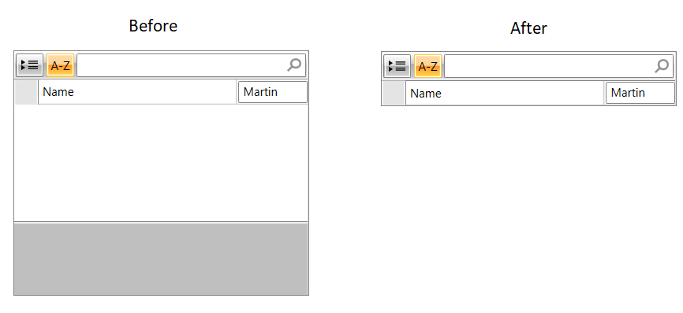

## Environment

<table>
	<tr>
		<td>Product Version</td>
		<td>2019.1.220</td>
	</tr>
	<tr>
		<td>Product</td>
		<td>RadPropertyGrid for WPF</td>
	</tr>
</table>

## Description

How to remove the white space when there is more space than displayed properties.

How to remove the gray area at the bottom of the control.

## Solution

To remove the white space, set the __VerticalAlignment__ of RadPropertyGrid to __Top__.

To remove the gray space, set the __DescriptionPanelVisibility__ property to __Collapsed__.


```XAML
	<telerik:RadPropertyGrid DescriptionPanelVisibility="Collapsed"  VerticalAlignment="Top" />
```

