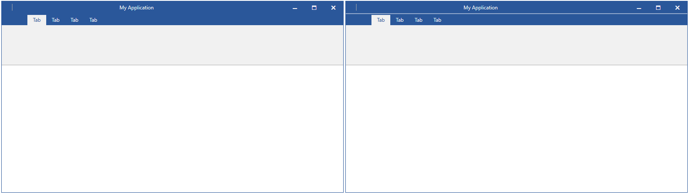

## Environment
<table>
	<tr>
		<td>Product Version</td>
		<td>2021.2.615</td>
	</tr>
	<tr>
		<td>Product</td>
		<td>RadRibbonView for WPF</td>
	</tr>
</table>

## Description

How to add a separator between the title and the ribbon of the RadRibbonWindow.

## Solution

To customize RadRibbonView in order to separate its title from the tabs, follow the next few steps:

1. Extract the default ControlTemplate for the theme of your choice by following the instructions of the **Extracting Control Templates Manually from the Theme XAML File** section of the [Editing Control Templates](  article.
2. In the extracted ControlTemplate look for the element with x:Name="**RibbonTitleBarPanel**". 
3. Add a Rectangle or Border with the thickness and colors of your choice.
4. Add a trigger that will show the above separator element (Rectangle/Border) when the RibbonView is hosted in a RadRibbonWindow.

Refer to the following code snippet with the Office2016 theme applied to the control:


```XAML
	<ControlTemplate x:Key="RadRibbonViewTemplate" TargetType="telerik:RadRibbonView">
		<Grid x:Name="RootPanel">
			<!-- Omitted code... -->

			<Grid x:Name="TopGrid">
				<!-- Omitted code... -->

				<telerikRibbonViewPrimitives:RibbonTitleBarPanel x:Name="RibbonTitleBarPanel" Grid.ColumnSpan="3" Visibility="{TemplateBinding TitleBarVisibility}">

					<!-- Omitted code... -->

				</telerikRibbonViewPrimitives:RibbonTitleBarPanel>

				<!-- The new separator -->
				<Rectangle x:Name="TitleBarSeparator" Grid.Row="1" Grid.ColumnSpan="3" VerticalAlignment="Top" Height="2" Fill="#80FFFFFF" Visibility="Collapsed"/>

				<!-- Omitted code... -->
			</Grid>
			<!-- Omitted code... -->
		</Grid>
		<ControlTemplate.Triggers>
			<!-- Omitted code... -->

			<!-- The trigger for the newly added TitleBarSeparator -->
			<MultiDataTrigger>
				<MultiDataTrigger.Conditions>
					<Condition Binding="{Binding RelativeSource={RelativeSource Self}, Path=IsHostedInRibbonWindow, FallbackValue=False}" Value="True" />
					<Condition Binding="{Binding RelativeSource={RelativeSource AncestorType=telerikRibbonView:RadRibbonWindow}, Path=IsWindowsThemeEnabled}" Value="False" />
					<Condition Binding="{Binding RelativeSource={RelativeSource AncestorType=telerikRibbonView:RadRibbonWindow}, Path=IsTitleVisible}" Value="False" />
				</MultiDataTrigger.Conditions>
				<Setter TargetName="TitleBarSeparator" Property="Visibility" Value="Visible" />
			</MultiDataTrigger>
		</ControlTemplate.Triggers>
	</ControlTemplate>

	<Style TargetType="telerik:RadRibbonView" BasedOn="{StaticResource RadRibbonViewStyle}">
		<Setter Property="Template" Value="{StaticResource RadRibbonViewTemplate}" />
	</Style>
```



## See Also
* [RibbonView Getting Started]()
* [Ribbon Window]()
* [Editing Control Templates]()
* [Setting a Theme]()

