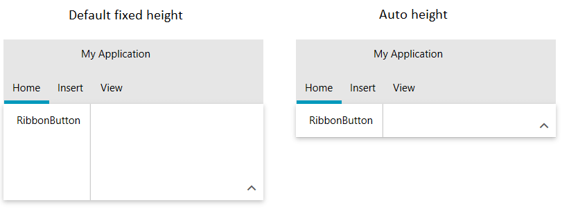

## Environment
<table>
	<tr>
		<td>Product Version</td>
		<td>2019.1.116</td>
	</tr>
	<tr>
		<td>Product</td>
		<td>RadRibbonView for WPF</td>
	</tr>
</table>

## Description

How to autofit the content area of RadRibbonView to the elements in the selected tab.

## Solution

To make the content height stretch based on the size of the elements in the selected tab, you can set the ContentHeight property of RadRibbonView to double.NaN.


```XAML
    <telerik:RadRibbonView ContentHeight="NaN" />
```


```C#
     this.radRibbonView.ContentHeight = double.NaN;
```



## See Also
* [Getting Started]()
* [Controlling Appearance]()
