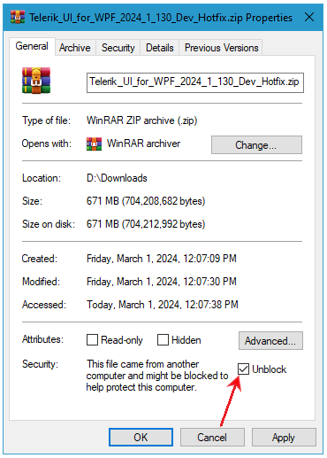

## Environment

<table>
	<tr>
		<td>Product Version</td>
		<td>2024.1.130</td>
	</tr>
	<tr>
		<td>Product</td>
		<td>RadRichTextBox for WPF</td>
	</tr>
</table>

## Description

The browser may sometimes block the .zip file that contains our assemblies when downloaded from your Telerik account. This is because your browser deems the site as untrusted and blocks the archive file, in order to protect your computer. If the assemblies are blocked, the MEF support will not be generated, which can lead to different errors. One such error can be raised when saving/loading the document via the RadRibbonViewUI control. The exception that is raised is of the type of UnsupportedFormatException.

## Solution

The first solution will be to download the .zip archive from your Telerik account that contains the assemblies and unblock it. To do so, right click on the archive, open the __Properties__ pane and navigate to the __General__ tab. Locate the __Unblock__ check box and click it and then press the __OK__ button.

The second solution will be to mark the site as trusted in your browser's settings. This way, future downloads of the .zip files will not result in blocked assemblies by the browser.