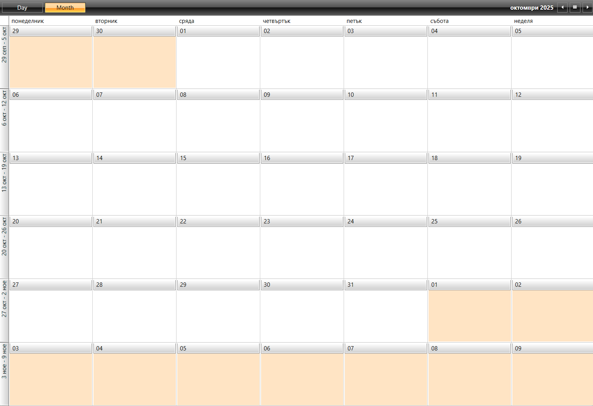

## Environment

|Product Version|Product|Author|
|----|----|----|
|2026.1.210|RadScheduleView for WPF|[Dinko Krastev](https://www.telerik.com/blogs/author/dinko-krastev)|

## Description

In this tutorial we will demonstrate how to customize the MonthView in the ScheduleView for UI for WPF to visually highlight the days belonging to the current month.

 

## Solution

To highlight the days of the current month in the MonthView, follow these steps:

1. Use the `TimeRulerItemStyleSelector` to style `TimeRulerItems`. For the MonthView, the style items are `TimeRulerMonthViewItemStyle`. Refer to the [Styling the TimeRulerItems](https://www.telerik.com/products/wpf/documentation/controls/radscheduleview/styles-and-templates/styling-timeruleritems) documentation.

2. Extract the default template of the `TimeRulerMonthViewItem`. Refer to the [Editing Control Templates](https://www.telerik.com/products/wpf/documentation/styling-and-appearance/styling-apperance-editing-control-templates) documentation for steps to extract the template.

3. Modify the template by setting the `Background` property of the first Grid that wraps the content.

4. Implement an `IMultiValueConverter` to determine which items belong to the current month. Pass necessary values to the converter for comparison.

### Example

Here is an example implementation using an `IMultiValueConverter`:

1. Use TimeRulerItemStyleSelector.

```XAML
<telerik:OrientedTimeRulerItemStyleSelector x:Key="TimeRulerItemStyleSelector"
	MonthViewGroupStyle="{StaticResource TimeRulerMonthViewGroupItemStyle}"
	MonthViewTickStyle="{StaticResource CustomTimeRulerMonthViewItemStyle}"
	MonthViewTodayTickStyle="{StaticResource TimeRulerMonthViewTodayItemStyle}"
	HorizontalGroupItemStyle="{StaticResource TimeRulerGroupItemStyle}"
	VerticalGroupItemStyle="{StaticResource TimeRulerGroupItemStyle_Vertical}"
	MajorHorizontalTickStyle="{StaticResource MajorHorizontalTimeRulerItemStyle}"
	MajorVerticalTickStyle="{StaticResource MajorVerticalTimeRulerItemStyle}"
	MinorHorizontalTickStyle="{StaticResource MinorHorizontalTimeRulerItemStyle}"
	MinorVerticalTickStyle="{StaticResource MinorVerticalTimeRulerItemStyle}"
	HorizontalLineStyle="{StaticResource TimeRulerLineStyle}"
	VerticalLineStyle="{StaticResource TimeRulerLineStyle}">
</telerik:OrientedTimeRulerItemStyleSelector>
```

2. Extract and modify the default template of the `TimeRulerMonthViewItem`.
```XAML
<local:DateMultiValueConverter x:Key="DateMultiValueConverter" />

<Style x:Key="CustomTimeRulerMonthViewItemStyle" TargetType="telerik:TimeRulerMonthViewItem">
    <Setter Property="Template">
        <Setter.Value>
            <ControlTemplate TargetType="telerik:TimeRulerMonthViewItem">
                <Grid Margin="2">
                    <Grid.Background>
                        <MultiBinding Converter="{StaticResource DateMultiValueConverter}">
                            <Binding RelativeSource="{RelativeSource TemplatedParent}" Path="Content"/>
                            <Binding Path="."/>
                            <Binding RelativeSource="{RelativeSource TemplatedParent}" Path="Content.DateTime.Date"/>
                        </MultiBinding>
                    </Grid.Background>
                    <telerik:RadButton
                    Padding="0"
                    VerticalAlignment="Top"
                    Height="21"
                    AutomationProperties.Name="{Binding RelativeSource={RelativeSource TemplatedParent}, Path=Content.DateTime.Date}"
                    Style="{StaticResource GoToDayButtonStyle}"
                    Command="{x:Static telerik:RadScheduleViewCommands.SetDayViewMode}"
                    CommandParameter="{Binding RelativeSource={RelativeSource TemplatedParent}, Path=Content.DateTime.Date}">
                        <ContentPresenter  Margin="{TemplateBinding Padding}"/>
                    </telerik:RadButton>
                    <telerik:RadToggleButton
                    Visibility="{Binding ExpandButtonVisibility}"
                    AutomationProperties.Name="{Binding RelativeSource={RelativeSource TemplatedParent}, Path=Content.DateTime.Date}"
                    IsChecked="{Binding IsExpanded, Mode=TwoWay}"
                    Style="{StaticResource ExpandMonthViewButtonStyle}"
                    HorizontalAlignment="Right"
                    VerticalAlignment="Bottom"/>
                </Grid>
            </ControlTemplate>
        </Setter.Value>
    </Setter>
</Style>

```

3. Implement an `IMultiValueConverter`.

```C#

public class DateMultiValueConverter : IMultiValueConverter
{
    public object Convert(object[] values, Type targetType, object parameter, CultureInfo culture)
    {
        var itemProxy = values[0] as TimerRulerItemProxy;
        var groupHeader = values[1] as GroupHeader;
        var scheduleView = groupHeader.ParentOfType<RadScheduleView>();
        if (scheduleView != null)
        {
            var currentMonth = scheduleView.CurrentDate.Month;
            if (itemProxy.DateTime.Month != currentMonth)
            {
                return new SolidColorBrush(Colors.Bisque); ;
            }
        }

        return new SolidColorBrush(Colors.Transparent);
    }

    public object[] ConvertBack(object value, Type[] targetTypes, object parameter, CultureInfo culture)
    {
        throw new NotImplementedException();
    }
}

```

## See Also

* [Styling the TimeRulerItems](https://www.telerik.com/products/wpf/documentation/controls/radscheduleview/styles-and-templates/styling-timeruleritems)
* [Editing Control Templates](https://www.telerik.com/products/wpf/documentation/styling-and-appearance/styling-apperance-editing-control-templates)
* [RadScheduleView Overview](https://www.telerik.com/products/wpf/documentation/controls/radscheduleview/overview)