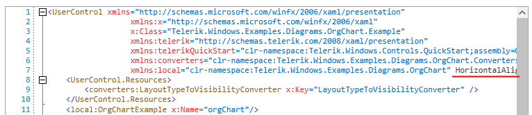
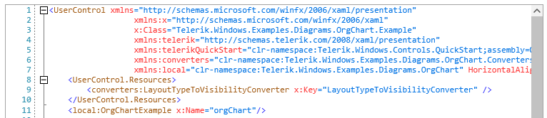

## Environment
<table>
    <tbody>
	    <tr>
	    	<td>Product Version</td>
	    	<td>2021.1.223</td>
	    </tr>
	    <tr>
	    	<td>Product</td>
	    	<td>RadSyntaxEditor for WPF</td>
	    </tr>
    </tbody>
</table>

## Description

The code highlighting is incorrect when scrolling the RadSyntaxEditor control horizontally.

## Solution

If the width of a given line is longer than that of the viewport of the RadSyntaxEditor control, by default, only the portion of the line which is in the viewport will be processed by the [taggers]() of the control.

This can lead to incorrect highlighting in some cases as can be observed on **Figure 1**. 

#### Figure 1: Incorrect XAML highlighting



If you want to ensure that highlighting is correct in all scenarios, you need to set the **ShouldTaggersProcessEntireLines** property to **True**.

__Example 1: Make RadSyntaxEditor process the entire lines__
```C#
    <telerik:RadSyntaxEditor ShouldTaggersProcessEntireLines="True" />
```

#### Figure 2: Correct XAML highlighting



## See Also

* [Taggers]()
* [Custom Tagger]()