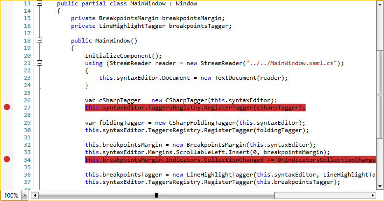

## Environment
<table>
    <tbody>
	    <tr>
	    	<td>Product Version</td>
	    	<td>2020.3.1130</td>
	    </tr>
	    <tr>
	    	<td>Product</td>
	    	<td>RadSyntaxEditor for WPF</td>
	    </tr>
    </tbody>
</table>

## Description

Make it possible to add breakpoints to the RadSyntaxEditor control.

## Solution

**1.** Create a custom **IndicatorsMargin&lt;Ellipse&gt;** to hold the breakpoints collection as shown in **Example 1**.

__Example 1: Creating a Custom IndicatorsMargin__
```C#

    public class BreakpointsMargin : IndicatorsMargin<Ellipse>
    {
        public BreakpointsMargin(RadSyntaxEditor syntaxEditor)
            : base(syntaxEditor)
        {
            this.IndicatorBrush = new SolidColorBrush(Color.FromArgb(255, 210, 47, 47));
        }

        protected override void UpdateIndicator(Ellipse ellipse, int lineNumber)
        {
            if (ellipse.Width != this.Editor.EditorFontSize)
            {
                ellipse.Width = this.Editor.EditorFontSize;
            }

            if (ellipse.Height != this.Editor.EditorFontSize)
            {
                ellipse.Height = this.Editor.EditorFontSize;
            }

            if (ellipse.Fill != this.IndicatorBrush)
            {
                ellipse.Fill = this.IndicatorBrush;
            }
        }
    }
```

**2.** Add a BreakpointsMargin instance to the **Margins** collection of the control, register a **LineHighlightTagger** in the **TaggersRegistry** of the RadSyntaxEditor and define an appropriate **TextFormatDefinition**.

__Example 2: Registering the LineHighlightTagger__
```C#

    public partial class MainWindow : Window
    {
        private BreakpointsMargin breakpointsMargin;
        private LineHighlightTagger breakpointsTagger;

        public MainWindow()
        {
            InitializeComponent(); 
            using (StreamReader reader = new StreamReader("../../MainWindow.xaml.cs"))
            {
                this.syntaxEditor.Document = new TextDocument(reader);
            }

            var cSharpTagger = new CSharpTagger(this.syntaxEditor);
            this.syntaxEditor.TaggersRegistry.RegisterTagger(cSharpTagger);

            var foldingTagger = new CSharpFoldingTagger(this.syntaxEditor);
            this.syntaxEditor.TaggersRegistry.RegisterTagger(foldingTagger);

            this.breakpointsMargin = new BreakpointsMargin(this.syntaxEditor);
            this.syntaxEditor.Margins.ScrollableLeft.Insert(0, breakpointsMargin);
            this.breakpointsMargin.Indicators.CollectionChanged += OnIndicatorsCollectionChanged;

            this.breakpointsTagger = new LineHighlightTagger(this.syntaxEditor, LineHighlightTagger.LineHighlightFormatDefinition);
            this.syntaxEditor.TaggersRegistry.RegisterTagger(this.breakpointsTagger);

            var breakpointBrush = this.breakpointsMargin.IndicatorBrush;
            this.syntaxEditor.TextFormatDefinitions.AddLast(LineHighlightTagger.LineHighlightFormatDefinition,
     new TextFormatDefinition(null, breakpointBrush, null, new Pen(breakpointBrush, 2)));
        }

        private void OnIndicatorsCollectionChanged(object sender, System.Collections.Specialized.NotifyCollectionChangedEventArgs e)
        {
            this.breakpointsTagger.HighlightLines(this.breakpointsMargin.Indicators);
        }
    }
```

#### __Figure 1: RadSyntaxEditor with breakpoints__


## See Also

* [Margins]()
* [Taggers]()
