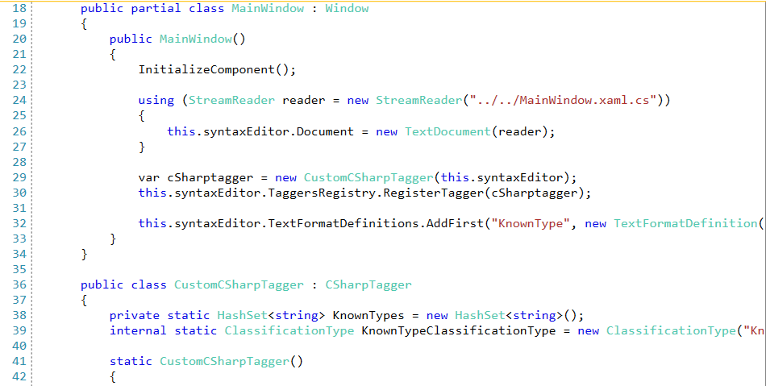

## Environment
<table>
    <tbody>
	    <tr>
	    	<td>Product Version</td>
	    	<td>2020.3.1020</td>
	    </tr>
	    <tr>
	    	<td>Product</td>
	    	<td>RadSyntaxEditor for WPF</td>
	    </tr>
    </tbody>
</table>

## Description

Change the foreground of the class names in a C# file displayed in the __RadSyntaxEditor__. 

## Solution

1. Create a custom __CSharpTagger__, introduce some logic to collect the names of the types from the needed assemblies and override the __TryGetClassificationType__ method to classify the known types. 

__Example 1: Creating a Custom CSharpTagger__
```C#

    public class CustomCSharpTagger : CSharpTagger
    {
        private static HashSet<string> KnownTypes = new HashSet<string>();
        internal static ClassificationType KnownTypeClassificationType = new ClassificationType("KnownType");

        static CustomCSharpTagger()
        {
            CollectKnownTypes(Assembly.GetExecutingAssembly());
            CollectKnownTypes(typeof(RadSyntaxEditor).Assembly);
            CollectKnownTypes(typeof(ClassificationType).Assembly);
            CollectKnownTypes(typeof(Window).Assembly);
            CollectKnownTypes(typeof(SolidColorBrush).Assembly);
            CollectKnownTypes(typeof(HashSet<>).Assembly);
            CollectKnownTypes(typeof(Assembly).Assembly);
        }

        public CustomCSharpTagger(Telerik.Windows.Controls.RadSyntaxEditor editor) : base(editor)
        {
        }

        protected override bool TryGetClassificationType(string word, out ClassificationType classificationType)
        {
            if (!base.TryGetClassificationType(word, out classificationType))
            {
                if (KnownTypes.Contains(word))
                {
                    classificationType = KnownTypeClassificationType;
                    return true;
                }
                else
                {
                    return false;
                }
            }
            else
            {
                return true;
            }
        }

        protected override IList<string> SplitIntoWords(string value)
        {
            var words = base.SplitIntoWords(value);
            
            foreach (var knownType in KnownTypes)
            {
                this.ClearKeywordsInCallChain(words, knownType);
            }

            return words;
        }

        private void ClearKeywordsInCallChain(IList<string> words, string wordToCheck)
        {
            string[] wordsCopy = new string[words.Count];
            words.CopyTo(wordsCopy, 0);

            for (int i = 0; i < wordsCopy.Length; i++)
            {
                var word = wordsCopy[i];
                if (i > 0 && word == wordToCheck && wordsCopy[i - 1].EndsWith("."))
                {
                    words.RemoveAt(i);
                }
            }
        }

        private static void CollectKnownTypes(Assembly assembly)
        {
            var coreTypes = assembly.GetExportedTypes().OrderBy(t => t.Name).ToList();
            foreach (var item in coreTypes)
            {
                KnownTypes.Add(item.Name);

                if (item.Name.EndsWith("`1"))
                {
                    KnownTypes.Add(item.Name.Replace("`1", string.Empty));
                }
            }
        }
    }
```

2. Register the custom tagger in the TaggersRegistry of the RadSyntaxEditor and define the TextFormatDefinition. 

__Example 2: Registering the Custom CSharpTagger__
```C#

	public partial class MainWindow : Window
    {
        public MainWindow()
        {
            InitializeComponent();

            using (StreamReader reader = new StreamReader("../../MainWindow.xaml.cs"))
            {
                this.syntaxEditor.Document = new TextDocument(reader);
            }

            var cSharptagger = new CustomCSharpTagger(this.syntaxEditor);
            this.syntaxEditor.TaggersRegistry.RegisterTagger(cSharptagger);

            this.syntaxEditor.TextFormatDefinitions.AddFirst("KnownType", new TextFormatDefinition(new SolidColorBrush(Color.FromRgb(78, 201, 176))));
        }
    }
```

#### __Figure 1: Csharp File With Colorized Class Names__


## See Also

* [Getting Started]()
* [Custom Regex Language]()
* [Custom Tagger]()
