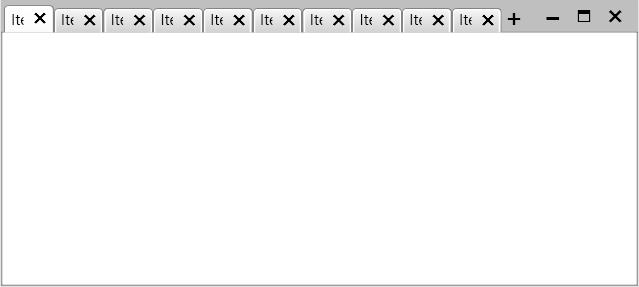

## Environment
<table>
    <tbody>
	    <tr>
	    	<td>Product Version</td>
	    	<td>2019.2.618</td>
	    </tr>
	    <tr>
	    	<td>Product</td>
	    	<td>RadTabbedWindow for WPF</td>
	    </tr>
    </tbody>
</table>

## Description

How to auto size the RadTabItem headers in RadTabbedWindow, instead of showing a scrollbar.

## Solution

Change the the default ItemsPanel of RadTabbedWindow to __TabStripPanel__. You can do this in the Loaded event handler of RadTabbedWindow.


```XAML
	<Window.Resources>
		<ItemsPanelTemplate x:Key="tabControlPanel">            
			<primitives:TabStripPanel />
		</ItemsPanelTemplate>
	</Window.Resources>
```

Where __primitives__ points to `xmlns:primitives="clr-namespace:Telerik.Windows.Controls.Primitives;assembly=Telerik.Windows.Controls.Navigation"`


```C#
	private void OpenTabbedWindow()
	{
		var tabbedWindow = new RadTabbedWindow();
		tabbedWindow.Width = 600;
		tabbedWindow.Height = 400;
		tabbedWindow.Loaded += OnRadTabbedWindowLoaded;            
		tabbedWindow.ItemsPanel = (ItemsPanelTemplate)this.Resources["tabControlPanel"];
		for (int i = 0; i < 10; i++)
		{
			tabbedWindow.Items.Add(new RadTabItem() { Header = "Item " + i, MaxWidth = 100 });
		}
		tabbedWindow.Show();            
	}

	private void OnRadTabbedWindowLoaded(object sender, RoutedEventArgs e)
	{
		var tabbedWindow = (RadTabbedWindow)sender;
		var childTabControl = tabbedWindow.FindChildByType<RadTabControl>();
		childTabControl.OverflowMode = TabOverflowMode.Wrap;
	}
```

