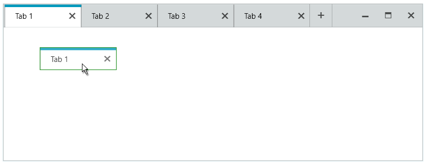

## Environment
<table>
    <tbody>
	    <tr>
	    	<td>Product Version</td>
	    	<td>2019.2.618</td>
	    </tr>
	    <tr>
	    	<td>Product</td>
	    	<td>RadTabbedWindow for WPF</td>
	    </tr>
    </tbody>
</table>

## Description

How to add a border around the drag visual of the tab item dragged out of RadTabbedWindow.

## Solution

1. Subscribe the RadTabbedWindow to the DragDropManager's __DragInitialize__ event.

2. In the event handler, get the DragVisual from the event arguments and set its __Stroke__ and __StrokeThickness__ properties.


```C#
	public partial class MainWindow : RadTabbedWindow
	{
		public MainWindow()
		{
			InitializeComponent();
			DragDropManager.AddDragInitializeHandler(this, OnDragIn, true);            
		}

		private void OnDragIn(object sender, DragInitializeEventArgs e)
		{
			var defaultDragVisual = (Rectangle)e.DragVisual;
			defaultDragVisual.Stroke = Brushes.Green;
			defaultDragVisual.StrokeThickness = 1;         
		}
	}
```



## See Also
* [DragDropManager]()
