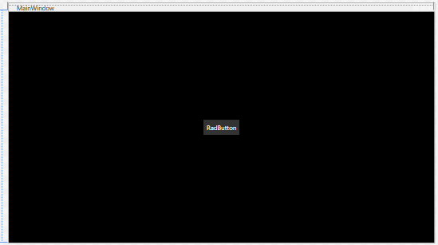

## Environment
<table>
	<tbody>
		<tr>
			<td>Product Version</td>
			<td>2023.3.1114</td>
		</tr>
		<tr>
			<td>Product</td>
			<td>Telerik UI for WPF</td>
		</tr>
	</tbody>
</table>

## Description

How to set a theme's color variation in Visual Studio's designer.

## Solution

Visual Studio will run code for designer use if you have enabled the __Project Code__ setting in the designer. 

To change the color variation of the theme at design-time, create a new UserControl that will contain the controls or a custom control. In in its static constructor, call the `LoadPreset` method of the palette of the chosen theme.

#### __[XAML] MainWindow displaying a custom UserControl__
{{region kb-themes-set-color-variation-design-time-0}}
	<Window x:Class="MyApplication.MainWindow"
	        xmlns="http://schemas.microsoft.com/winfx/2006/xaml/presentation"
	        xmlns:x="http://schemas.microsoft.com/winfx/2006/xaml"
	        xmlns:d="http://schemas.microsoft.com/expression/blend/2008"
	        xmlns:mc="http://schemas.openxmlformats.org/markup-compatibility/2006"
	        xmlns:local="clr-namespace:DesignTimeThemeVariationTest"
	        mc:Ignorable="d"
	        Title="MainWindow" Height="450" Width="800">
	    <Grid Background="Black">
	        <local:MyUserControl/>
	    </Grid>
	</Window>
{{endregion}}

#### __[XAML] Custom UserControl__
{{region kb-themes-set-color-variation-design-time-1}}
	<UserControl x:Class="MyApplication.MyUserControl"
	             xmlns="http://schemas.microsoft.com/winfx/2006/xaml/presentation"
	             xmlns:x="http://schemas.microsoft.com/winfx/2006/xaml"
	             xmlns:mc="http://schemas.openxmlformats.org/markup-compatibility/2006" 
	             xmlns:d="http://schemas.microsoft.com/expression/blend/2008" 
	             xmlns:local="clr-namespace:DesignTimeThemeVariationTest" xmlns:telerik="http://schemas.telerik.com/2008/xaml/presentation"
	             mc:Ignorable="d" 
	             d:DesignHeight="450" d:DesignWidth="800">
	    <Grid>
	        <telerik:RadButton HorizontalAlignment="Center" VerticalAlignment="Center" 	Content="RadButton"/>
	    </Grid>
	</UserControl>
{{endregion}}

#### __[C#] Setting the theme's color variation in the static constructor of the custom UserControl__
{{region kb-themes-set-color-variation-design-time-2}}
	public partial class MyUserControl : UserControl
	{
	    static MyUserControl()
	    {
	        FluentPalette.LoadPreset(FluentPalette.ColorVariation.Dark);
	    }

	    public MyUserControl()
	    {
	        InitializeComponent();
	    }
	}
{{endregion}}

#### __[VB.NET] Setting the theme's color variation in the static constructor of the custom UserControl__
{{region kb-themes-set-color-variation-design-time-3}}
	Public Partial Class MyUserControl
	    Inherits UserControl

	    Private Shared Sub New()
	        FluentPalette.LoadPreset(FluentPalette.ColorVariation.Dark)
	    End Sub

	    Public Sub New()
	        InitializeComponent()
	    End Sub
	End Class
{{endregion}}

__Designer with the Dark color variation of the Fluent theme__

Clean, rebuild and run the project before reloading the designer for the changes to take effect.

>important Setting the theme's color variation in the static constructor of MainWindow will not be reflected in the designer as it is not called at design-time.

## See Also
* [Available Themes]()
