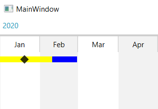

## Environment
<table>
	<tr>
		<td>Product</td>
		<td>RadTimeline for WPF</td>
	</tr>
</table>

## Description

How to manipulate the ZIndex of items that are shown in the same row in a RadTimeLine. 

## Solution

Set the __Panel.ZIndex__ attached property of the ContentPresenter elements that hold the TimelineItemControl and TimelineInstantItemControl. To demonstrate this we are going to define a class that will hold sample data.

__Example 1: Defining a model__
```C#

	public class TimelineData
    {
        public DateTime Date { get; set; }
        public TimeSpan Time { get; set; }
        public Brush Background { get; set; }
        public int ZIndex { get; set; }
    }
```

We will also define a custom RowIndexGenerator to show all items in the same row. 

__Example 2: Defining a RowIndexGenerator__
```C#

	public class RowIndexGenerator : IItemRowIndexGenerator
    {
        public void GenerateRowIndexes(List<TimelineRowItem> dataItems)
        {
            foreach (var item in dataItems)
            {
                item.RowIndex = 0;
            }
        }
    }
```

The custom logic for setting the __Panel.ZIndex__ to the ZIndex property of the model will be in a separate class.

__Example 3: Defining a RowIndexGenerator__
```C#

    public class TimelineUtilities
    {
        public static int GetTimelineItemZIndex(DependencyObject obj)
        {
            return (int)obj.GetValue(TimelineItemZIndexProperty);
        }

        public static void SetTimelineItemZIndex(DependencyObject obj, int value)
        {
            obj.SetValue(TimelineItemZIndexProperty, value);
        }

        public static readonly DependencyProperty TimelineItemZIndexProperty =
            DependencyProperty.RegisterAttached(
                "TimelineItemZIndex",
                typeof(int), 
                typeof(TimelineUtilities), 
                new PropertyMetadata(0, OnTimelineItemZIndexChanged));

        private static void OnTimelineItemZIndexChanged(DependencyObject d, DependencyPropertyChangedEventArgs e)
        {
            var item = (TimelineItemControlBase)d;
            var presenter = item.ParentOfType<ContentPresenter>();
            if (presenter != null)
            {
                Panel.SetZIndex(presenter, (int)e.NewValue);
            }
        }
    }
```

What is left to setup up the code behind and xaml of our MainWindow.

__Example 4: Creating a collection of TimelineData objects and setting their ZIndex__
```C#

    public MainWindow()
    {
        InitializeComponent();

        var source = new List<TimelineData>()
        {
            new TimelineData() { Date = new DateTime(2020, 1, 20), ZIndex =  2},

            new TimelineData() { Date = new DateTime(2020, 1, 1), Time = TimeSpan.FromDays(40), ZIndex = 1, Background = Brushes.Yellow },
            new TimelineData() { Date = new DateTime(2020, 1, 20), Time = TimeSpan.FromDays(40), Background = Brushes.Blue,
        };
        this.DataContext = source;
    }
```

The attached behavior will be added to the items through styles targeting the TimelineItemControl and TimelineInstantItemControl.

__Example 5: Defining the RadTimeLine__
```XAML

    <telerik:RadTimeline PeriodStart="2020-01-01"
                            PeriodEnd="2021-01-01"
                            StartPath="Date"
                            DurationPath="Time"
                            ItemsSource="{Binding}">
        <telerik:RadTimeline.Resources>
            <Style TargetType="telerik:TimelineItemControl">
                <Setter Property="example:TimelineUtilities.TimelineItemZIndex" Value="{Binding DataItem.ZIndex}" />
                <Setter Property="Background" Value="{Binding DataItem.Background}" />
            </Style>
            <Style TargetType="telerik:TimelineInstantItemControl">
                <Setter Property="example:TimelineUtilities.TimelineItemZIndex" Value="{Binding DataItem.ZIndex}" />
            </Style>
        </telerik:RadTimeline.Resources>
        <telerik:RadTimeline.ItemRowIndexGenerator>
            <example:RowIndexGenerator />
        </telerik:RadTimeline.ItemRowIndexGenerator>
        <telerik:RadTimeline.Intervals>
            <telerik:DayInterval />
            <telerik:WeekInterval />
            <telerik:MonthInterval />
            <telerik:YearInterval />
        </telerik:RadTimeline.Intervals>
    </telerik:RadTimeline>
```

#### __Figure 1: Result from Example 5__


## See Also

* [RowIndexGenerator](#using-item-rowindex-generators)