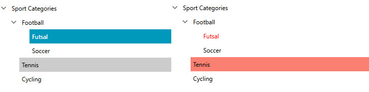

## Environment
<table>
	<tbody>
		<tr>
			<td>Product Version</td>
			<td>2020.1.302</td>
		</tr>
		<tr>
			<td>Product</td>
			<td>RadTreeView for WPF</td>
		</tr>
	</tbody>
</table>

## Description

How to remove or change the selection and highlight appearance of the RadTreeViewItems.

## Solution

To change the appearance of the TreeView items when they are selected or hovered, you need to [extract and modify the control template]() of the **RadTreeViewItem** element. 

Once you've extracted the respective template for the required theme(s), you need to find the needed triggers or visual states (depending on the theme) which are responsible for the selected and/or hovered state of the items.

Here's an example of how to apply such a modification in the Fluent theme:


```XAML
	<!-- IsSelected general setters -->
	<Trigger Property="IsSelected" Value="True">
		<Setter TargetName="Header" Property="Foreground" Value="Red"/>
		<Setter Property="mat:MaterialAssist.MouseOverBrush" Value="{telerik1:FluentResource ResourceKey=AccentMouseOverBrush}"/>
		<Setter TargetName="BorderVisual" Property="Background" Value="Transparent"/>
	</Trigger>

	<!-- Hovered -->
	<Trigger Property="IsMouseOver" Value="True" SourceName="HeaderRow">
		<Setter TargetName="BorderVisual" Property="Background" Value="Salmon"/>
	</Trigger>
```

Note that we've changed the **Background** of the **BorderVisual** element to **Transparent** for the selected state and to **Salmon** for the hovered state. The **Foreground** of the **Header** is also changed to **Red** for the selected state.

The figure below shows the appearance of the items after this modification is applied.



## See Also
* [Editing Control Templates]()
* [Styling the RadTreeViewItem]()
