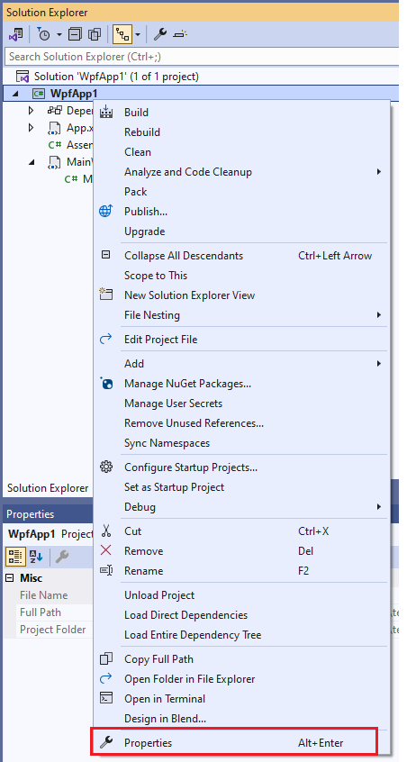
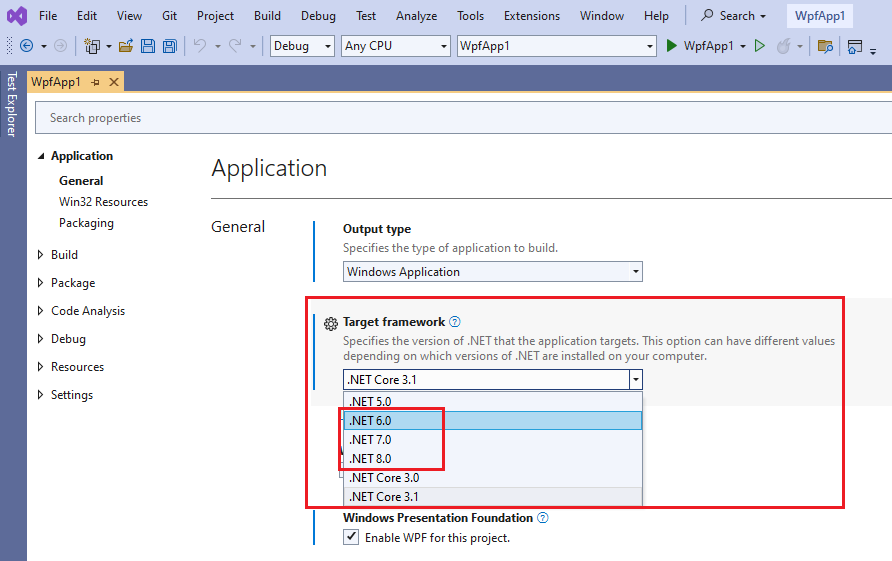
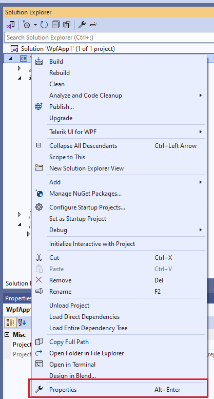
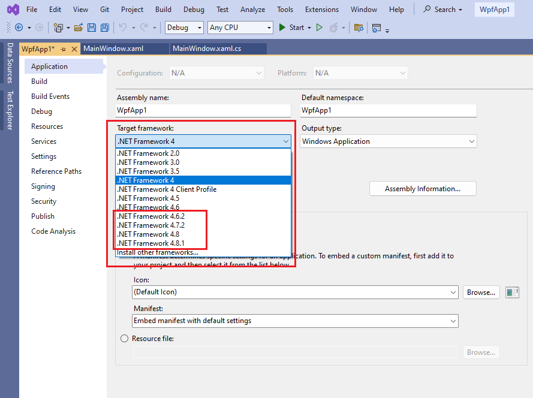

## Environment

<table>
	<tbody>
		<tr>
			<td>Product</td>
			<td>UI for WPF</td>
		</tr>
	</tbody>
</table>

## Description

With the 2024 Q2 release (May 2024), Telerik UI for WPF no longer supports __.NET Framework 4.0 and 4.5__ and __.NET Core 3.1__. The minimum supported versions are __.NET Framework 4.6.2__ and __.{{ site.minimum_net_core_version }}__.

You need to migrate your project to a supported target framework.

## Solution

If you currently use .NET Framework, upgrading to .NET 8 or later is recommended because it provides easier project maintenance and performance improvements.

### Migrate from .NET Core 3.1 to .{{ site.minimum_net_core_version }}

There is no API difference between Telerik dlls for these targets, so you only need to change the project target framework and update Telerik references.

1. Download and install the corresponding [.NET developer pack](https://dotnet.microsoft.com/en-us/download/dotnet/8.0) (.{{ site.minimum_net_core_version }} or later).

2. Right-click the WPF project in Visual Studio and select __Properties__.

	

3. In __Target framework__, select __.{{ site.minimum_net_core_version }}__ (or later), then save the project file.

	

4. Update the referenced Telerik assemblies using your preferred installation approach (we recommend [using NuGet]()).

5. If needed, manually delete the __bin__ and __obj__ folders before rebuilding to ensure Visual Studio cache is cleared.

### Migrate from .NET Framework 4.0/4.5 to .{{ site.minimum_net_core_version }}

Create a new .{{ site.minimum_net_core_version }} (or later) project and include the files from the .NET Framework project. Then [install the Telerik .NET assemblies]() in the new project.

For full guidance, see [Migrating to .NET]().

### Migrate from .NET Framework 4.0/4.5 to .NET Framework 4.6.2

There is no API difference between Telerik dlls for these targets, so you only need to change the project target framework and update Telerik references.

1. Download and install the corresponding [.NET Framework developer pack](https://dotnet.microsoft.com/en-us/download/dotnet-framework/net462) (4.6.2 or later).

2. Right-click the WPF project in Visual Studio and select __Properties__.

	

3. In __Target framework__, select __.NET Framework 4.6.2__ (or later), then save the project file.

	

4. Update the referenced Telerik assemblies using your preferred installation approach (we recommend [using NuGet]()).

5. If needed, manually delete the __bin__ and __obj__ folders before rebuilding to ensure Visual Studio cache is cleared.

## See Also

* [Overview of porting from .NET Framework to .NET](https://learn.microsoft.com/en-us/dotnet/core/porting/)
* [Migrate to .NET Framework 4.8, 4.7, and 4.6.2](https://learn.microsoft.com/en-us/dotnet/framework/migration-guide/)

