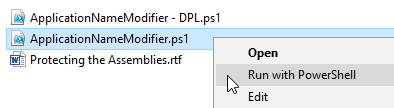
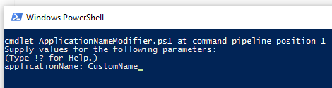

# Redistributing Telerik Assemblies

The Telerik UI for {{ site.framework_name }} suite includes a limited run-time royalty-free license to redistribute the controls in your own solutions subject to the License Agreement. You can use the components in the suite to build your own solutions and redistribute your solutions to your end users who are not required to purchase a license from Telerik to access your solution.

## Examples of Permitted Uses

* WPF applications for internal company use.
            
* Commercial WPF applications deployed to Your end users. __In this case, you may deploy the Telerik assemblies together with your application with the sole exception of the assemblies providing the additional design-time support for the Telerik controls. The design-time assemblies may not be deployed to end-users under any circumstance__.

	The design-time assemblies are located in the __Telerik UI for WPF installation folder/Binaries/WPF40/design__ folder.
	
	>tip The location of the design-time assemblies may vary depending on the Xaml or NoXaml binaries usage and also the .NET version of the control dlls. For example, the [NoXaml](), .NET 4.6.2 design-time assemblies are located in  *Telerik UI for WPF installation folder/Binaries.NoXaml/WPF462/design*.

* WPF applications that offer a trial or free version of Your application. __If offering a free or trial version of Your Integrated Product, redistribution of the assemblies is not permitted. You are required to protect all Telerik assemblies by using the method in the [Protecting Telerik UI Assemblies](#protecting-telerik-ui-assemblies) section of this article.__

>important The next sections in this article describe how to include additional protection to the Telerik assemblies redistributed with your application when necessary.

## Protecting Telerik UI Assemblies

Technical guidelines for protecting **Telerik UI for {{ site.framework_name }} by Progress** binaries when redistributed with other applications.
     
There are a couple of approaches that you can take:
* [Use the PowerShell Scripts](#protect-the-telerik-assemblies-using-the-powershell-scripts)
* [Manually Edit the Source Code](#protect-the-telerik-assemblies-by-manually-editing-the-source-code)

## Protect the Telerik Assemblies Using the PowerShell Scripts

Telerik UI source code provides two power shell scripts that will allow you to easily apply the modifications needed to protect the Telerik assemblies without the need to open and edit any files. The scrips are located in the **Build\BuildInstructions\AssemblyProtection** folder of the suite's source code which can be downloaded as explained in [this article]()[this article](). 

The available scripts are: 

* **ApplicationNameModifier.ps1**: Uncomments the **ValidatePassPhrase()** method call and changes the **ApplicationName** in the **Core\Controls\Common\AssemblyProtection.cs** file with the provided one. 

* **ApplicationNameModifier - DPL.ps1**: Uncomments the **ValidatePassPhrase()** method call and changes the ApplicationName in the **Documents\Licensing\AssemblyProtection.cs** file with the provided one.

### Instructions

1. Right-click on the needed script and click Run with **PowerShell** menu item

	

2. Enter the new **ApplicationName** when prompted: 

	

3. Rebuild the Telerik UI assemblies using one of the approaches explained in the source code build instructions (located in the **Build\BuildInstructions** folder). 

4. In your application resources **App.xaml** create a string resource with key __"Telerik.Windows.Controls.Key"__ and value equal to the value of the ApplicationName defined in **step 2**:

#### __[XAML] Example 1: Merging the application key resource__ 	
{{region protecting-telerik-radcontrols-assembly_5}}
	<Application 
	      xmlns="http://schemas.microsoft.com/client/2007"
	      xmlns:x="http://schemas.microsoft.com/winfx/2006/xaml" 
	      xmlns:system="clr-namespace:System;assembly=mscorlib"
	      x:Class="...">
	        <Application.Resources>
	            <system:String x:Key="Telerik.Windows.Controls.Key">Sample Application Name v2.0 (tm)</system:String>
	        </Application.Resources>
	</Application>
{{endregion}}

## Protect the Telerik Assemblies by Manually Editing the Source Code

__Prerequisites__

All control assemblies should be built from source code due to modifications applied to the source files. The source code of UI for SilverlightWPF is distributed separately and is bundled with build instructions. Please, read the source code building instructions beforehand. For brevity, this document assumes that the source distribution ZIP file is extracted in **C:\Telerik{{ site.framework_name }}Source**
        
__Instructions__

1. Open **C:\Telerik{{ site.framework_name }}Source\Core\Controls\Common\AssemblyProtection.cs** in a text editor (notepad, Visual Studio, etc.)

2. Uncomment the following line:

	#### __[C#] Example 2: Before the change__ 	
	{{region protecting-telerik-radcontrols-assembly_0}}
        public static void Validate()
		{
		    //Uncomment the following line
		    //ValidatePassPhrase();
		}
	{{endregion}}
	
	#### __[C#] Example 3: After the change__ 		
	{{region protecting-telerik-radcontrols-assembly_1}}
        public static void Validate()
		{
		    //Uncomment the following line
		    ValidatePassPhrase();
		}
	{{endregion}}

3. Change the **ApplicationName** constant to match the name of your application:

	#### __[C#] Example 4: Before the change__ 		
	{{region protecting-telerik-radcontrols-assembly_2}}
		internal const string ApplicationName = "MyApp";
	{{endregion}}
	
	#### __[C#] Example 5: After the change__ 		
	{{region protecting-telerik-radcontrols-assembly_3}}
		internal const string ApplicationName = "Sample Application Name v2.0 (tm)";
	{{endregion}}

4. Save __AssemblyProtection.cs__ and rebuild the suite (described separately in the source code build instructions document).
            
5. In your application, replace the existing references to the Telerik assemblies with the ones built from the source code.

6. If you run the application now you should get an exception with the message **"This version of Telerik UI for {{ site.framework_name }} is licensed only for use by Sample Application Name v2.0 (tm)"**. Note that **"Sample Application Name v2.0 (tm)"** will be replaced with the value of the **ApplicationName** constant.

7. In your application resources **App.xaml** create a string resource with key __"Telerik.Windows.Controls.Key"__ and value equal to the value of the ApplicationName constant from **step 3**:

	#### __[XAML] Example 6: Merging the application key resource__ 	
	{{region protecting-telerik-radcontrols-assembly_4}}
		<Application 
			  xmlns="http://schemas.microsoft.com/client/2007"
			  xmlns:x="http://schemas.microsoft.com/winfx/2006/xaml" 
			  xmlns:system="clr-namespace:System;assembly=mscorlib"
			  x:Class="...">
				<Application.Resources>
					<system:String x:Key="Telerik.Windows.Controls.Key">Sample Application Name v2.0 (tm)</system:String>
				</Application.Resources>
		</Application>
	{{endregion}}

<!-- -->

## Protect the Telerik Documents Assemblies by Editing the Source Code

The instructions in the previous section explain how to build the **Telerik.Windows.Controls** assembly and the assemblies depending on it. The UI for SilverlightWPF suite contains libraries for processing documents that do not depend on **Telerik.Windows.Controls.dll**. 

If you are building the assemblies needed for one of the components depending on **Telerik.Windows.Documents.Core**, such as the [Telerik Document Processing by Progress libraries](https://docs.telerik.com/devtools/document-processing/introduction), you need to execute the following steps as well.
        
>importantThe following instructions are valid for Telerik UI for SilverlightWPF version __Q2 2014__ or later.
          
1. Open **C:\TelerikDocumentsProcessingSource\Documents\Licensing\AssemblyProtection.cs** in a text editor (notepad, Visual Studio, etc.).

	> In versions of the suite prior to R2 2016, the path is **C:\TelerikDocumentsProcessingSource\Documents\Core\Core\Licensing\AssemblyProtection.cs**.            

2. Uncomment the following line:
            
	#### __[C#] Example 7: Before the change__  
	{{region protecting-telerik-radcontrols-assembly_6}}
		public static bool IsValid()
		{
			// Uncomment the following line
			// return ValidatePassPhrase();
			return true;
		}
	{{endregion}}

	#### __[C#] Example 8: After the change__  
	{{region protecting-telerik-radcontrols-assembly_7}}
		public static bool IsValid()
		{
			// Uncomment the following line
			return ValidatePassPhrase();
		}
	{{endregion}}

<!-- -->

3. Execute steps **3-7** from the previous section.

## Building the Source Code After Assembly Protection Code Changes

After enabling the assembly protection by modifying the code as shown in the previous section of this article, the source code of Telerik UI for WPF should be rebuilt. The produced DLLs can be redistributed with the final product. To see how to properly rebuild the source code, check the following documents in [the .zip file with Telerik's source](https://www.telerik.com/account/product-download?product=RCWPF):

* `C:\Telerik UI for WPF Source Code\Build\BuildInstructions\Source Code Build Instructions for .NET Framework (4.6.2).rtf`
* `C:\Telerik UI for WPF Source Code\Build\BuildInstructions\Source Code Build Instructions for .NET.rtf`

## See Also  
* [Installing Telerik UI on your Computer]()
