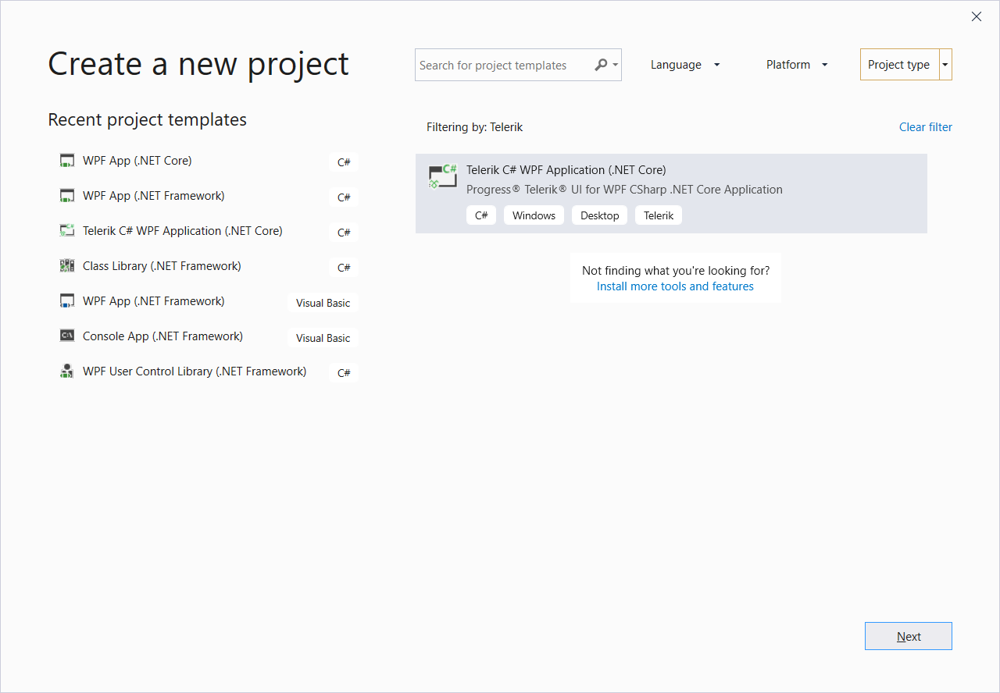
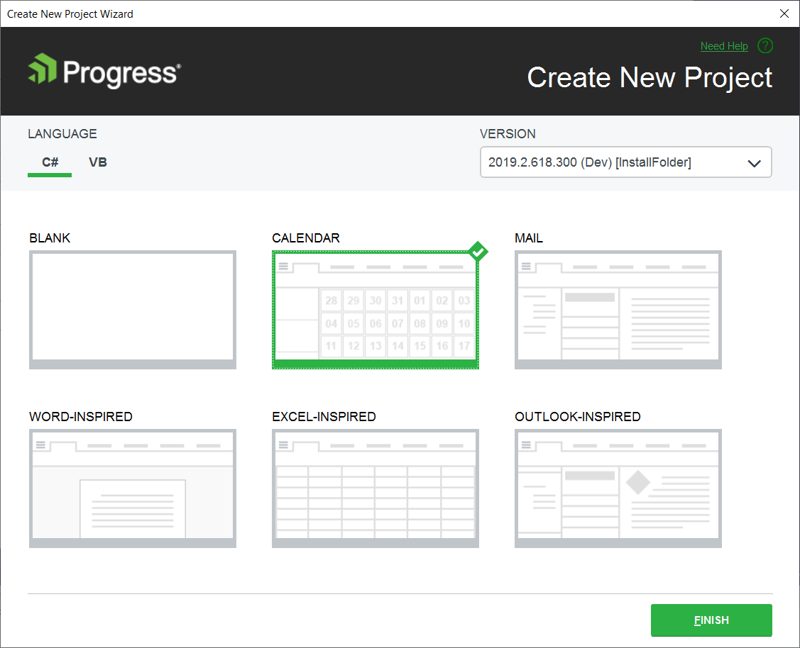
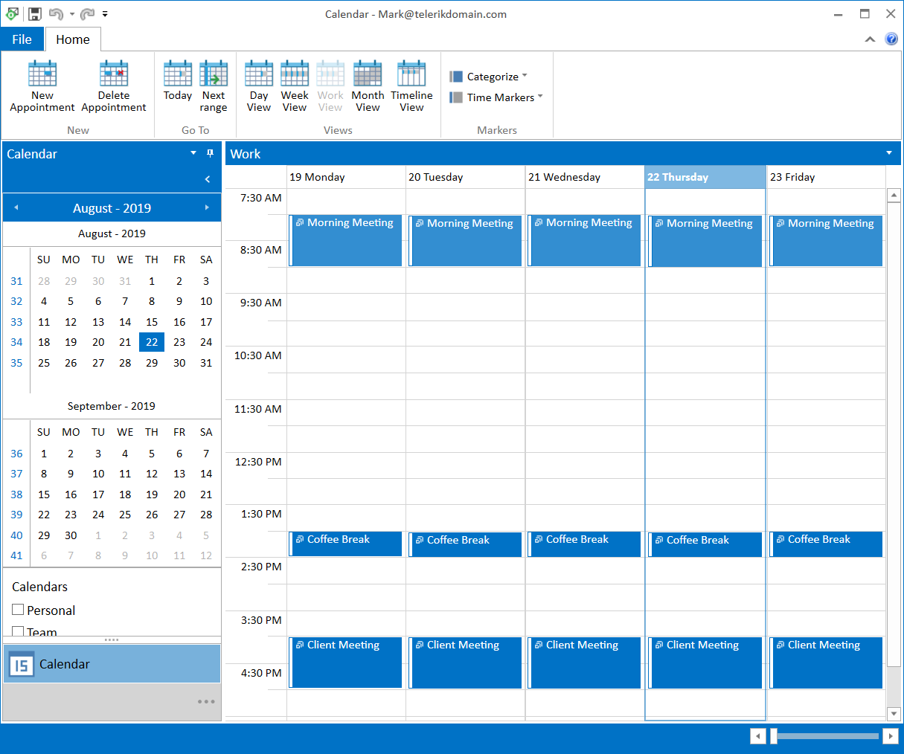
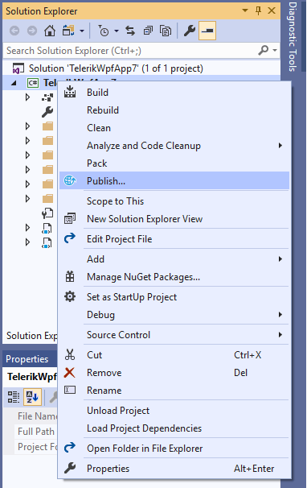
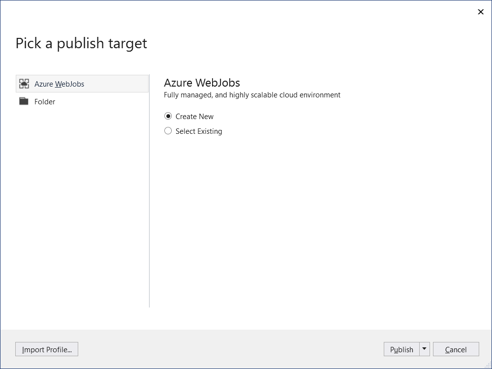
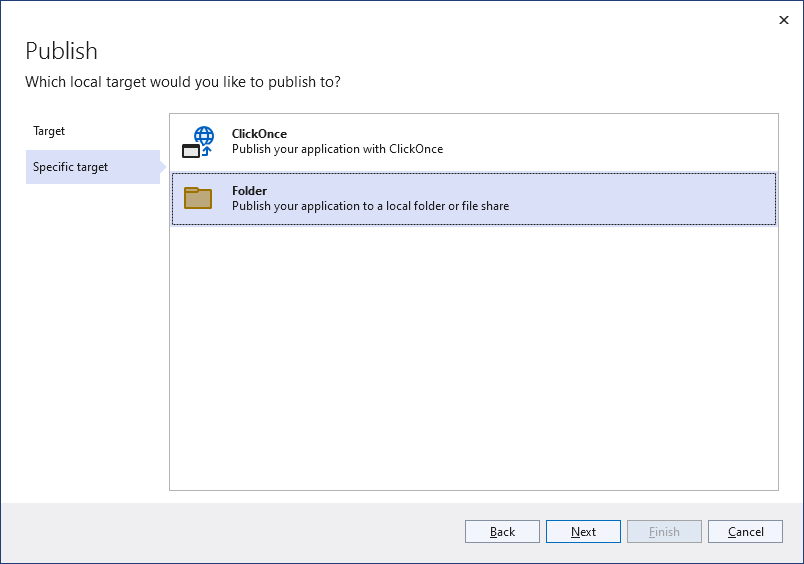
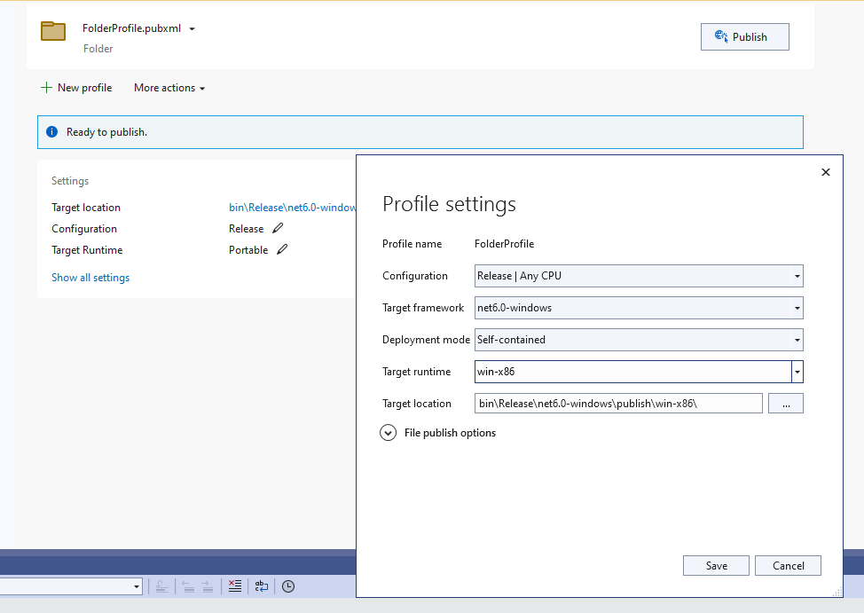
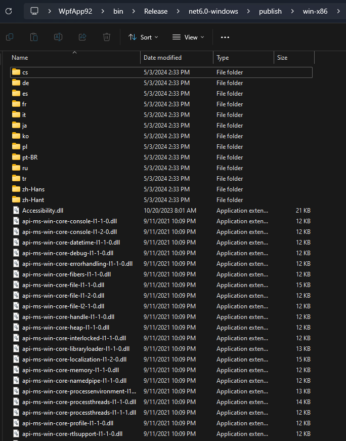

# Deploying WPF .NET Application

This article shows how to deploy a WPF .NET Application using Visual Studio.

## Create an Application

If you already have a WPF project, you can go directly to the [Deploy the Application](#deploy-the-application) section of this article.

1. Create a new WPF project using the [Telerik Visual Studio Extensions]() (VSX). If the VSX is installed you will see the __Telerik C# WPF Application__ template in the Visual Studio's project templates list.

	
	
2. Select one of the application templates from the New Project Wizard. For this example, use the Calendar template.

	
	
#### __Figure 1: Calendar application created with the New Project Wizard__

## Deploy the Application

1. Right click the project in Visual Studio and select the __Publish__ option. This will open the __Pick a publish taget__ dialog.

	

2. Choose the publishing approach and location. Then click __Finish__.

	
		
	
	
	

3. In the publish page, you can find the profile settings. Click on __Show all settings__ and change the __Deployment mode__ to __Self-contained__. Then select a __Target Runtime__.

	

4. Save the configuration and click the __Publish__ button. This will generate files in the publish location.

	

5. Copy the output files from the publish location to your deployment environment.

>tip You can package your application using the MSIX format. Read more, in the [What is MSIX?](https://docs.microsoft.com/en-us/windows/msix/overview) MSDN article.

## See Also

* [Migrating to .NET Core]()
