# .NET Core Project Converter

>important With Q2 2024 the Project Converter is no longer supported. The converter works only with Visual Studio 2019 and .NET Core 3.1 projects. The last Telerik version where .NET Core 3.1 assemblies were distributed was 2024.1.423.

Since R2 2020 Telerik UI for WPF suite provides tooling in Visual Studio 2019, via the [Telerik Visual Studio Extension](), that will convert client projects that use .NET Framework 4.8 (or lower) into .NET Core projects to ease out the migration.

> The tooling is based on the [Try-Convert](https://github.com/dotnet/try-convert) tool and the [.NET Portability Analyzer ](https://github.com/microsoft/dotnet-apiport) that Microsoft offers to help .NET developers port their projects to .NET Core. Please have in mind that even though the conversion may be successful, we don't guarantee that the project will be compiled and you may need to fine-tune the output.

This article will guide you through the conversion process:

1. Let's start with an existing Telerik WPF project that uses .NET Framework 4.5:

	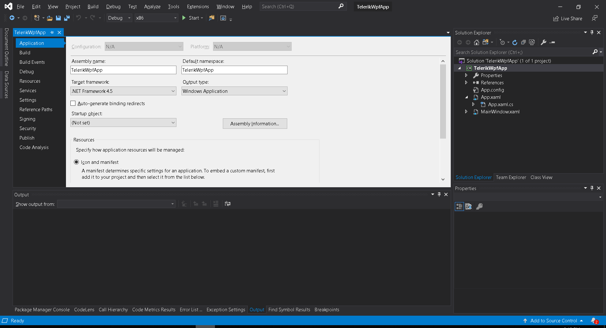  

2. Navigate to the __Extensions__ menu. If the Telerik menu item is not available, click __Manage Extensions__ and download it:

	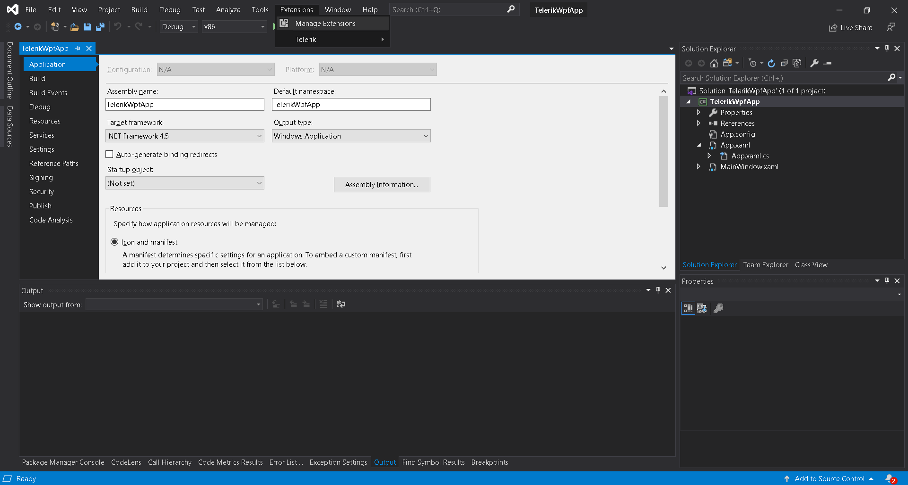  

	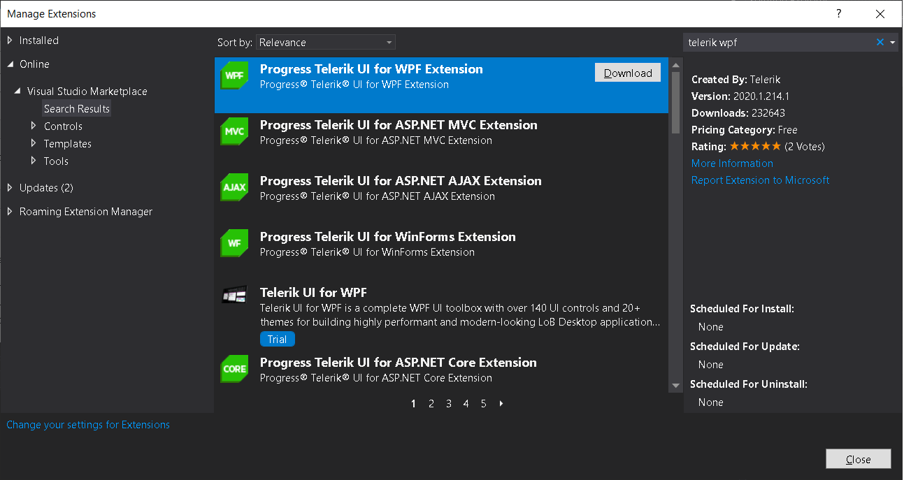  

3. After restarting Visual Studio, you are expected to see the __.NET Core Project Converter__ option in the __Extensions__ menu and in the project's context menu as well:

	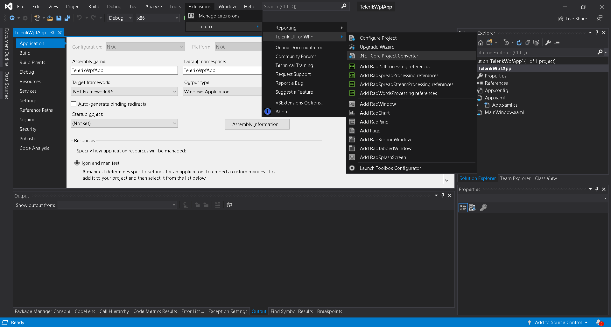  

	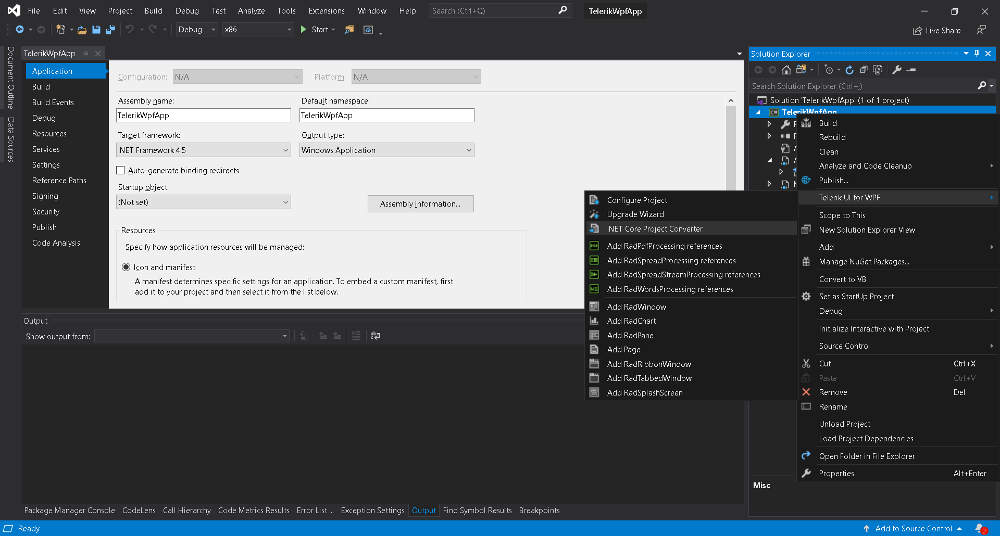 

4. Run the converter and follow the wizard:

	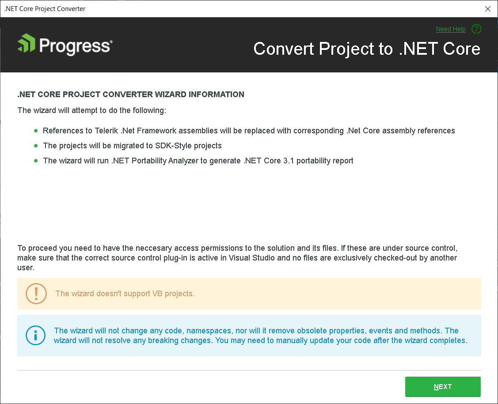
																	   
	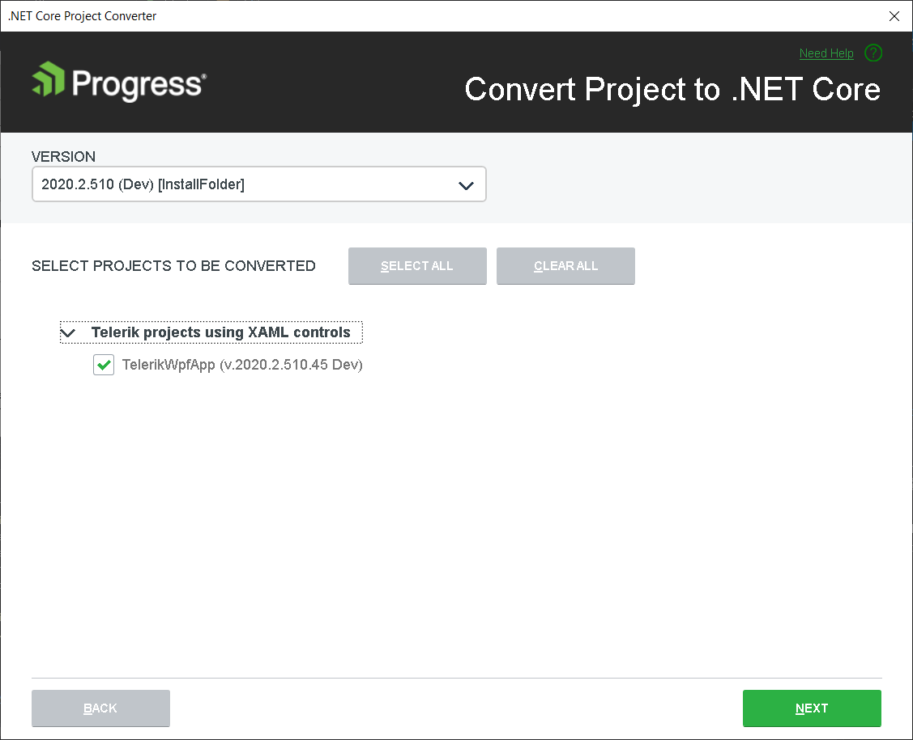
																	 
	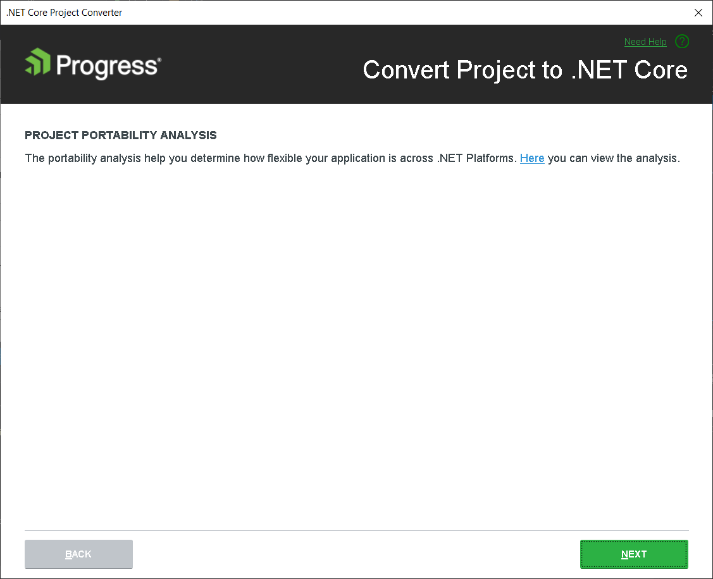
																	  
	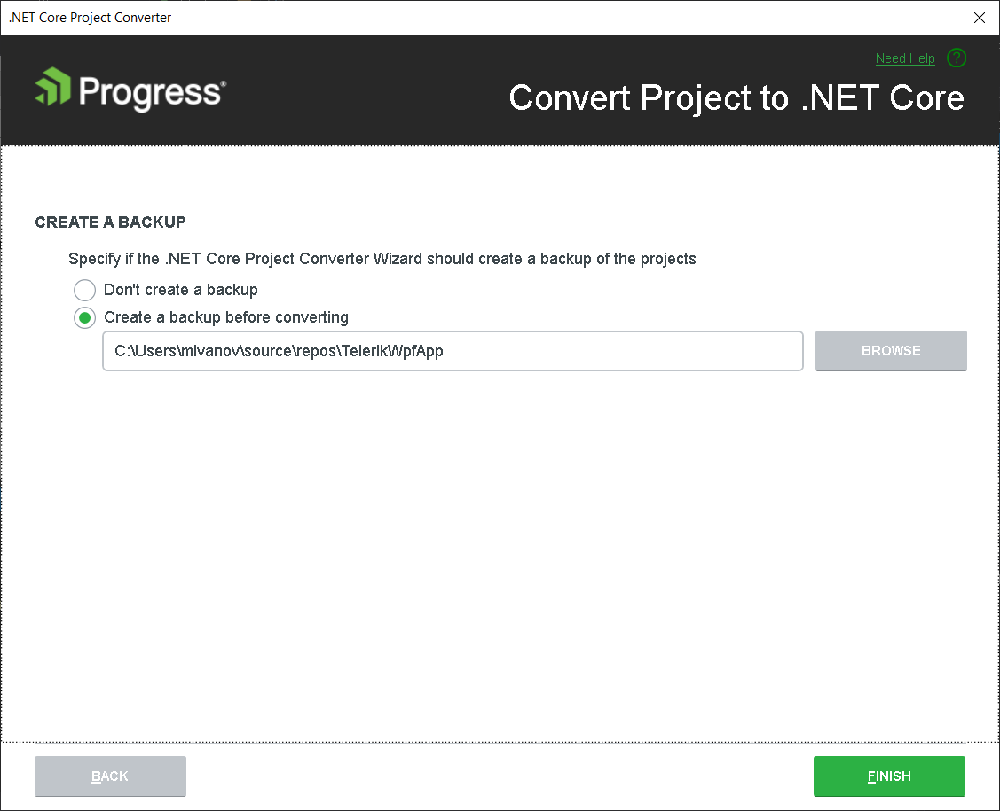
																	  
	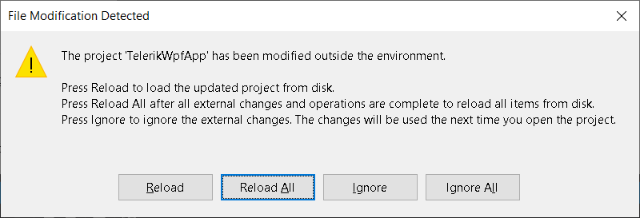
																	   
	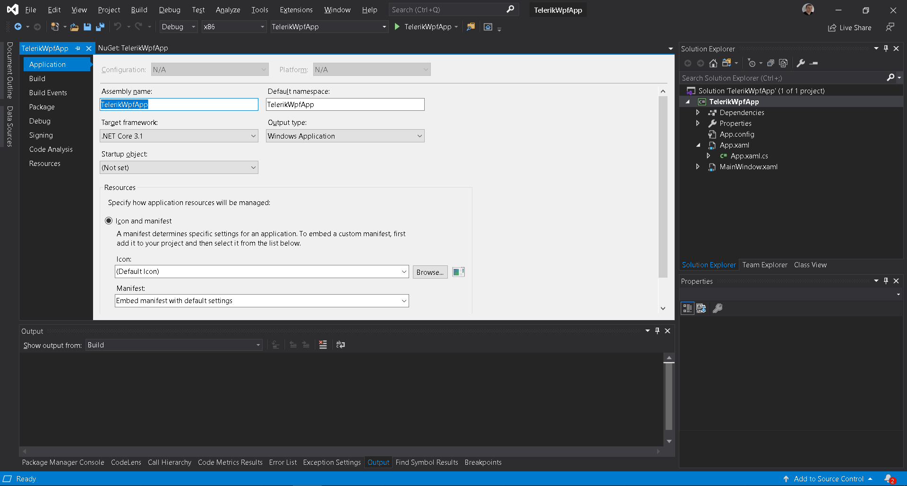

5. Now, the project can be run using .NET Core 3.1

6. There is a backup folder containing the initial project.

	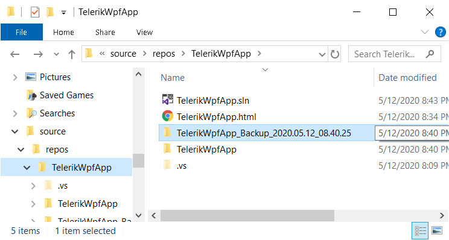

## See Also

* [.NET Core Support Overview]()
* [Deploying WPF .NET Core Application]()
