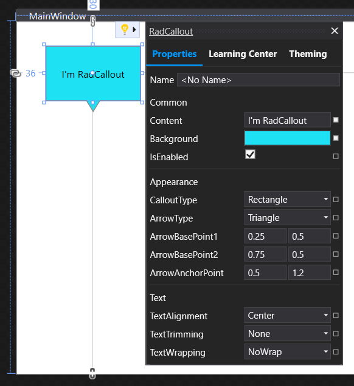

# Suggested Actions Menu

The new WPF XAML Designer includes a **Suggested Actions** menu that is similar to the [Smart Tags](). The controls from the **Telerik.Windows.Controls** assembly support these actions for .NET Core projects.

>To use Suggested Actions, you need to have **Visual Studio Preview 16.10** or later installed.

Suggested Actions give you access to common properties of a control selected within the new WPF XAML Designer. To use this feature, first enable it through **Tools > Options > Preview Features > XAML Suggested Actions**. Once enabled, click on a supported control and use the lightbulb to expand and interact with the Suggested Actions UI.

#### Figure 1: Suggested actions menu displayed on RadCallout control

## See Also

* [.NET Core Support Overview]()
* [Smart Tags]()