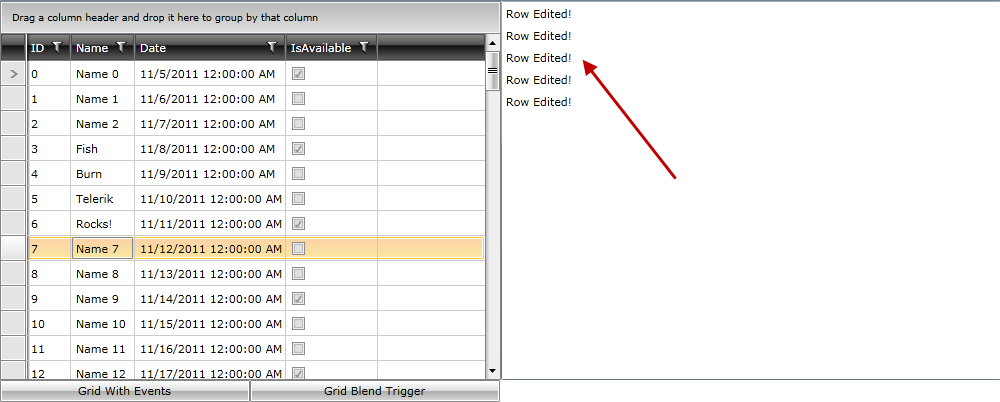
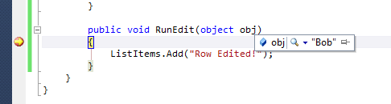
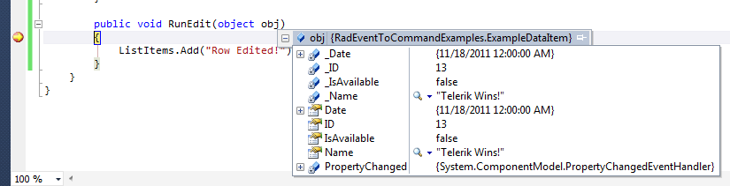

# Blend Option

Returning to our sample solution that we have been developing, we now want to go ahead and utilize Triggers instead of a regular event to respond to user interaction.  The advantage behind using Triggers is that instead of just using the event, thereby utilizing code-behind, we can move the command to our ViewModel and make it further separated from our view logic.

## Getting Started

Since we’re utilizing a similar setup for all projects, go ahead and add a new user control named GridBlendInteraction.xaml and include the following Telerik namespace as well as a GridView and ListBox code:

#### __XAML__

{{region patterns-and-practices-eventtocommand-blend_0}}
	xmlns:telerik="http://schemas.telerik.com/2008/xaml/presentation"
	 ...
	<Grid x:Name="LayoutRoot"
	          Background="White">
		<Grid.ColumnDefinitions>
			<ColumnDefinition />
			<ColumnDefinition />
		</Grid.ColumnDefinitions>
	
		<telerik:RadGridView x:Name="xRadGridView">
		</telerik:RadGridView>
	
		<ListBox x:Name="xDetailListBox"
	                 Grid.Column="1" />
	</Grid>
	{{endregion}}

Now we will add two new namespaces as well as an assembly reference.  Add the System.Windows.Interactivity reference to your project (included in the source download or the Blend SDK) and then create a namespace for that as well as for the local project:

#### __XAML__

{{region patterns-and-practices-eventtocommand-blend_1}}
	xmlns:i="clr-namespace:System.Windows.Interactivity;assembly=System.Windows.Interactivity"
	xmlns:local="clr-namespace:RadEventToCommandExamples"
	{{endregion}}



#### __XAML__

{{region patterns-and-practices-eventtocommand-blend_1_1}}
	xmlns:i="clr-namespace:System.Windows.Interactivity;assembly=System.Windows.Interactivity"
	xmlns:local="clr-namespace:RadEventToCommand.WPF"
	{{endregion}}



Our last step is to ensure we can access the ExampleViewModel without touching the code-behind, so create an instance of it within the UserControl.Resources collection:

#### __XAML__

{{region patterns-and-practices-eventtocommand-blend_2}}
	<UserControl.Resources>
	   <local:ExampleViewModel x:Key="xVM" />
	</UserControl.Resources>
	{{endregion}}

## Connecting Data

For anyone already familiar with XAML binding and MVVM concepts this section will be easy, for everyone else this will help demonstrate how we can wire up bindings to a VM without leaving our XAML.  We’ve created an instance of the ExampleViewModel as a resource within the user control, meaning we can easily set the DataContext of our LayoutRoot grid to the VM:
      

#### __XAML__

{{region patterns-and-practices-eventtocommand-blend_3}}
	<Grid x:Name="LayoutRoot"
	      Background="White"
	      DataContext="{StaticResource xVM}">
	{{endregion}}

Now that we have our DataContext set to the VM, simple binding statements will enable data from the VM to be displayed (and edited) in our other controls.  We’ll set up a two-way binding on our RadGridView and a one-way binding on our ListBox, since we’ll never be editing that and only using it to display edit information:
      

#### __XAML__

{{region patterns-and-practices-eventtocommand-blend_4}}
	<telerik:RadGridView x:Name="xRadGridView"
	                 ItemsSource="{Binding GridItems, Mode=TwoWay}">
	</telerik:RadGridView>
	
	<ListBox x:Name="xDetailListBox"
	                 Grid.Column="1"
	                 ItemsSource="{Binding ListItems, Mode=OneWay}" />
	{{endregion}}

One last quick step, open up the ExampleViewModel and add a quick get and set to both the Grid and List collections (if you rebuild after this you’ll see our sample data is displaying in RadGridView already before we even run the program):
     

#### __C#__

{{region patterns-and-practices-eventtocommand-blend_5}}
	public ObservableCollection<ExampleDataItem> GridItems { get; set; }
	public ObservableCollection<string> ListItems { get; set; }
	{{endregion}}

If we were to run this right now we would see the GridItems collection displayed within RadGridView, however we aren’t yet responding to the RowEditEnded event in any way so we will need to utilize Triggers to make that happen.
     

## Working with Triggers

There are a host of reasons to use either Triggers or Behaviors (covered later) in our development, one of the most important for our sakes is to move event processing to our VMs where we can more easily test and maintain our code apart from our design.  We have already added the System.Windows.Interactivity namespace reference to our user control, so the next step is to hook into the Triggers for RadGridView:
      

#### __XAML__

{{region patterns-and-practices-eventtocommand-blend_6}}
	<i:Interaction.Triggers>
	</i:Interaction.Triggers>
	{{endregion}}

Working with triggers we’ll need to specify an event to use.  We know this is RowEditEnded, so our next step is to add an EventTrigger referencing that event name:
       

#### __XAML__

{{region patterns-and-practices-eventtocommand-blend_7}}
	<i:EventTrigger EventName="RowEditEnded">
	</i:EventTrigger>
	{{endregion}}

Since we are using the Blend interactivity assembly we can then use InvokeCommandAction to bind to a command on our VM, but we don’t have a command yet!  Jump into ExampleViewModel and create a public DelegateCommand (add a using for Telerik.Windows.Controls, we have an implementation built-in) and additionally instantiate it after our SetupData call:
     

#### __C#__

{{region patterns-and-practices-eventtocommand-blend_8}}
	public DelegateCommand TestCommand { get; set; }
	 
	public ExampleViewModel()
	{
	    SetupData();
	 
	    TestCommand = new DelegateCommand(<something needed here>);
	}
	{{endregion}}

You’ll notice that DelegateCommand expects an action (we won’t be using the CanExecute variant since we always want this to execute).  For this we’ll create a simple method called RunEdit that will update our ListItems collection whenever this command is reached:

#### __C#__

{{region patterns-and-practices-eventtocommand-blend_9}}
	public void RunEdit(object obj)
	{
	     ListItems.Add("Row Edited!");
	}
	{{endregion}}

Just don’t forget to update your TestCommand initialization with that method name:

#### __C#__

{{region patterns-and-practices-eventtocommand-blend_10}}
	TestCommand = new DelegateCommand(RunEdit);
	{{endregion}}

Back into our XAML again, the last step is to actually setup our InvokeCommandAction with our new command.  This is done with the same style of binding that we used for setting ItemsSource on our Grid and List:

#### __XAML__

{{region patterns-and-practices-eventtocommand-blend_11}}
	<i:InvokeCommandAction Command="{Binding TestCommand, Mode=OneWay}" />
	{{endregion}}

Now simply add another RadButton to MainPage.xaml and hook up the Click code to load our GridBlendInteraction user control:

#### __XAML__

{{region patterns-and-practices-eventtocommand-blend_12}}
	<telerik:RadButton x:Name="xGridBlend"
	                  Grid.Column="1"
	                  Content="Grid Blend Trigger"
	                  Click="xGridBlend_Click" />
	{{endregion}}

#### __C#__

{{region patterns-and-practices-eventtocommand-blend_13}}
	private void xGridBlend_Click(object sender, RoutedEventArgs e)
	{
	     xContentBorder.Child = new GridBlendInteraction();
	}
	{{endregion}}

And when we run we can see that this new version will still respond to events, but we’ve got a generic message letting us know the trigger was hit but little else:

## Adding Details with InvokeCommandAction

While we’ve done good work to decouple our command from our view, we’re a step back in that the event-based model allowed us to have the full event arguments that include the status of the event and the data item being edited. 
      

InvokeCommandAction allows you to add a CommandParameter, but not the full event arguments.  For a quick example, we set CommandParameter=”Bob” and can then run the application.  Placing a breakpoint by the command in the VM we see our parameter passed through:
      

However, ‘Bob’ isn’t necessarily a useful bit of information or in any way relevant to our scenario.  Instead, we can bind the CommandParameter to the SelectedItem of RadGridView, or to any element or value in our VM, providing a little more of a look into what is happening.  Here’s an example of utilizing ElementName binding to pick the SelectedItem, which is likely the item being edited, from RadGridView:
      	

#### __XAML__

{{region patterns-and-practices-eventtocommand-blend_14}}
	<i:InvokeCommandAction Command="{Binding TestCommand, Mode=OneWay}"
	           CommandParameter="{Binding ElementName=xRadGridView, Path=SelectedItem}"/>
	
	{{endregion}}

And going back to our breakpoint we can see this item is passed post-edit:

Again, this is closer to what we need, however we lack the full control of the event-based model and the event arguments.  We’ll see other alternatives in the following sections that give finer-grained access to data and other values while performing edits.
      	

# See Also

 * [MVVM Light Option]()
