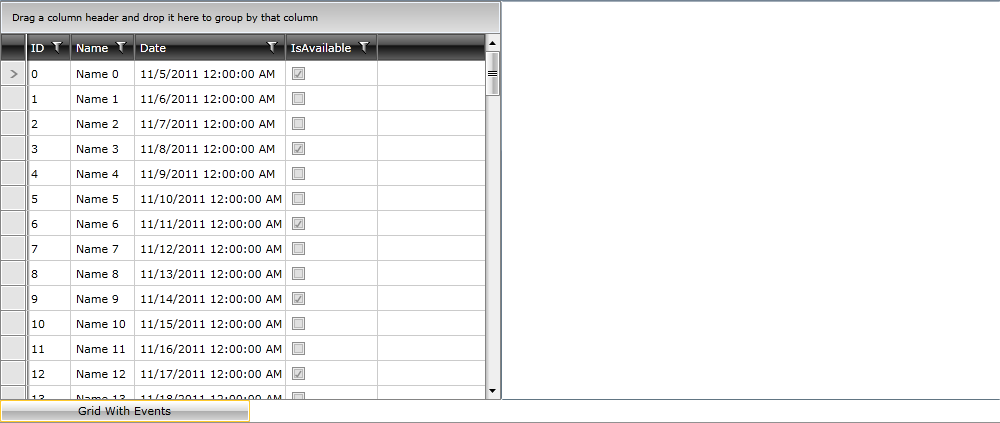
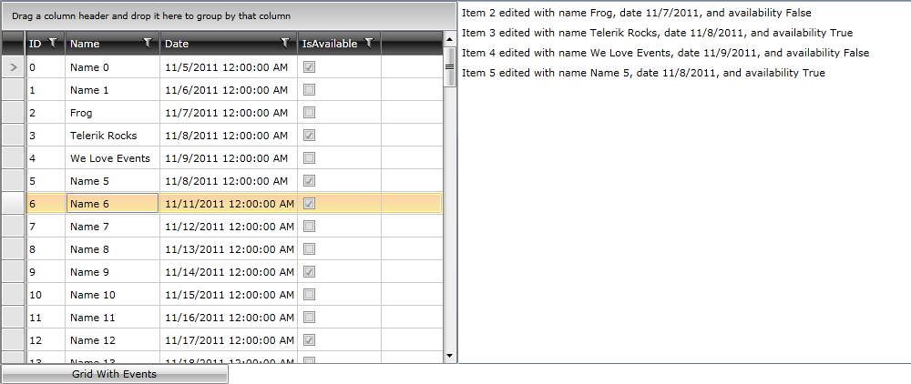

# Event-Based Setup

Building on the example we started in the Overview, our next step is to add a view that uses event-based programming to demonstrate a standard operation using RadGridView.  By seeing how the event-based model works we can understand what value it brings as well as what experience we would need to replicate when moving to an event-to-command setup.

## Getting Started

Working within the same solution, create a new user control named GridWithEvents.xaml.  This user control will host an instance of RadGridView as well as a Listbox for displaying information as we update records in the grid.  Before we can add those, however, you’ll want to add a reference to the Telerik namespace:

#### __XAML__

{{region patterns-and-practices-eventtocommand-eventbased_0}}
	xmlns:telerik="http://schemas.telerik.com/2008/xaml/presentation"
	{{endregion}}

Then we can use this simple setup for creating a split-screen between RadGridView and a ListBox.  (Keep in mind that you need to retype the RowEditEnded event to have Visual Studio create the event code for you in the code-behind!)

#### __XAML__

{{region patterns-and-practices-eventtocommand-eventbased_1}}
	<Grid x:Name="LayoutRoot"
	          Background="White">
		<Grid.ColumnDefinitions>
			<ColumnDefinition />
			<ColumnDefinition />
		</Grid.ColumnDefinitions>
	
		<telerik:RadGridView x:Name="xRadGridView"
	                             RowEditEnded="xRadGridView_RowEditEnded">
		</telerik:RadGridView>
	
		<ListBox x:Name="xDetailListBox"
	                 Grid.Column="1" />
	</Grid>
	{{endregion}}

This is it for our XAML, everything else will be handled via the code-behind for this section.

## Coding With Events

Since we are using event-based programming we will utilize the code-behind for this user control, but in future sections we will stick to a cleaner, MVVM-based approach.  Right now our code-behind looks like the following:
      

#### __C#__

{{region patterns-and-practices-eventtocommand-eventbased_2}}
	public partial class GridWithEvents : UserControl
	{
		public GridWithEvents()
		{
			InitializeComponent();
		}
	
	
		private void xRadGridView_RowEditEnded(object sender, Telerik.Windows.Controls.GridViewRowEditEndedEventArgs e)
		{
	
		}
	}
	{{endregion}}

We want to add an instance of our ExampleViewModel  here, so before the declaration for GridWithEvents() we’ll add a public ExampleViewModel:

#### __C#__

{{region patterns-and-practices-eventtocommand-eventbased_3}}
	public ExampleViewModel VM;
	{{endregion}}

Then we’ll set the loaded event for the user control:

#### __C#__

{{region patterns-and-practices-eventtocommand-eventbased_4}}
	this.Loaded += new RoutedEventHandler(GridWithEvents_Loaded);
	{{endregion}}

And finally we’ll instantiate the VM and set the ItemsSource for RadGridView and the ListBox to the collections within the VM:

#### __C#__

{{region patterns-and-practices-eventtocommand-eventbased_5}}
	void GridWithEvents_Loaded(object sender, RoutedEventArgs e)
	{
		VM = new ExampleViewModel();
	
		xRadGridView.ItemsSource = VM.GridItems;
		xDetailListBox.ItemsSource = VM.ListItems;
	}
	{{endregion}}

Last, but certainly not least, we want to actually handle the RowEditEnded event to ensure we’re displaying something when a record is edited.  Since we have the event arguments we can check the e.EditAction to see if it is a Commit or Cancel, we’ll only want to respond to Commits:
       

#### __C#__

{{region patterns-and-practices-eventtocommand-eventbased_6}}
	if (e.EditAction == GridViewEditAction.Commit)
	{
	}
	{{endregion}}

The last thing we need to do is to cast the e.EditedItem instance as an ExampleDataItem and then add a new string to our ListItems collection (found in our VM) with the updated values:

#### __C#__

{{region patterns-and-practices-eventtocommand-eventbased_7}}
	ExampleDataItem edi = e.EditedItem as ExampleDataItem;
	 
	VM.ListItems.Add(string.Format("Item {0} edited with name {1}, date {2}, and availability {3}",
			 edi.ID.ToString(), edi.Name, edi.Date.ToShortDateString(), edi.IsAvailable.ToString()));
	{{endregion}}

Now our user control is complete, the next and final section will cover adding this to our example shell and seeing the results.

## Adding Our New View

Right now if you were to run the example you would still just see a single button on MainPage.xaml.  With the button we’ve already defined, go ahead and set the click event:
      

#### __XAML__

{{region patterns-and-practices-eventtocommand-eventbased_8}}
	Click="xGridWithEventsButton_Click"
	{{endregion}}

Now jumping into our code-behind, within that event we just need to set the xContentBorder child to our new user control:

#### __C#__

{{region patterns-and-practices-eventtocommand-eventbased_9}}
	private void xGridWithEventsButton_Click(object sender, RoutedEventArgs e)
	{
		xContentBorder.Child = new GridWithEvents();
	}
	{{endregion}}

Hit F5 to load the application and then click the RadButton, you should see the following as the user control loads and the VM creates our data:

Go ahead and edit a few records and you’ll see our event being responded to as the edit history gets listed within the ListBox:

As you can see, event-based development is quite easy, but as previously mentioned we sometimes want to abstract even the event away to a VM to enable our application logic and visuals to be completely decoupled.
		

Proceed to the next section to see how we can achieve this with built-in support from Blend and System.Windows.Interactivity.
      	

# See Also

 * [Blend Option]()
