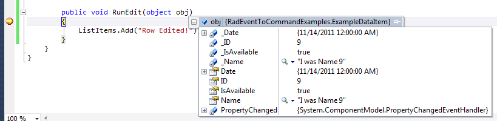
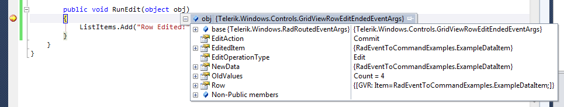
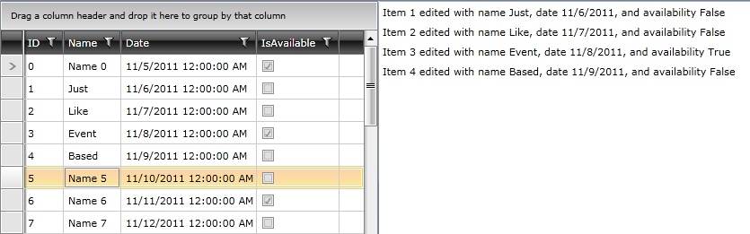

# MVVM Light Option

Building off what we learned in the Blend example, MVVM Light will allow us to go a step further in what details are passed to our ViewModel (VM), getting us closer to the flexibility found with the event-based method.   MVVM Light, for anyone who has not worked with it before, is a product of Laurent Bugnion/Galasoft and is one of the most compact and streamlined MVVM frameworks for Silverlight, WPF, and Windows Phone available today.  
      You can download it 
      [here from Codeplex](http://mvvmlight.codeplex.com/).

## Getting Started

This tutorial will use many of the same concepts from the previous tutorial on Blend Interactivity, so rather than starting from scratch we will utilize the code from that example to begin.  First add the following MVVM Light assemblies to your project:

* GalaSoft.MvvmLight.Extras.SL4

* GalaSoft.MvvmLight.SL4

* GalaSoft.MvvmLight.Extras.WPF4

* GalaSoft.MvvmLight.WPF4

Then create a new user control named GridMVVMLight.xaml.  Add the following namespaces to your new user control:
        

#### __XAML__

{{region patterns-and-practices-eventtocommand-mvvmlight_0}}
	xmlns:telerik="http://schemas.telerik.com/2008/xaml/presentation"
	xmlns:i="clr-namespace:System.Windows.Interactivity;assembly=System.Windows.Interactivity"
	xmlns:commands="clr-namespace:GalaSoft.MvvmLight.Command;assembly=GalaSoft.MvvmLight.Extras.SL4"
	xmlns:local="clr-namespace:RadEventToCommandExamples"
	{{endregion}}



#### __XAML__

{{region patterns-and-practices-eventtocommand-mvvmlight_0_1}}
	xmlns:telerik="http://schemas.telerik.com/2008/xaml/presentation"
	xmlns:i="clr-namespace:System.Windows.Interactivity;assembly=System.Windows.Interactivity"
	xmlns:commands="clr-namespace:GalaSoft.MvvmLight.Command;assembly=GalaSoft.MvvmLight.Extras.WPF4"
	xmlns:local="clr-namespace:RadEventToCommand.WPF"
	{{endregion}}



And copy and paste the following XAML (taken directly from the last example) to replace the pre-existing code:

#### __XAML__

{{region patterns-and-practices-eventtocommand-mvvmlight_1}}
	<UserControl.Resources>
		<local:ExampleViewModel x:Key="xVM" />
	</UserControl.Resources>
	
	<Grid x:Name="LayoutRoot"
	          Background="White"
	          DataContext="{StaticResource xVM}">
		<Grid.ColumnDefinitions>
			<ColumnDefinition />
			<ColumnDefinition />
		</Grid.ColumnDefinitions>
	
		<telerik:RadGridView x:Name="xRadGridView"
	                             ItemsSource="{Binding GridItems, Mode=TwoWay}">
			<i:Interaction.Triggers>
				<i:EventTrigger EventName="RowEditEnded">
				   <i:InvokeCommandAction Command="{Binding TestCommand, Mode=OneWay}"
	                              CommandParameter="{Binding ElementName=xRadGridView, Path=SelectedItem}"/>
				</i:EventTrigger>
			</i:Interaction.Triggers>
		</telerik:RadGridView>
	
		<ListBox x:Name="xDetailListBox"
	                 Grid.Column="1"
	                 ItemsSource="{Binding ListItems, Mode=OneWay}" />
	</Grid>
	{{endregion}}

Last step?  Comment out InvokeCommandAction as we are about to replace that with something more powerful courtesy of MVVM Light.

## EventToCommand – First Try

Now we have a trigger that occurs on the RowEditEnded event but nothing responding to it.  
      This is where MVVM Light and EventToCommand come into play.  
      For starters, we added the commands namespace above to provide access to EventToCommand, which has the capabilities of InvokeCommandAction (and more), so we will try to reproduce the same effect of binding to TestCommand and using the RadGridView SelectedItem as our parameter:
      

#### __XAML__

{{region patterns-and-practices-eventtocommand-mvvmlight_2}}
	<commands:EventToCommand Command="{Binding TestCommand}"
	                  CommandParameter="{Binding ElementName=xRadGridView, Path=SelectedItem}" />
	{{endregion}}

Before testing this, do a quick build and add the new button and code-behind to our MainPage to allow us access to this new control:
       

#### __XAML__

{{region patterns-and-practices-eventtocommand-mvvmlight_3}}
	<telerik:RadButton x:Name="xGridMVVMLight"
	                  Grid.Column="2"
	                  Content="Grid MVVM Light"
	                  Click="xGridMVVMLight_Click" />
	
	{{endregion}}

#### __C#__

{{region patterns-and-practices-eventtocommand-mvvmlight_4}}
	private void xGridMVVMLight_Click(object sender, RoutedEventArgs e)
	{
	   xContentBorder.Child = new GridMVVMLight();
	}
	{{endregion}}

Once that is in place, we can run our application and see we get the same information in our breakpoint:
      

Useful, for sure, but we can do one step better.

## EventToCommand – Second Try

As stated above, the main issue here is that we’re relying on the SelectedItem of RadGridView to be the edited item and to contain all the information we require.  Obviously this will work for simpler scenarios, but for anymore more complex you want to know more about what has happened – for example, whether the edit was cancelled or committed.  Luckily, EventToCommand can provide this granular level of detail.

Stepping back into the code we produced previously, remove the CommandParameter section and instead set the property PassEventArgsToCommand.  We’ll also duplicate the TestCommand DelegateCommand as well as the RunThis method and add a ‘2’ to both to ensure our previous examples still function.  Your code should now look something like this:

#### __XAML__

{{region patterns-and-practices-eventtocommand-mvvmlight_5}}
	<commands:EventToCommand Command="{Binding TestCommand2}"
	            PassEventArgsToCommand="True" />
	{{endregion}}

Now when we run the application and hit the breakpoint we see something slightly different:

That’s right, the full event arguments!  This means that by switching the code from our event-based method around slightly, we can write the same information to the collection bound to our ListBox and see the results of our edits the same as with the event-based model, complete with the ability to utilize the other information that event arguments provide if needed.  First the code:
      	

#### __C#__

{{region patterns-and-practices-eventtocommand-mvvmlight_6}}
	// MVVM Light Version with PassEventArgs
	public void RunEdit(object obj)
	{
		GridViewRowEditEndedEventArgs e = obj as GridViewRowEditEndedEventArgs;
	
		if (e.EditAction == GridViewEditAction.Commit)
		{
			ExampleDataItem edi = e.EditedItem as ExampleDataItem;
			VM.ListItems.Add(string.Format("Item {0} edited with name {1}, date {2}, and availability {3}", edi.ID.ToString(), 
					edi.Name, edi.Date.ToShortDateString(), edi.IsAvailable.ToString()));
		}
	}
	{{endregion}}

And then the result:

As you can see, this provides the versatility of the event-based method with the separation of concerns and testability that MVVM provide and can work with any event for any control.
		

You can feel free to stop here, but if you like to utilize Prism for your Silverlight/WPF development read on to the final section to see another method for configuring an event-to-command setup using behaviors.
		

# See Also

 * [Prism Option]()
