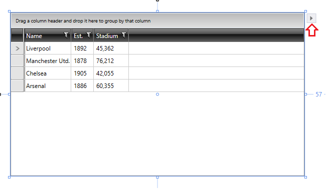
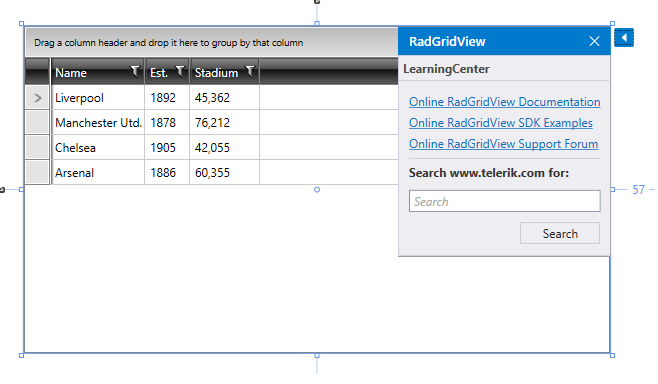

# Smart Tags

In **R1 2017** we introduced the **Smart Tags** feature which provides easy access to the most important documentation articles related to each control. Though the feature is especially useful for users that have recently started using **Telerik** controls, it might come handy for experienced users as it provides easy navigation to the control's documentation and demos.
 
As shown in **Figure 1**, when you focus a certain Telerik control in the Visual Studio Designer, the **Smart Tag** arrow would appear on the right top corner of the control. 

#### **Figure 1: Smart Tag icon on RadGridView:** 

Unfolding the **Smart Tag** presents you with a list of different useful resources as well as the possibility to search the forum for certain topics. **Figure 2** shows the default menu for the RadGridView control. The appearance and resources vary depending on the control.

#### **Figure 2: Available resources for the RadGridView control:** 

## See Also

* [Getting Started]()
* [Introduction]()
