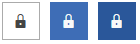
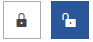

# Font Glyphs Overview

With the Office2016 theme, we introduced a new approach to add icons and icon-like images. We are providing font *glyphs* via the __TelerikWebUI__ font. The glyphs are vector symbols that can be used as information-carrying icons or interaction indicators. This article explains the specifics of this approach, demonstrates usage with examples and provides a reference sheet for the available glyphs.

> As of **R1 2018**, we recommend using the new **RadGlyph** class and markup extension to visualize font glyphs. It has many advantages that are documented in [the RadGlyph article]().

For a list with all available glyphs, see the [Glyphs Reference Sheet]().

## Advantages

The TelerikWebUI font provides over 400 individual glyphs. We have chosen this approach to define the icons in the Office2016 because it provides a number of advantages and benefits:

* The glyphs are vector paths that are easily scalable without loss of quality.

* There is a wide range of different beautiful built-in glyphs to choose from.

* They are easily colored – since they are text shapes. You can change their color by setting a Foreground color, which allows their usage in scenarios where the background of the control changes between light and dark color in different interaction states – e.g. buttons.

* They are all contained in a small font file. To use them, include the Telerik.Windows.Controls assembly and merge the needed resource dictionary for easier referencing.

* They are available for use in any of our themes when the needed resources are included. They are __not__ specific for the Office2016.

## Glyph Groups

The available glyphs are separated in several groups, based on their usage:

* __Navigation and Layout__
* __Action__
* __Media__
* __Toggle__
* __Alert and Notification__
* __Image__
* __Editor__
* __Map__
* __Social__
* __File__

## Using glyphs

The __recommended size__ for the TelerikWebUI glyphs is 16 or any multiple of 16 (e.g. 32, 48, 64, etc.) since they are designed for 16px height. However, they are vector paths and, like any font, would look clean, distinguishable, non-pixelated and beautiful in almost any size, which is their advantage to raster images and icons.

The following list provides examples that demonstrate how to use glyphs:

* Use controls with textual content.

   The glyphs are basically text shapes, so they must be hosted in a control with textual content. We recommend the __TextBlock__ as it has no special styling:

	__Example 1: Using glyphs__
	```XAML
		<TextBlock FontFamily=”{x:Static telerik:RadGlyph.TelerikFontFamily}” 
				FontSize=”16” 
				Text=”{StaticResource GlyphHeart}” 
				FontWeight=”Normal” 
				Foreground=”{telerik:Office2016Resource ResourceKey=IconBrush}”/>
	```

	>Prior to the **R2 2022** release you would use the **TelerikWebUI StaticResource** to set the FontFamily, but we now recommend using the **static TelerikFontFamily property**. The former font family is still available but provides a smaller set of available glyphs.

* Set the content of the text-hosting element.

   The content of the text-hosting element is set in a string with format *&#xe[3-digit number];*. Since this string carries no meaning for the glyph it relates to, we provide a dictionary with key-value pairs for all available glyphs. This enables the usage of more meaningful references for the needed glyphs.

	__Example 2: Setting a glyph__
	```XAML
		<!-- Glyph string -->
		<TextBlock Text="&#xe101;" /> 
		
		<!-- Meaningful reference name -->
		<TextBlock Text="{StaticResource GlyphRedo}" /> 
	```

   >tip The dictionary approach allows us to continuously include new glyphs in the __TelerikWebUI__ font. Sometimes, the addition of a glyph shifts the numbers of some existing glyphs. With every change, we update the resource dictionary and ship it with the font in the assembly. This eliminates the need for any changes in the already existing projects.

* Include the required resources.

   To use the glyph references and the font as __StaticResources__ in a project, include the __Telerik.Windows.Controls.dll__ and merge the required dictionary in the application resources:

	__Example 3: Adding the ResourceDictionary with the fonts__
	```XAML
		<ResourceDictionary Source="/Telerik.Windows.Controls;component/Themes/FontResources.xaml"/> 
	```

   >tip The needed resources are available in the UI for WPF controls out-of-the-box. The approach demonstrated in **Example 3** above is required only if you use the font and the glyphs in your custom project.

* Change the glyphs’ color.

   To change the glyphs’ color, change the foreground of the holding element in the same manner as the foreground of a regular font. This is extremely useful in scenarios when the background of the control changes in different interaction states (see __Example 4__).

	__Example 4: Setting glyph foreground__
	```XAML
		<telerik:RadToggleButton HorizontalAlignment="Center" VerticalAlignment="Center" Padding="10">
			<TextBlock Text="{StaticResource GlyphLock}" 
					FontFamily="{x:Static telerik:RadGlyph.TelerikFontFamily}" 
					FontSize="16" 
					Foreground="{Binding RelativeSource={RelativeSource AncestorType=ContentPresenter}, 
					Path=(TextElement.Foreground)}" />
		</telerik:RadToggleButton>
	```

	#### __Figure 1: Updated glyph foreground based on the interaction state of the control - normal, mouse over and pressed__  
	

* Change the glyph based on the state of the __RadToggleButton__.

   __Example 5__ demonstrates how to change the glyph based on a __RadToggleButton__ being checked or unchecked.

	__Example 5: Dynamic glyph change__
	```XAML
		<telerik:RadToggleButton HorizontalAlignment="Center" VerticalAlignment="Center" Padding="10" >
			<TextBlock FontFamily="{x:Static telerik:RadGlyph.TelerikFontFamily}" FontSize="16"
				Foreground="{Binding RelativeSource={RelativeSource AncestorType=ContentPresenter}, Path=(TextElement.Foreground)}" />
			<telerik:RadToggleButton.Resources>
				<Style TargetType="TextBlock">
					<Style.Triggers>
						<DataTrigger Binding="{Binding RelativeSource={RelativeSource AncestorType={x:Type telerik:RadToggleButton}}, Path=IsChecked}" Value="True">
							<Setter Property="Text" Value="{StaticResource GlyphUnlock}" />
						</DataTrigger>
						<DataTrigger Binding="{Binding RelativeSource={RelativeSource AncestorType={x:Type telerik:RadToggleButton}}, Path=IsChecked}" Value="False">
							<Setter Property="Text" Value="{StaticResource GlyphLock}" />
						</DataTrigger>
					</Style.Triggers>
				</Style>
			</telerik:RadToggleButton.Resources>
		</telerik:RadToggleButton>
	```

	#### __Figure 2: Dynamic change of the glyph icon when RadToggleButton is toggled__  
	

## Binding Glyphs

To bind glyphs from your view model, you must parse the code of the glyph to a **single character**. Otherwise, all characters of the code will be displayed as-is. This can be achieved either by using a converter for your bindings or by doing the conversion inside your viewmodel.

**Example 6** demonstrates how to do this with an **IValueConverter**, but you can use the same approach directly in your viewmodel.

__Example 6: Using a converter to parse the glyph hex code__
```C#
	public class StringToGlyphConverter : IValueConverter 
    {
        public object Convert(object value, Type targetType, object parameter, System.Globalization.CultureInfo culture)
        {
            if (value.GetType() != typeof(string))
            {
                return null;
            }

            string glyph = (value as string).Substring(3, 4); // for example: &#xe11b; will become e11b
            return (char)int.Parse(glyph, NumberStyles.HexNumber);
        }

        public object ConvertBack(object value, Type targetType, object parameter, System.Globalization.CultureInfo culture)
        {
            return null;
        }
    }
```

If, for example, you have a **Glyph** property in your viewmodel which is of type **string** and has the value **"\&#xe11b;"**, you can bind it to the **Text** property of a **TextBlock** as demonstrated in **Example 7** to display the **close** glyph.

__Example 7: Use the StringToGlyphConverter for the binding__
```XAML
	<TextBlock FontFamily="{x:Static telerik:RadGlyph.TelerikFontFamily}" Text="{Binding Glyph, Converter={StaticResource StringToGlyphConverter}}" />
```

>tip Since R1 2019 the **StringToGlyphConverter** is built-in the UI for WPF suite so you can access it via the `telerik` namespace in xaml or code-behind. Read more about this in the [Converters](#stringtoglyphconverter) article.

## See Also  
* [Setting a Theme (Using  Implicit Styles)]()
* [Office2016 Theme]()
* [Glyphs Reference Sheet]()
