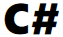
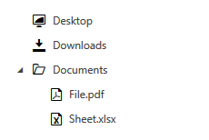

# RadGlyph

With the **R1 2018** release, the Telerik UI for {{ site.framework_name }} suite provides the **RadGlyph** which is a **FrameworkElement** that enables seemless visualization of font glyphs.

* [Benefits](#benefits)
* [Usage](#usage)
* [Properties](#properties)
* [Register Fonts](#register-fonts)
* [Use Glyphs as Geometry](#use-glyphs-as-geometry)
* [Use Glyphs as ImageSource](#use-glyphs-as-imagesource)

## Benefits

Apart from the **shorter load time** compared to the ordinary glyphs, the RadGlyph provides out-of-the-box **design-time support**. In addition, it respects the **FlowDirection** property in the same manner as a standard **Path** element, for example. Last but not least, it **inherits the Foreground** property from its parent element if it is not set explicitly.

## Usage

The RadGlyph can be used both standalone and as a markup extension. **Examples 1 and 2** demonstrate both approaches, respectively.

#### __[XAML] Example 1: Define a RadGlyph in XAML__

{{region xaml-common-styling-appearance-glyphs-overview-1}}
	<telerik:RadGlyph Glyph="&#xe91e;" Foreground="Black" FontSize="100" />
{{endregion}}

#### __[XAML] Example 2: Use the RadGlyph markup extension__

{{region xaml-common-styling-appearance-glyphs-overview-2}}
	<Image Source="{telerik:RadGlyph Glyph={StaticResource GlyphCs}, Foreground=Black}" />
{{endregion}}

#### Figure 1: The result from examples 1 and 2

> In order to use the glyph references (such as **GlyphCs** in **Example 2**) as static resources in a project, you need to include the **Telerik.Windows.Controls.dll** and merge the **FontResources.xaml** dictionary in the application resources as demonstrated in **Example 3**. A list of the available glyphs and their resource keys can be found in the [Glyphs Reference Sheet]() article.

#### __[XAML] Example 3: Adding the FontResources.xaml dictionary__
{{region xaml-common-styling-appearance-glyphs-overview-3}}
	<ResourceDictionary Source="/Telerik.Windows.Controls;component/Themes/FontResources.xaml"/> 
{{endregion}}

## Properties

The RadGlyph class exposes the following properties:

* **Glyph**: The actual text to be displayed. It is of type **String**.

* **Foreground**: The foreground of the element which would color the rendered glyph. It is of type **Brush**.

* **Background**: The background of the element. It is of type **Brush**.

* **Font**: The name of the font to be used. It is of type **String** and corresponds to one of the [registered fonts](#register-fonts).

* **FontSize**: The font size of the element. It is of type **Double**.

The RadGlyphExtension on the other hand provides this set of properties:

* **Glyph**: The actual text to be displayed. It is of type **Object**.

* **Foreground**: The foreground of the element which would color the rendered glyph. It is of type **Brush**.

* **Font**: The name of the font to be used. It is of type **String** and corresponds to one of the [registered fonts](#register-fonts).

* **Size**: The font size of the element. It is of type **Double**.

* **Type**: Explicitly sets type of the exported glyph. It is of type **GlyphExportType** which is an enumeration with the values **None** (default), **Image** (which returns an **ImageSource**) and **Path** (which returns a **Geometry**).

## Register Fonts

The default font family used by the glyphs is the **TelerikWebUI**. A list of the available glyphs can be found in the [Glyphs Reference Sheet]() article.

If you wish to use a custom font in your project, you first have to register it by calling the static **RadGlyph.RegisterFont** method. It has the following 4 overloads:

* **RegisterFont(string fontName)**
* **RegisterFont(FontFamily fontFamily)**
* **RegisterFont(FontFamily fontFamily, string fontName)**
* **RegisterFont(Uri fontUri, string fontName)**

**Example 3** shows how to register the **Webdings** typeface, which is included in all versions of Microsoft Windows **since Windows 98**.

#### __[C#] Example 4: Register the Webdings typeface__

{{region cs-common-styling-appearance-glyphs-overview-4}}
	static MainWindow()
	{
		RadGlyph.RegisterFont("Webdings");
	}
{{endregion}}

#### __[XAML] Example 5: Use the Webdings glyphs__

{{region xaml-common-styling-appearance-glyphs-overview-5}}
	<Path Data="{telerik:RadGlyph Font=Webdings, Glyph=&#x00fc;}" Fill="{telerik:Office2016Resource ResourceKey=IconBrush}" Width="50" Height="50" Stretch="Uniform" />
{{endregion}}

#### Figure 2: The resulting Webdings glyph

## Use Glyphs as Geometry

#### __[XAML] Example 6: Set a RadPathButton's PathGeometry in XAML__

{{region xaml-common-styling-appearance-glyphs-overview-6}}
	<telerik:RadPathButton Width="50" Height="50" PathGeometry="{telerik:RadGlyph Glyph={StaticResource GlyphButton}}" />
{{endregion}}

#### Figure 3: The RadPathButton in normal and hovered states in the Office2016 theme

The same result can be achieved in code behind as demonstrated in **Example 6**. Note that it uses the static **RadGlyph.GetGeometry** method which takes two parameters - a glyph string and a font family.

#### __[C#] Example 7: Set a RadPathButton's PathGeometry in code-behind__

{{region cs-common-styling-appearance-glyphs-overview-7}}
	private RadPathButton CreateButton()
	{
		var button = new RadPathButton();
		button.Width = 50;
		button.Height = 50;
		button.PathGeometry = RadGlyph.GetGeometry(this.GetGlyph("&#xe63d;"), "TelerikWebUI");
		return button;
	}

	private string GetGlyph(string hexCode)
	{
		string glyphInt = hexCode.Substring(3, 4);
		var character = (char) int.Parse(glyphInt, NumberStyles.HexNumber);
		return character.ToString();
	}
{{endregion}}

> Please note that in this scenario we use the custom **GetGlyph** method to transform the 8-character code to a **single character**. This is required as otherwise all 8 characters will be displayed as-is.

## Use Glyphs as ImageSource

#### __[XAML] Example 8: Provide ImageSource for RadTreeView items__

{{region xaml-common-styling-appearance-glyphs-overview-8}}
	<telerik:RadTreeView>
		<telerik:RadTreeViewItem Header="Desktop"
										DefaultImageSrc="{telerik:RadGlyph Type=Image, Glyph={StaticResource GlyphToggleFullScreenMode}}" />
		<telerik:RadTreeViewItem Header="Downloads"
										DefaultImageSrc="{telerik:RadGlyph Type=Image, Glyph={StaticResource GlyphDownload}}" />
		<telerik:RadTreeViewItem Header="Documents" 
										IsExpanded="True"
										DefaultImageSrc="{telerik:RadGlyph Type=Image, Glyph={StaticResource GlyphFolder}}"
										ExpandedImageSrc="{telerik:RadGlyph Type=Image, Glyph={StaticResource GlyphFolderOpen}}">
			<telerik:RadTreeViewItem Header="File.pdf" 
											DefaultImageSrc="{telerik:RadGlyph Type=Image, Glyph={StaticResource GlyphPdf}}"/>
			<telerik:RadTreeViewItem Header="Sheet.xlsx"
											DefaultImageSrc="{telerik:RadGlyph Type=Image, Glyph={StaticResource GlyphExcel}}"/>
		</telerik:RadTreeViewItem>
	</telerik:RadTreeView>
{{endregion}}

#### Figure 4: The resulting RadTreeView in the Office2016 theme

## See Also

* [Setting a Theme (Using  Implicit Styles)]()
* [Glyphs Reference Sheet]()
