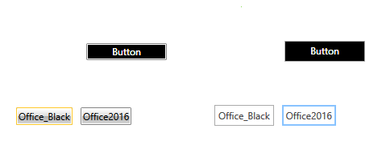

# Switching Custom Styles with Themes at Runtime

Setting a theme using [implicit styles](), you have the option to change the theme of the controls at runtime without recreating the UI.

The resources in a merged dictionary occupy a location in the resource lockup scope that is just after the scope of the main resource dictionary they are merged into. What you can do is to isolate your custom styles in separate resource dictionaries and add them after the default dictionaries each time you change the theme.

As an example, you can follow the steps bellow:

**1.** Create a new application and add the required assemblies from the **Binaries.NoXaml** folder located in the Telerik UI for {{ site.framework_name }} installation folder as well as the theme assemblies:

* **Telerik.Windows.Controls.dll**

* **Telerik.Windows.Controls.Input.dll**

* **Telerik.Windows.Themes.Office_Black.dll**

* **Telerik.Windows.Themes.Office2016.dll**

**2.** Add the respective resource dictionaries for the default theme in **App.xaml**:

__Example 1: Merge resource dictionaries__

```XAML
	<ResourceDictionary>
		<ResourceDictionary.MergedDictionaries>
			<ResourceDictionary Source="/Telerik.Windows.Themes.Office_Black;component/Themes/System.Windows.xaml"/>
			<ResourceDictionary Source="/Telerik.Windows.Themes.Office_Black;component/Themes/Telerik.Windows.Controls.xaml"/>
	 		<ResourceDictionary Source="/Telerik.Windows.Themes.Office_Black;component/Themes/Telerik.Windows.Controls.Input.xaml"/>
	    	<!-- ... -->
		</ResourceDictionary.MergedDictionaries>
	</ResourceDictionary>	
```

>Initially we merge the resource dictionaries for the **Office_Black** theme.

**3.** Add a few controls of your choice to the layout root of your application. And also two buttons which will be used to switch between the themes. 

__Example 2: Add buttons to switch between the themes__

```XAML
	<Grid x:Name="LayoutRoot" Background="White">
		<Grid.RowDefinitions>
			<RowDefinition Height="\*"/>
			<RowDefinition Height="auto"/>
		</Grid.RowDefinitions>
        <telerik:RadButton Content="Button" VerticalAlignment="Center" Width="100"/>
        <StackPanel Grid.Row="1" Orientation="Horizontal">
            <Button x:Name="Office_Black" Margin="5" Content="Office__Black" Click="Office_Black_Click"/>
            <Button x:Name="Office2016" Margin="5" Content="Office2016" Click="Office2016_Click"/>
		</StackPanel>
	</Grid>
```

**4.** Now add your custom styles in separate resource dictionaries for the different themes called **CustomStyles_Office_Black.xaml** and **CustomStyles_Office2016.xaml**, respectively, contained in the **Themes** folder of your project. These custom resource dictionaries will have the following content:

__Example 3: Add custom styles in separate resource dictionary__

```XAML
	<ResourceDictionary xmlns="http://schemas.microsoft.com/winfx/2006/xaml/presentation"
			    xmlns:telerik="http://schemas.telerik.com/2008/xaml/presentation"
			    xmlns:x="http://schemas.microsoft.com/winfx/2006/xaml">
		<Style TargetType="telerik:RadButton" BasedOn="{StaticResource RadButtonStyle}">
			<Setter Property="Background" Value="Black"/>
            <Setter Property="Foreground" Value="White"/>
		</Style>
	</ResourceDictionary>
```

>Creating separate resource dictionaries for the different themes allows for easy customization on a per-theme basis. You can, however, use a single dictionary and merge only this dictionary when switching the themes, provided you do not have any theme-specific changes in it. Such changes would include any [modified control templates]() as these differ from theme to theme and may result in errors when switching.

**5.** Add the resource dictionary to the application's MergedDictionaries collection:

__Example 4: Add dictionary to MergedDictionaries__

```XAML
    <ResourceDictionary.MergedDictionaries>
        <ResourceDictionary Source="/Telerik.Windows.Themes.Office_Black;component/Themes/System.Windows.xaml"/>
        <ResourceDictionary Source="/Telerik.Windows.Themes.Office_Black;component/Themes/Telerik.Windows.Controls.xaml"/>
        <ResourceDictionary Source="/Telerik.Windows.Themes.Office_Black;component/Themes/Telerik.Windows.Controls.Input.xaml"/>
        <!-- ... -->
        <ResourceDictionary Source="/ProjectName;component/Themes/CustomStyles_Office_Black.xaml"/>
    </ResourceDictionary.MergedDictionaries>
```

>Note that you should replace **ProjectName** with the actual name of your project.

**6.** Then, in the buttons' **Click** handlers, we will clear the merged dictionaries from the application resources and merge the new resource dictionaries from the theme assemblies along with our custom styles contained in the custom resource dictionaries:

__Example 5: Clear and merge dictionaries upon button click__

```C#
	private void Office_Black_Click(object sender, RoutedEventArgs e)
    {
        this.MergeDictionaries("Office_Black");
    }

    private void Office2016_Click(object sender, RoutedEventArgs e)
    {
        this.MergeDictionaries("Office2016");
    }

    private void MergeDictionaries(string theme)
    {
        Application.Current.Resources.MergedDictionaries.Clear();
        Application.Current.Resources.MergedDictionaries.Add(new ResourceDictionary()
        {
            Source = new Uri("/Telerik.Windows.Themes." + theme + ";component/Themes/System.Windows.xaml", UriKind.RelativeOrAbsolute)
        });
        Application.Current.Resources.MergedDictionaries.Add(new ResourceDictionary()
        {
            Source = new Uri("/Telerik.Windows.Themes." + theme + ";component/Themes/Telerik.Windows.Controls.xaml", UriKind.RelativeOrAbsolute)
        });
        Application.Current.Resources.MergedDictionaries.Add(new ResourceDictionary()
        {
            Source = new Uri("/Telerik.Windows.Themes." + theme + ";component/Themes/Telerik.Windows.Controls.Input.xaml", UriKind.RelativeOrAbsolute)
        });
        Application.Current.Resources.MergedDictionaries.Add(new ResourceDictionary()
        {
            Source = new Uri("/ProjectName;component/Themes/CustomStyles_" + theme + ".xaml", UriKind.RelativeOrAbsolute)
        });
    }
```

>Please note that the theme provided in the MergeDictionaries should match the name of the respecitve theme assembly, for example - **Expression_Dark**, **Office2016Touch**, **Material**. Using this approach you can switch to any of the [themes]() provided by the UI for {{ site.framework_name }} suite.

The result based on the above code is illustrated in **Figure 1**.

#### Figure 1: RadButtons with Office_Black and Office2016 themes



## See Also

* [Setting a Theme]()
* [Switching Icons at Runtime]()
* [Setting a Theme on MS Controls]()
